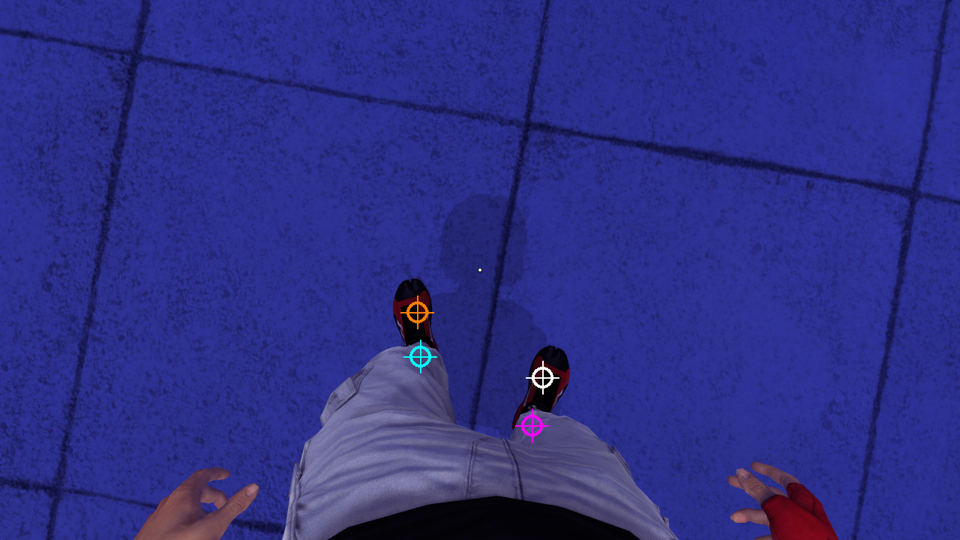
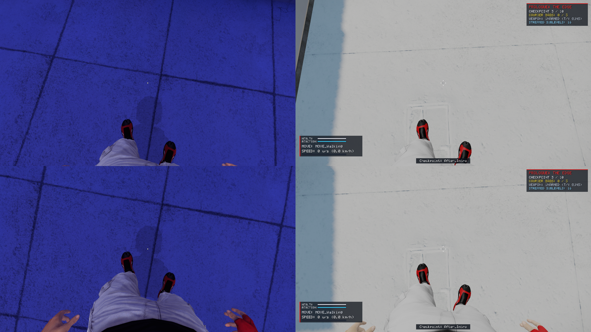
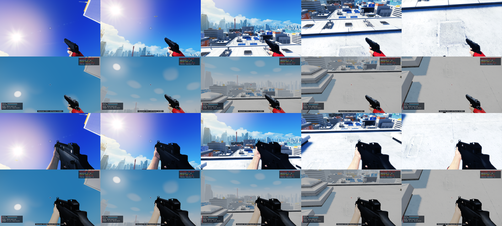
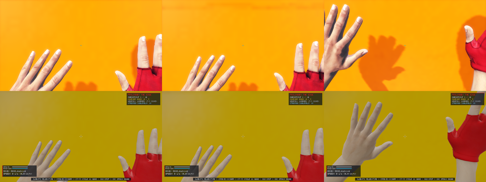
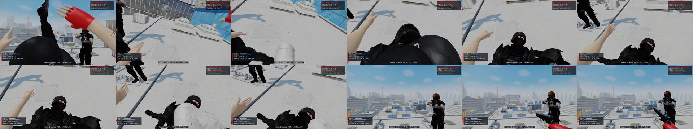

# Mirror's Edge first-person animation: what plays when, and where the hands are

How retail chooses Faith's first-person animations, how the camera relates to her body, and how the port reproduces both. It follows [`ANIMATION_SYSTEM_RE.md`](ANIMATION_SYSTEM_RE.md), which covers the file formats (skeletal meshes, animation sequences, skinning).

Every statement comes from the retail packages and scripts unless it says "measured" (taken from a retail recording or frame) or "not established".

Tools: `tools/ue3_tree.py` (property trees), `tools/uscript_bytecode.py` (script), `tools/retail/` (the retail recorder), the recordings in `recordings/`.

---

## 1. The pieces

| Piece | Where | What |
|---|---|---|
| `TdPlayerPawn.Mesh1p` | `TdGame.u`, `Default__TdPlayerPawn.TdPawnMesh1p` | `TdSkeletalMeshComponent`: `SK_UpperBody`, `AnimTreeTemplate = AT_C1P.AT_C1P`, `AnimSets = [AS_C1P_Unarmed, 4 empty]` (the weapon fills the rest), `FOV = 90`, `SDPG_Foreground`, owner-only |
| `TdPlayerPawn.Mesh1pLowerBody` | `…TdPawnMesh1pLowerBody` | `SK_LowerBody`, `ParentAnimComponent = Mesh1p` (it has no tree: it takes the upper body's pose), `SDPG_Intermediate` |
| the tree | `Characters/AT_C1P.upk` | one `AnimTree`, 203 nodes: 117 sequence players, 11 custom-animation slots, the rest blends and state switches. Also the skeletal controls and morph nodes |
| the sequences | `Animations/AS_C1P_Unarmed.upk` and the weapon sets | named `AnimSequence`s; a node names the one it plays |
| what the moves ask for | `TdGame.u`, `TdMove_*` | each move's script calls `PlayMoveAnim` / `StopCustomAnim` / `SetAnimationMovementState` |

So an animation reaches the screen one of two ways:

* a **state node** of the tree picks a child from the pawn's state (movement state, walking state, weapon, grab slope …) and the child's sequence loops, or
* a move's script plays a **custom animation** by name on one of the tree's slots, over whatever the state nodes are doing.

## 2. The camera

`TdPlayerPawn.CalcCamera`, in full:

```
out_Location = Mesh1p.GetBoneLocation('EyeJoint')           // world space
out_Rotation = GetViewRotation()                            // the controller's view
GetCameraAnimation(CameraAnimLocation, CameraAnimRotation)
out_Rotation.Pitch += -CameraAnimRotation.Roll
out_Rotation.Yaw   +=  CameraAnimRotation.Pitch
out_Rotation.Roll  += -CameraAnimRotation.Yaw
if (SwanNeck1p != None) out_Location += SwanNeck1p.GetSwanNeckPos(yaw-only view rotation)
if (the move wants it and this is not a cinematic) Moves[MovementState].CheckForCameraCollision(out_Location, out_Rotation)
```

The camera is not a point above the capsule. It is the `EyeJoint` bone of the animated first-person skeleton, wherever the animation and the skeletal controls have put it, turned to the controller's view. The hands are where they are in the picture because the same pose holds both the eye and the hands.

The first-person mesh is drawn with its own field of view (`TdSkeletalMeshComponent.FOV = 90`), in the foreground depth group, whatever the world camera's field of view is.

## 3. The tree, top down

```
AnimTree
 WeaponPoseOffset                      TdAnimNodeWeaponPoseOffset
  IkEffectorController                 TdAnimNodeIKEffectorController
   IgnoreRootTransformation            per-bone blend from Hips: Source = a "notifier dummy" branch (footstep and breathing notifies by speed)
    Target: Custom_Canned              slot (cutscenes, intros)
     per-bone blend from SpineX        Target: Custom_CannedUpperBody (slot)
      Camera_Split                     per-bone blend, CameraJoint only. Target: Custom_Camera (slot)
       LandNode                        TdAnimNodeLandOffset: the dip after a landing
        ArmedRight / ArmedLeft         per-bone blends that lay the weapon arm(s) over the body
         AgainstWallCam                TdAnimNodeDirBone
          UpperBodySplit               per-bone blend from SpineX and EyeJoint. Target: Custom_UpperBody (slot)
           Custom_FullBody             slot
            MasterSync                 AnimNodeSynch, group "Walk"
             TdAnimNodeMovementState   Walking / Jump / Falling / Crouch / Vertigo go through "1pAim" (TdAnimNodeDirBone) and the
                                       Custom_FullBody_Dir and Custom_LowerBody slots; everything else goes straight to:
              TdAnimNodeMovementState  one child per movement state (below)
```

The second movement-state node's children, by `StateMapping` (an `EMovement` value each):

| Child | State | Plays |
|---|---|---|
| Default | anything not listed | `WalkingState`: Idle → `Stand` with the stand-turn sequences; Sneak / Walk / Jog+Run → a `TdAnimNodeBlendDirectional` each (`sneakfwd`/`sneakbwd`; `walkfwd`, `walkfwdstiff`, `walkbwd`, `walkbwdstiff`; `runfwd`, `runfwdstiff`, `runbwd`, `runbwdstiff`); Sprint → `SprintFwd` |
| Grabbing | 3 | `Hang` / `HangFree` by slope (`hang45left/right`, `hangfree45left/right`), and the hang-turn idles |
| WallClimbing, Falling, Jump, GrabJump, IntoGrab | 6, 2, 11, 13, 14 | `JumpLand` (a pose; the move's custom animation is what is seen) |
| WallRunningLeft / Right | 5, 4 | `WallrunLeft` / `WallrunRight`, rate 1.4 |
| Slide | 16 | `CrouchSlideEnd` |
| Balance | 29 | `walkbalancefwd` with its lean and lose-balance variants |
| 180TurnInAir | 25 | `jumpturnflyend` |
| LayOnGround | 26 | `jumpturnlandingidle` |
| Climb | 21 | ladder and pipe: the two "still" poses, the slide-down variants, the look-left/right idles |
| ZipLine | 28 | `ZipLine` |
| Crouch | 15 | `crouchfwd`/`crouchbwd` (`…ready` with a heavy weapon), idle `crouchstill` with the crouch-turn sequences |
| rumpslide | 38 | `crouchslideend45` |
| LedgeWalk | 30 | `ledgeright` / `ledgeleft` |
| Vertigo | 47 | `edgedetectionidle` |
| Swing | 60 | `swingposefronttop`, `swingposebackstraight`, `swingposebacktop` by swing phase |
| GrabTransfer | 31 | `hangtransferupidle` |
| fallinguncontrolled | 72 | `fallinguncontrolled` (`fallinguncontrolledbwd` after a 180 turn in the air) |
| SoftLanding | 78 | `fallinglandintosoftlanding` |

The slots are `CustomNodeType`: `CNT_Canned` 0, `CNT_CannedUpperBody` 1, `CNT_FullBody` 2, `CNT_FullBody_Dir` 3, `CNT_UpperBody` 4, `CNT_LowerBody` 5, `CNT_Camera` 6, `CNT_Weapon` 7, `CNT_Face` 8. `TdMove.PlayMoveAnim(Type, AnimName, Rate, BlendInTime, BlendOutTime, bRootMotion, bRootRotation)` is `TdPawn.PlayCustomAnim` with `bLooping = false, bOverride = true`.

## 4. What retail was recorded doing

From telemetry version 6 the recorder's hook walks `Mesh1p`'s tree every frame and logs the three heaviest sequence players: `anim1p = [[name, time in seconds, weight], …]`. Nine of the recordings in `recordings/` have it. Standing still:

```
MOVE_Walking  [["Stand", 0.0161, 1.0], ["StandTurn90Right", 0.0161, 0.0806]]
```

and the first frames of a running jump:

```
MOVE_Jump     [["runfwd", 0.3162, 0.7457], ["JumpSlow", 0.0168, 0.1682], ["JumpLand", 0.0168, 0.07]]
```

`JumpSlow` is the custom animation `TdMove_Jump.StartJump` played; `JumpLand` is the Jump child of the state node coming in under it; `runfwd` is the walking state going out. These records are what the port's choice of animation is checked against.

**A sample's camera is up to a frame older than its pawn.** The hook reads the camera out of the frame being presented and the pawn out of the game thread as it is at that moment, and the game thread runs up to a frame ahead of the render thread. So `x y z yaw pitch roll` of sample `i` belong with `px py pz cyaw cpitch anim1p` of sample `i - 1` or of sample `i` itself, in stretches: two thirds of the samples of a typical recording are a frame apart and a third are level (a few, across a hitch, two or three apart). Compared sample for sample the camera seems to trail the eye by a frame's travel (10 uu at a wall run's 600 uu/s) in some stretches and to sit on it in others. `build/re/fpanim/eyelag.py` picks the lag per sample, where she moves fast enough for the choices to differ (section 7).

**Only three sequences a sample.** `anim1p` holds the three heaviest sequence players. On a beam, with two lose-balance poses blending, the lean pose can drop off the list; and the weapon arm's sequences (`standready`, `standfire` ...) never make it, sitting as they do under a per-bone blend. For those the recorder's full tree dump is used (`animdump`, on request: every node with its children's weights).

## 5. Rules measured on the recordings

What the scripts do not say (the nodes are native) was measured on the nine recordings, 80,238 frames.

**Walking state.** `TdPawn.UpdateWalkingState` follows the 2D speed of the frame before (the pawn ticks before its physics), with the same thresholds speeding up and slowing down. The recorder logs `CurrentWalkingState`, so these are read directly:

| state | from |
| --- | --- |
| Sneak | 5 |
| Walk | 50 |
| Jog | 260 |
| Run | 400 |
| Sprint | 630 |

**The walk cycle.** Every walking, running, crouching, balancing and wall running sequence is in the synch group `Walk` of `MasterSync`. The heaviest member leads at its own rate (its `Rate` x the sequence's `RateScale` x speed / `BaseSpeed`, clamped to `RateMin`..`RateMax`), and every other member sits at the same place in its own cycle, `SynchPosOffset` apart (0.32 for the forward sequences, 0.78 for the backward ones). A member that becomes relevant starts at its `SynchPosOffset` (`TdAnimNodeSequence.OnBecomeRelevant`). `TdPawn.IsLeftLegForward` is the leader being past half its length. The speed in the rate is the frame before's, like the walking state's (to 1 uu/s over 2,900 frames whose frame time is known; this frame's is 3 to 25 uu/s out while she speeds up), and the leader is the heaviest by the frame before's weights.

**How long a state takes to change.** The walking state node never blends in under 0.2 s. The movement state nodes (`bUseCustomBlend`) take the longer of the two moves' `TdMove.AnimBlendTime`, the one left and the one entered, and never under 0.2 s: Slide and RumpSlide 0.5, Balance 0.4, Crouch 0.25, Falling and the wall runs 0.2, Swing 0.15, Grab 0.1. Measured: 0.4 s on to a beam and off it, 0.2 into a jump, a fall or a wall run and back to the ground.

**The stopping step.** Letting go of the stick while walking plays `walktostandpassleft` or `walktostandpassright` on `Custom_LowerBody`, blending in over 0.1 s and out over the last 0.15 s. It starts on the frame the braking starts, at any speed, so it is the input that triggers it and not the speed. Which one: `right` when the leading walk sequence is between 0.21 and 0.71 of its length: 95 of 101 starts on retail's own cycle, and 89 on the port's, which is within a twentieth of retail's at 93 of them.

**Direction (`TdAnimNodeBlendDirectional`).** Its direction is the velocity in the pawn's frame with the two parts scaled to add up to 1 (the package saves one so: 0.639, -0.361). The sideways child takes the sideways part: half at 45 degrees, 0.156 at 10, 0.712 at 68, and never more than 0.9, so straight sideways is 0.9 of the "stiff" run and 0.1 of the plain one. Which three play, forward or backward, is sticky: it changes only once the forward part is more than 0.163 the other way, about 11 degrees past sideways (nine changes: none at 0.1605, the first at 0.1657), and then over `ForwardInterpTime` 0.4 s; sideways moves over `DirInterpTime` 0.1 s. The sideways children are the "stiff" runs: `1pAim` (a `TdAnimNodeDirBone`, an aim offset on `Hips` and `Spine`) turns the hips the way she is going, up to the quarter turn its left and right poses hold, and the spine back against them.

**Landing.** Every landing goes through `TdMove_Landing.StartMove`. An ordinary one is `LandNormal(GetLandingAmount())` and straight back to walking: `Amount = clamp((fall - 300) / 230, 0.2, 1)`, 0.7 out of a coil, 0.85 for a springboard. It sets `LandNode.Landed` (the dip of the eye and `SpineX`, section 7) and activates the `LandingRun` custom blend: `FallingLandMedium` over the run at `Amount` for `0.6 x Amount` seconds, 0.15 s in and 0.4 s out.

**Close to the ground.** `TdMove_Falling.CloseToGround` (called from native code) lets the jump animation go with `StopCustomAnim(FullBody_Dir, 0.3)`. Measured on 21 firings: it fires in a fall when her own box, swept 0.4 s along the velocity, meets something. Landing on level ground that is the drop left being 0.38 to 0.42 of the fall speed; flying at a wall it fired 0.39 s before she hit it; and it fires at any speed (a step off a low ledge fired it 0.17 s in, falling at 240). A ledge she is about to catch counts only if that straight line meets the wall under it, so a fall that arcs down on to a ledge can keep its jump animation to the end.

**A slot's blend time is for a whole blend.** `PlayCustomAnim` and `StopCustomAnim` shorten the time by the weight the channel they blend to already has (`AnimNodeBlendList::SetActiveChild`): the `StopCustomAnim(FullBody_Dir, 0.3)` above, on an animation 0.56 of the way in, took 0.167 s. The state nodes do not do this (shortening theirs too loses 0.3% of the walking frames).

**What a move reads as it starts.** A move's `StartMove` runs before the frame's physics, so the velocity it tests is the frame before's: a jump out of a vault on to a ledge (66 uu/s then, 29 a frame later) is `JumpSlow`, not `JumpStill`.

**The forced state.** `SetAnimationMovementState(State, Delay)` makes the state nodes read `State` instead of the pawn's movement state, at once or after `Delay`; `TdMove.StopMove` clears it, so it never outlives the move that set it.

**Hanging (`TdAnimNodeGrabbing`).** With `d` the view's yaw off the body's and `T` the move's `CurrentGrabTurnType` (0 none, 1 the turn's start, 3 turned, 2 the turn's end): turned past a quarter turn with `T` 2 or 3, the idle of that side shows at once, shared with its "extreme" by how far past, `(|d| - 90) / 90`; with `T` 0 or 1 the node goes back to `Hang` (`HangFree` hanging free: `SetActiveMove` from the script) over 0.2 s; in between it stays as it is. It starts on the hang whenever it regains weight. All 777 frames in which the node has weight fit to 0.005.

**Climbing (`TdAnimNodeClimb`).** The child is the slide while she slides (`bClimbDownFast`), else the still pose of the hand `bClimbLeftHand` says, of the ladder's or the pipe's set; a change blends over 0.2 s. All 580 frames fit to 0.009. On a pipe the fast two-rung animation is used while more than one rung is left above her and the plain one for the last (`HandleClimbAction`; 99.5% of the climbing frames with it). Looking back past a quarter turn (`TdMove_Climb.StartTurningAngle`) the look idle of that side takes over, and gives way again under it, over the same 0.2 s: on at 90.2 to 92.8 degrees in a recording made for it (`2_ladder_look`, 99.1% of its frames).

**The beam (`TdAnimNodeBalanceWalk`, `TdAnimNodeBalanceBlend`).** Under a per-bone blend that gives the legs `walkbalancefwd` whatever happens, `BalanceDir` mixes `walkbalancefwd` with `walkbalancefwdleanleft` or `...right` by how far she leans, and `TdAnimNodeBalanceWalk` switches from it to `walkbalancelosebalanceleft` or `...right` while she is losing her balance: in over 0.4 s, back over 0.6 (its `BlendWeight`, as measured). The poses carry the camera: `walkbalancefwd` rolls the view 4.6 degrees (1.6 to 7.1 through the step), the full lean 32, the lose-balance pose 35. From a recording made for it (`5_beam`, 7,855 frames on a beam): she walks it at 245 uu/s (`SpeedModifier` 0.34); a key held leans her that way at 2.0 to 2.7 a second; the lose-balance state comes on about 0.27 s after a key is held from the middle and goes at once when the other key is pressed; 0.8 s of it (`TimeToCounter`) and `TdMove_Balance.Falloff` plays `walkbalancefalloffleft` / `right` (0.3 / 0.3), 1.09 s after the key went down both ways. The fall off animation starts while she is still on the beam, and she is falling 0.27 to 0.30 s later. Stepping on dead in line and left alone, the lean wanders 0.2 to 0.7 either way and she reaches the far end of a 1,740 uu beam every time; stepping on with the view off the line, by 0.7 degrees or by 8, she is over in 3.2 to 3.6 s, mostly to the side away from the turn. On a beam the view turns 31 degrees each way and no further. The balance itself is native (`ControlInfluence` 1.5, `CameraInfluence` 0.3, `GravityInfluence` 0.3, `SpeedInfluence` 2.5 are its numbers); the port's is a fit to those times (a key 2.4 a second, a steady push while the view is off the line, both growing on themselves at `GravityInfluence`, the lose-balance state past 0.65). The wander is laid over what the tree is shown as a slow sway of that size and plays no part in whether she falls: retail's lean showed 0.72 on a free walk and was not the lose-balance state.

**The ledge's slope (`TdAnimNodeGrabSlope`).** Under both `Hang` and `HangFree`: the level hang, `hang45right` and `hang45left`. In `hang45right` the right hand is 42 uu lower than the left with the hands 42 apart: the hang from a ledge falling 45 degrees to her right. The node is native and no recording has a sloped ledge; the port mixes the level pose with those straight in the slope.

**The swing (`TdAnimNodeSwing`).** By the move's `SwingAngle` alone, with nothing smoothing it: with `a = clamp(angle / 90 degrees, -1, 1)`, Front `max(a, 0)`, back `max(-a, 0)`, Middle `1 - |a|`. The crossfader under Middle stays at its saved 0.2556 and the camera-bone mask at 0.8013. Three swings, 2,143 frames, every leaf to 0.005. The angle is positive ahead of the bar; the pawn's centre is on a circle of radius 120 (`SwingPendulumLength`) about it, to 0.001.

**Standing turns (`TdAnimNodeTurn`).** The legs keep their own yaw. Moving, it comes round to the way she is going (the other way going backward). Standing, it stays while the view turns, never more than 90 degrees behind it; once the view is more than 65 degrees (`ExtendedRegionLimit`) off the legs the quarter-turn step of that side plays, bringing the legs round 90 degrees over its 0.8 s whatever the view does meanwhile, blending in and out over 0.2 s. The 45 degree steps are never chosen in 76 turns. Taking the first turn of a standing stretch as given, the rule makes 27 of the 30 that follow, on the right side and within three frames. How fast the legs come round while she moves is a rough fit (2.4 degrees a second for each uu/s). The standing legs' aim offset (`bAimSourceIsLegRotation`) twists the hips by how far the legs are off the body, whole at 18 degrees (its `HorizontalRange` 0.2 of a quarter turn). Crouched, the node under `crouchstill` follows the same rule with the crouch-turn sequences (a recording made for both, `1_turn_in_place`: 97.1% of its frames).

**Not listed by the recorder:** what plays on the `Custom_Camera` and `Custom_Canned` slots (`gethitfront`, the wall run impacts, `CrouchIntoStand`, the level intros). Their names appear in no recording; the port plays them and leaves them out of what it compares.

## 6. What each move plays

`PlayMoveAnim(Slot, Name, Rate, BlendIn, BlendOut)` is `TdPawn.PlayCustomAnim` without looping. Blend times in seconds; a blend-out of 0 or less holds the last frame until something else takes the slot. `TdPawn.OnAnimEnd` calls the current move's `OnCustomAnimEnd` only for an animation that move started.

Where a move picks between animations by what it found in the level, the controller says which (`PlayerTelemetry::move_anim`, section 9) and the director plays it the way this table says.

| move | calls |
| --- | --- |
| Jump | `StartJump`, on the velocity she had before the jump: forward speed under 5 `JumpStill` (0.15 / 0.15); under `LongJumpNormalThreshold` 500, or with ground within 200 below the point 1.1 x speed ahead, `JumpSlow` (0.1 / 0.2); else `JumpFast`. All on `FullBody_Dir`. Stop: `StopCustomAnim(FullBody_Dir, 0.2)` unless a fall or a vault follows |
| Falling | off an edge from walking: `JumpAir` (0.3 / 0.2); backing off one with room for her under it (`CanStand` a body's height down) the move stops her dead and plays `JumpStill` (0.3 / 0.2), and backing off a lower one it plays nothing. After a dodge jump: state 33. Stop: `FullBody` and `FullBody_Dir` out over 0.2 |
| SpeedVault / VaultOver | `StopCustomAnim(FullBody_Dir, 0.2)`; `VaultTypes[].AnimName` on `FullBody` (0.15 / 0.2): `autostepuprightleg` (a ledge up to 48), `stepuprightleg88` (48 to 148 with momentum under 200), `VaultOnto`, `VaultOver` (64 to 148), `VaultOverHigh`, `VaultOntoHigh` (145 to 192) |
| AutoStepUp / StepUp | `autostepuprightleg` at 0.8 (0.15 / 0.25); `vaultonto` (0.15 / 0.25), then `stepup{left,right}leg48`, `stepupleftleg88` at 1.2, `stepup144` (0.15 / 0.1) |
| SpringBoard | start: `LandNormal` at 0.85. At the foot plant (`ReachedPreciseLocation`): `SpringBoardRightLeg` with the left leg forward, else `SpringBoardLeftLeg` (0.15 / 0.25). Stop: `FullBody` out over 0.1 |
| WallRun | `wallrunrightstart` / `wallrunleftstart` at `WallrunStartUpperBodyAnimPlayRate` 0.6 (1.0 with no wall beside the head) (0.2 / 0.2); at the wall, when the camera takes the hit, `wallrunimpactright` / `left` on `Camera` (0.15 / 0.15) |
| WallrunJump | `FullBody` out over 0.2; pushing off hard (`PushSpeed > 0.6`) `WallrunJumpLeft` / `Right`, else `JumpSlow`, on `FullBody_Dir` (0.2 / 0.2); state 11. Stop as Jump |
| WallClimb | `WallRunVertical` looping at 0.2 (0.2 in); stop over 0.25. 180: `wallrunvertical180turn` (0.2 / 0.1) then `WallrunJumpLeft` (0.1 / 0.2) |
| DodgeJump | `dodgejumpleft` / `right` (0.1 / 0.2; 0.2 / 0.2 off a wall run) |
| IntoGrab | plays nothing until the hands are on the ledge (`ReachedPreciseLocation`, just before `SetMove(Grabbing)`), then (on a sloped ledge, `MoveLedgeNormal.Z < 0.999`, the lighter catches go to the `Camera` slot and the others take 0.8 s to leave) by where she came from and `IntoGrabSpeed`, her vertical speed when the move started: out of a wall climb's double jump `hanghardstartvertical` (0.2 / 0.2); hanging free `HangFreeHardStart` (0.1 / 0.2); under -1000 `HangHardStart3` with `gethitfront` on `Camera` (0.05 / 0.2); under -600 `HangHardStart2`; else `HangHardStart` (0.1 / 0.2). A folded hang (`CheckForFoldedHang`) plays `HangFoldedStart` (0.2 / 0) with state 3 instead |
| Grab | shimmy (`StartShimmy`): one `HangStrafeLeft` / `Right` (`HangFreeStrafeLeft` / `HangFreeStrafe`) a step (0.2 / 0), started again from its first frame while the stick is held; let go, it stops over 0.4 only between 0.1 and 0.25 of the step or past 0.8. Looking back (`UpdateViewRotation`): past a quarter turn `HangTurnRightStart` / `LeftStart` (0.2 / 0.2), the turn type 1 and after 0.2 s 3; back inside it `HangTurnRightEnd` / `LeftEnd` (0.2 / 0.2), type 2 until it ends. Hanging free: `HangFreeTurnRight` / `Left` once past 85.9 degrees. Dropping: `HangEnd` / `HangFreeEnd` (0.1 / 0.2) with state 2 after 0.2 |
| GrabPullUp | `HangHeaveUp`, `HangFreeHeaveUp`, `HangFoldedHeaveUp`, `...ToCrouch` (0.1 / 0.2) or `Hang(Free)HeaveOver` (0.2 / 0.2); state 3, then 0 (or 15 for the crouching ones) after 0.2 |
| GrabJump / GrabTransfer | `HangTurnJump` (0.2 / 0.2), state 3; transfer: `HangTurn{Right,Left}Start` (0.2 / 0.1), `hang(free)transferup` (0.1 / 0.1), state 31 |
| Landing | hard: `FallingLandHard` / `FallingLandHard2` (0.05 / 0.2); on something soft `FallingLandSoftLanding` (0.1 / 0.1); backward `JumpTurnLanding` (0.1 / 0.1) |
| SkillRoll / SoftLanding | `fallinglandroll` with root motion (0.2 / 0.2), state 1 after 0.2; state 25 and `fallinglandintosoftlanding` looping (0.6 in) |
| Swing / SwingJump | `SwingHardStart(Wide)` (0.15 / 0.2), `Swing180` (0.2 / 0.3), `SwingJumpOff`, `SwingEnd` (0.2 / 0.2); state 60, cleared after 0.3, `SwingOff` |
| IntoClimb | `PlayStartAnimation`: from a wall run or a transfer `{Pipe,Ladder}ClimbHangStart{Left,Right}` (0.15 / 0.25); falling faster than 800 `...HangStartHard`, than 200 `...HangStart` (0.1 / 0.25); else, on a pipe, `PipeClimbStart` (0.15 / 0.25); always state 21 after 0.15. From the top: `LadderEnterTop` (0.25 / 0.1) |
| Climb | a step at a time (`HandleClimbAction`, `Climb`): `{Pipe,Ladder}ClimbUp{Left,Right}Hand` on `FullBody` (0.1 / 0.075), the left hand's first, `bClimbLeftHand` turning over 0.1 s into each step; a pipe with more than one rung left above uses `PipeClimbUpFast...`, two rungs to the animation, and `PipeClimbUp...Hand` for the last (down: fast past the second rung). The move flies each 32 uu rung at 96 uu/s (ladder) or 64 (pipe), so a step lasts as long as its animation and the next one starts when it arrives. Down is the slide (`bClimbDownFast`: the stick right back, more than four rungs up; the tree's node shows it) or, near the bottom, a step down: the other hand's up animation at -1. Over the top: `...ExitTop{Right,Left}Hand` with root motion (0.1 / 0.1), state 1 after 0.5. Letting go: `PipeExitBottom` (0.1 / 0.4) |
| Disarm | `ChooseDisarmType`: from behind `SnatchBack`; from the front `SnatchFwd`, and against a patrol cop's light weapon one of `SnatchFwd`, `SnatchFwd2`, `SnatchFwd3` at random (the TMP: the last two). `StartMove` turns her to the enemy, levels the view (`ResetCameraLook(0.2)`), turns the weapon's grip offsets off and flies her to `DisarmOffset` (125.9) from them at 400 uu/s or her own speed. `PlayDisarmStart`: the weapon's sets go in (`UpdateAnimSets`), the weapon state stays unarmed, and the animation plays on `Canned` (0.1 in, no blend out) out of the weapon's own set or `AS_C1P_OneHanded_Common`: 1.5 to 4.7 s by weapon (2.53 s the one-handed `SnatchFwd`). The move ends when the animation does; the slot lets go at once, with no hold and no blend, and as the weapon becomes hers `unholster` plays (section 8). A miss is `SnatchFail` on `FullBody` (0.1 / 0.4) with root motion, 0.77 s in the move |
| IntoZipLine / ZipLine | `ZiplineStart` (0.2 / 0.4), state 27 after 0.2; letting go `SwingJumpOff` (0.2 / 0.2); `ziplinehitwall` (0.1 / 0.2) |
| Slide / RumpSlide | `UpperBody` out over 0.1, state 1 then cleared after 0.4, `CrouchSlide` (0.4 / 0.4); stop over 0.2 and `CrouchSlideToCrouch` (0.1 / 0.2), whatever she does next; `crouchslideintoend45` (0.15 / 0.2) |
| Crouch | start: `FullBody_Dir` and `LowerBody` out over 0.25; stop: `CrouchIntoStand` on `Camera` (0.2 / 0.2) |
| Coil | state 15, `JumpCoil` (0.15 / 0.15); stop `JumpCoilEnd` (0.25 / 0.35) |
| 180Turn | `RunTurn180` or `StandTurn180Right` (0.2 / 0.2); in the air `JumpTurnFly` (0.1 / 0.1) |
| Barge / AirBarge | `BargeInLeft` on `UpperBody` (0.2 / 0) or `MeleeKickObject` (0.1 / 0.1), `BargeOutLeft` (0 / 0.2); state 15 and `MeleeInAir` / `AirBargeIdle` (0.15 / 0.15) |
| Melee | `TriggerMove`: `Camera` out over 0.05, `Weapon` over 0.1, state 1, then on `UpperBody` `MeleeStartLeft` / `Right` at 1.5 (0.1, held); hands alternate, and the third blow of a combo is `MeleeStartShove`. When the wind-up ends (0.11 s) the blow lands or misses (`TestHit`: a target within 170 and 37 degrees): `MeleeHitLeft` / `Right` at 1.5 (0.2 / 0.1) or `MeleeMissedLeft` / `Right` at 1.5 (0.08 / 0.1); the shove is `MeleeHitShove` (0 / 0.1) either way. Stop: `UpperBody` and `FullBody` out over 0.3 |
| MeleeCrouch | state 15; `MeleeCrouchStart` (0.1, held), then `MeleeCrouchHit` (0.1 / 0.2), hit or miss |
| MeleeAir | faster than 200: `MeleeInAir` (0.1 / 0.2), on a hit `MeleeInAirHit` (0.1 / 0.2); else `MeleeInAirStill`; on a target below, `MeleeFromAbove` (0.1 / 0.1) |
| MeleeSlide / MeleeWallrun | `MeleeSlide` (0.1 / 0.1) with state 16; `MeleeWallRunLeft` / `Right` by the wall she was on (0.1 / 0.2) |
| Vertigo / LedgeWalk / Balance | `edgedetection` on `FullBody_Dir` (0.28 / 0.28), out over 0.4; `LedgeInto` (0.2 / 0.3); `walkbalancefalloff{left,right}` (0.3 / 0.3) |

## 7. The view

`TdPlayerPawn.CalcCamera` puts the camera at the `EyeJoint` bone of the first-person mesh and turns the controller's view by what the animation does to the camera bone. Both are checked against the camera retail recorded:

- **Position.** The eye of the port's pose, against the capsule centre retail logged, is retail's camera with one constant: the mesh's origin is 94 below the capsule centre (4 below the feet; 65 when crouched, with the shorter capsule). Standing, the difference is that constant with no spread at all; through the moves the median stays within 3 uu of it. Standing, the camera is 64 to 65 above the capsule centre, about 155 above the feet. It is **not** `BaseEyeHeight` 76 above the centre.
- **Rotation.** `GetCameraAnimation` (native) gives the turn of the `CameraJoint` bone, the eye's child, and `CalcCamera` adds it to the view angle by angle (`Pitch += -Roll`, `Yaw += Pitch`, `Roll += -Yaw`). The mesh's axes are +X left, -Y up, +Z forward, and at rest the bone's are the mesh's, so the camera looks along the bone's Z with the bone's -X to its right and -Y up. That frame, in the pawn's axes, read as a rotator (`FMatrix::Rotator`) is the pitch, yaw and roll the animation adds: through a disarm, where the camera pitches, turns and rolls at once (36, 21 and 13 degrees), the port's is retail's to half a degree all the way (below). Reading the bone's mesh-space rotator and swapping its angles is the same thing for a turn about one axis, and was 5 to 8 degrees out in that disarm. Past straight down the pitch comes back and the yaw and roll go half a turn, which is the orientation a somersault's pitch would run on to: the skill roll turns the view right over. Retail's camera minus the controller's view is that turn to within a degree at the median, in every move recorded. The wall run's tilt (17.8 degrees) is all animation: the controller's view has no roll.
- **The landing dip.** `LandNode` (`TdAnimNodeLandOffset`) is an `AnimNodeAimOffset` whose one pose, `jumplandpose`, turns `SpineX` and the `EyeJoint` and moves the eye 8.25 in the mesh's space. Against retail's camera through four landings its strength goes to `Landed` in 0.1 s and back in 0.3 (the node's `LandOut` says 0.4): the view dips 3 degrees and the port's follows it to a tenth of a degree.
- **The swan neck.** Looking down past `SwanNeckEnableAtPitch` `SwanNeck1p.GetSwanNeckPos` cranes the camera forward and down off the eye, so that she sees her feet and not her chest. `TdSwanNeck`, decompiled: with `P` the pitch below level in Unreal units, `thr = int(Start x 182.044)` and `t = (P - thr) / (17385 - thr)`, forward is `Forward x t x cos(t pi / 4)` and down `Down x t x sin(t pi / 4)`, which looking straight down is 24.3 and 18.7 with the defaults (measured standing still in retail: 24.2 and 18.6). What it returns follows that with `T += (wanted - T) x min(1, dt / 0.07)`. Each move has its own three numbers: 15 degrees, 35 and 30 by default; hanging 0, 70, 30; a ladder forward 40; lying on the ground and the turn in the air none at all; the skill roll none from 0.2 s in.
- **The hips.** `SetHipsOffset` moves the hips and legs, not the eye, so that the craned camera has something under it: running (walking state above Walk) back by four times the swan neck's forward, 20 at most; crouched, by how far the view is off the legs, 25 forward and 30 sideways at a quarter turn (and nothing for 0.3 s after a slide).
- **Field of view.** `Mesh1p.FOV` is 90, horizontal, whatever the world's is.
- **The root.** `IgnoreRootTransformation` takes the root bone from the notify carriers, not from what is playing, so no animation moves the mesh off the pawn; root motion (`UseRootMotion`) moves the pawn instead.

With those, the body is where retail has it. Below is retail looking straight down, standing; the marks are where the port's pose puts the `LeftToeBase`, `LeftFoot`, `RightToeBase` and `RightFoot` bones through that camera (`build/re/fpanim/handmark.py`). The wrists come out just under the bottom edge, which is where retail's are: only the fingers show.



Nothing in the tree turns the unarmed arms with the view. Standing, they hang at her sides and are out of sight until she looks nearly straight down; running, the wrists reach about 42 degrees under the horizon at the top of the swing, so with a 90 degree view at 16:9 (29 degrees from the centre to the bottom edge) the hands show when she looks a little down and not when she looks at the horizon. A retail frame of a run at 446 uu/s looking 35 degrees down has no arm in it, and neither does the port's pose for that frame.

Retail's camera looked further back than the eye in a few moves (10 uu in a wall run, 9 on a springboard, 4 to 5 crouched or sliding), and spread 10 to 24 uu in the air. Both were the recorder: a sample's camera is up to a frame older than its pawn (section 4), so it trails by the speed over the frame rate, in stretches. With the lag found per stretch every move's camera is on the eye (the table in section 9), a jump's to 0.1 uu.

Retail (left) and the port's window (right), standing, looking down at about 76 degrees and straight down (`build/re/fpanim/fpshot.py --look`, which turns the port's view with its look keys, I J K L):



**Where the moves put the mesh.** Two things move the whole mesh against the pawn without being in the pose, so they move the camera and leave the body's place in the view alone:

- `TdPawn.SetRootOffset`: the swing lifts the mesh 50 and sets it back 32 (`vect(0, -50, -32)` in the root bone's space, over 0.15 s, off over 0.1), the rump slide lifts it 20, a crouch out of a walk lifts it 15 for 0.15 s while the capsule drops; a hang with the legs on the wall pushes it 1 toward the wall over 0.3 s; `TdMove.StopMove` takes any of them off over 0.3 s.
- `TdMove_Swing.SetPawnRotation`: the swing control turns the body by the swing's angle about a point 94 above the mesh's origin, which is the capsule's centre.

With both, the port's eye through 2,118 frames of swinging is retail's camera to 0.1 uu and under a tenth of a degree (10th to 90th percentile), where without them it was 131 uu and 69 degrees out.

**A change of floor height** does not reach the mesh at once (`TdPawn.SmoothOffset`, `TargetMeshTranslationZ`, `NewFloorSmooth`: native). Retail over a 32 uu step, up or down, walking or running: the eye is left 20 uu behind, no more, and closes on the pawn by 0.835 a sixtieth of a second until 6.7 uu is left, then at 60 uu/s, there after 0.23 s. On a flight of stairs, which is a ramp to the pawn: 1.6 uu low climbing at 96 uu/s of rise, 14 at 249, 21 at 283 and 293; 15 to 16 high coming down at 280 to 446; no different from level ground at 79. The port holds back what the floor moves faster than 85 uu/s, up to 20 uu, and lets it out as over the step.

**Against a wall** (`TdPlayerPawn.AgainstWallState`, section 8) the view cannot go far down: it stops 26 to 27.5 degrees below level, standing or crouched, with one hand on the wall or two, and a view further down than that as the state comes on is brought up to it with a time constant of 0.2 s (0.71 of what is left each 0.067 s). It turns freely. Two metres out the same view went to 80 down. That limit, and not anything moving the camera, is what keeps the craned camera out of a wall she stands at: with it the eye is never nearer than 15 uu. Retail's camera at the wall is where it is in the open, 18.1 to 19.2 uu ahead of the capsule's centre (21.9 while she pushes on, playing `sneakfwd` on the spot), but for the `AgainstWallCam` node: an aim offset whose one pose that is not empty, centre-down, has the `EyeJoint` 12 back, driven by the pitch (`bUsePitch`): 1.2 back measured at 15 degrees down, 3.4 at 27.

**`CheckForCameraCollision`** is the last step of `CalcCamera` for the moves with `bUseCameraCollision` (Walking, Crouch, Slide, Jump, Melee, the wall runs, 180Turn, Vertigo, GrabPullUp, SpeedVault and VaultOver): a 2 uu box swept from 5 behind the camera to 11 ahead along the pawn's facing (15 ahead and 5 up for the first 0.2 s of a crouch or a slide; 20 along the view pulling up; 15 to the side vaulting), and where it meets something `TdPawn.OffsetMeshXY` (native) moves the mesh back by what is missing. Standing at a wall the look limit above keeps it from firing. Jumping into one looking 75 degrees down it fires: the swan neck has the eye within a unit of the wall as she meets it, and 0.1 s later the eye is 12.6 uu off it (11.7 uu back: the sweep's 11 and the box's 2), where it stays through the jump with the view not pushed at all. Once she is falling, a move without the check, it goes forward again at 97 uu/s. The port takes the mesh back at 170 uu/s and lets it forward at 100.

`TdMove_Walking` goes on, where she is not against a wall, to stop the view going further down while something is within 15 uu along it, and to bring it up by how near the thing is. Retail landing from that jump a little short of the wall, hands down: the view came up by itself from 75 degrees down to level.

## 8. With a weapon

What the scripts and the packages say, checked against a retail session recorded for it with a pistol (Colt 1911) and a rifle (G36C) in hand: frames at every 15 degrees of pitch, and the tree dumped at each step (`build/retail/extra/`, pass 4).

**The sequences.** `TdPawn.UpdateAnimSets` fills `Mesh1p.AnimSets`: `[0]` stays `AS_C1P_Unarmed`, `[1]` is the common armed set (`AS_C1P_OneHanded_Common` for a light weapon, `AS_C1P_TwoHanded_Common` for a heavy one) and `[2]` the weapon's own `AnimationSetCharacter1p`. A node's sequence name is looked up in the weapon's set first, then the common one, then the unarmed one. The armed sets carry 82 bone tracks to the unarmed set's 74 (the weapon bones).

**Where the arms come from.** Each arm is a per-bone blend of its own, always whole (`ArmedRight` from `SpineXRight` down, `ArmedLeft` from `SpineXLeft`; `Child2Weight` 1 in the package and in every dump). What it lays over the body:

```
ArmedRight -> AgainstWallState [1, 3] -- Default --> Custom_Weapon (slot) -> WeaponState
                                      -- against the wall --> againstwall
ArmedLeft  -> AgainstWallState [1, 2] -- Default --> WeaponType: light -> the body's own; heavy -> Custom_Weapon -> WeaponState
                                      -- against the wall --> againstwall
WeaponState: Default -> standready / walkfwdready / runfwdready by walking state; Relaxed, Unarmed, HeavyArmed -> the body's own
```

So unarmed, relaxed or holstered the arms are the body's; at the ready the right arm is the ready stance (both arms with a heavy weapon), and `standfire` and the reload play over it on `Custom_Weapon`.

**The weapon state** (`TdPawn.WeaponAnimState`: 0 unarmed, 1 relaxed, 2 ready, 3 reloading, 4 throwing away, 5 heavy, 6 holstering):

| when | what | retail |
| --- | --- | --- |
| a weapon comes to hand | `unholster` on `CannedUpperBody` (in at once, out over 0.2), state 2 | |
| firing | `StopCustomAnim(Weapon, 0)`, `standfire` on `Weapon` (0.1 in, no blend out), state 2 | 0.83 of the slot 0.07 s after the shot, all of it 0.56 s in (the G36C's is 0.87 s long), gone a second after |
| throwing it away | `throwaway` on `CannedUpperBody` (0.1 in), state 4 | playing, 0.47 s in, 0.3 s after the button |
| `UpdateWeaponAnimState` | a light weapon goes from ready to relaxed after 5 s and 1,000 uu of travel (`AmountTilUnarmed`, counted from when she became ready: `SetWeaponAnimState` does nothing when the state is already the one asked for, so a shot fired at the ready does not start either over); a heavy one stays up | the pistol, 250 uu walked since it came up, a shot, 8 s still: ready throughout, and 750 uu into a run it began to come down; the rifle ready after 6 s still |

`TdAnimNodeWeaponState` blends over 0.3 s to ready and 2.0 s back: in the run above the node was 0.72 ready / 0.28 relaxed 0.55 s after it began.

Standing, the ready stance is `standready`; walking `walkfwdready`; running `runfwdready`; crouched and still, `standready` again; sliding, `runfwdready` under the slide. Relaxed, a pistol is out of sight at every pitch: the arm is the body's and swings with the run.

**The grip.** `TdAnimNodeWeaponPoseOffset` holds a profile of bones for each weapon ("OneHanded-Colt1911", "TwoHanded-G36C" ...): on those bones the pose is offset by the difference between the weapon's own `weaponpose` and the common set's, which fits the same stance to each grip. Two light weapons also nudge the right shoulder (`OneHandedRightShoulderTranslationOffset`: the Beretta (0, 0.80, -1.43), the TMP (0, 4, -1)).

**The aim.** `TdSkelControlAim1p` on `SpineXRight` and `SpineXLeft` keeps the armed arm in the view. It is native. In retail's frames the weapon is at the same place on the screen at every pitch from 75 degrees up to 75 down, pistol and rifle both, whether the swan neck has the camera craned out over her feet or not. So the arm, from its spine bone out, is carried rigidly with the camera: turned by the view's pitch about the eye, and moved by what the swan neck moves the camera, by how far the weapon is at the ready. (Turned about its own spine bone, as the port first had it, the pistol sank out of the picture looking down.) Retail above the port for each weapon, at 60 and 30 degrees up, level, 30 and 60 down:



**The look** is half as fast with a weapon in hand: `TdPlayerInput.PlayerInput` scales `aTurn` and `aLookUp` by the pawn's `GetMobilityMultiplier` (native), and 360 degrees' worth of mouse counts turned retail's view 180.5 with the pistol or the rifle, at the ready or not. (The walk button scales it too, by `WalkButtonMultiplier` 0.3.)

**Picking one up** plays `unholster` at once at full weight for 0.5 s and out over the next 0.2, the ready stance coming in under it over 0.3 s. Spawned with a weapon she has it at the ready from the first frame, with no `unholster` seen.

**Against a wall.** `TdPlayerPawn.AgainstWallState` (native `UpdateAgainstWall`: 0 none, 1 both arms, 2 the left, 3 the right; only in Walking, Crouch and LedgeWalk, `bEnableAgainstWall`) puts the arms it names on `againstwall` and the camera's node on the `AgainstWallCam` aim. Unarmed both palms go flat on the wall; with a pistol the left palm does and the pistol points straight up in the right hand, the ready stance gone while she stands there; she cannot throw a blow (`TdMove_Melee.CanDoMove`), nor fire with both hands on the wall or with a light weapon while the left is (`TdWeapon.ShouldRefire`), and the idle animations stop. From a recording made for it (`5_wall_camera`, the tree dumped every 0.13 s):

- both arms with her body up to 28.6 degrees off square to the wall; from 29.6 to 59.9 only the arm of the near shoulder; from 63.9 neither. Walked in at 10 and 20 degrees: both; at 30 and 60: the near one;
- standing, it is on up to 11 uu short of touching the wall and off from 12; things that stop below her shoulders (a pipe stub, a vent) do not bring it on;
- running at the wall (430 uu/s) it comes on 65 uu out square on, 61 at 20 degrees, 49 at 30, 25 at 60, and the arms are whole 0.15 s after; creeping up to it crouched they start as she arrives;
- walking away the arms start down about 0.15 s after she starts (`StopAgainstWall` checks again on a 0.15 s timer);
- the arms' nodes take 0.3 s to the wall and 0.55 back (`BlendWeight` 0.35 and 0.55), the camera's 0.2 either way.

The port finds the wall with a trace from each shoulder (15 uu either side) along her facing, 43.3 uu from her centre line and 0.121 s of her speed further, which has to meet a wall no more than 62 degrees off square.

**The hands on it.** `againstwall` has both palms flat on a plane 34 uu ahead of her centre, and the capsule stops 30.6 from a wall, so by itself it has the hands 3 uu inside the wall. Retail sets `AgainstWallLeftHand` / `RightHand` and runs the limb controls on them (native; the skeleton has an IK bone for the left hand only, `LeftHand_GameIK`). In its frames at a flat wall the left fingers are where they would be with the wrist 15 uu out from her middle and 17 under the eye, on the wall, which is 4 further in and 6 lower than the animation has it; the right hand is where the animation has it; and at a fence she stood further from, the left hand reaches out to it. The port: the left wrist goes to the point of the wall in front of its shoulder, a hand's thickness (2 uu) short of it; the right is only brought out to the wall's surface; a two-bone solve bends or straightens each arm to suit, and the hands keep their turn. With a two-handed weapon both hands stay on it. Retail above the port at the same wall, pushing on it, standing at it, and looking down as far as the view goes there:



**The disarm** (section 6), checked against retail taking a pistol from a patrol cop from behind four times (`1a_disarm_behind_*`, the tree dumped every 0.02 to 0.1 s): `SnatchBack` on the top slot (`Custom_Canned`), in over 0.1 s, whole to its last frame, the move lasting exactly the sequence's 1.9667 s; she settles 126.0 uu from him. In the dump after its last frame the sequence is gone and `unholster` is there at full weight with `standready` whole under it; `unholster` holds to 0.5 s and is out by 0.7. The pistol is not in her hand during the move (it is loose between his hand and hers half way through) and is there 0.08 to 0.16 s after it ends. The camera goes with the animation: up to 90 uu ahead of the capsule's centre and 21 to the side, pitched 41 degrees down, turned 21 and rolled 14. The port's eye through that move against retail's telemetry (`build/re/fpanim/snatchcam.py`) is within 1 uu and half a degree at every tenth of a second but the last, where the blend out has it 2.6 degrees off:

| s into the move | retail: ahead, right, up; pitch, yaw, roll | the port |
| --- | --- | --- |
| 0.3 | 83.5, 20.5, 61.8; 3.3, -5.1, 2.9 | 83.0, 20.4, 61.7; 3.3, -5.0, 2.6 |
| 0.7 | 64.0, 20.8, 53.4; -32.1, -15.3, 6.9 | 64.1, 20.8, 53.4; -31.9, -15.2, 6.8 |
| 1.1 | 57.3, 17.1, 46.4; -40.4, -16.1, 0.8 | 57.5, 17.2, 46.5; -40.5, -16.1, 1.1 |
| 1.5 | 50.4, 14.3, 47.7; -38.6, -21.3, -14.2 | 50.2, 14.2, 47.8; -38.4, -21.4, -14.2 |
| 1.9 | 8.1, 0.0, 64.2; -18.7, -4.2, -0.4 | 8.1, 0.0, 64.2; -16.1, -3.6, -0.4 |

The port's, a pistol taken from the front (no retail recording has that one: 35 scripted tries from the front were all hit first):



## 9. The port

| file | what |
| --- | --- |
| `src/anim/fp_anim.*` | `fp::AnimTree`: `AT_C1P` loaded from the package and ticked: node weights and blend times, the state nodes (movement, walking, weapon, hanging, climbing, swing, standing and crouched turn, balance, direction), the slots (`play_custom_anim` / `stop_custom_anim`), the synch group, the custom blend, the aim offsets' strengths; sequence names looked up through the layered sets |
| `src/anim/fp_director.*` | `fp::Director`: the walking state, each move's calls from section 6, the forced animation state and its timer, the landing, the stopping step, the climb's steps, the shimmy and the look back while hanging, the blows, the weapon state, the swan neck and the hips offset, the root offset and the swing's turn |
| `src/anim/fp_pose.*` | `fp::PoseEvaluator`: the bones the tree's weights make (list and slot blends, per-bone masks from `Child2PerBoneWeight`, aim offsets over their range, the weapon's grip offsets, the armed arm's turn), and `view()`: the camera of section 7 |
| `src/anim/anim_system.cpp` | `tick_first_person` runs the tree once per simulated time from the controller's telemetry. `player_camera` puts the world camera on the tree's eye in play. `evaluate_faith_1p` draws the tree's pose from that eye, armed or not; only the disarm (`MOVE_Snatch`) still lays its own arms over the tree's legs |
| `src/physics/parkour_controller.cpp` | says what its moves chose (below); the beam's balance, the against-wall state and its look limits, the camera checks, the floor smoothing, the disarm's alignment and length |
| `src/tools/anim_main.cpp` | `me_anim`: the tree over a recorded retail run, headless; `--eye` writes the camera, `--bones` where bones are in it (`--bones ?` lists the skeleton), `--armed` puts the one-handed weapons' set in front for the armed stances and the disarm |
| `tools/retail/anim_check.py` | lays what `me_anim` plays next to retail's `anim1p` records and scores it |

What the controller tells the animation, in `PlayerTelemetry`:

| field | from |
| --- | --- |
| `move_anim`, `move_anim_serial` | the vault type by the ledge's height, landing on top or beyond, and pace; the ledge catch by where she came from and her fall speed; the heave that ends standing or crouched; the wall run jump that pushes off hard; `@reached` when the springboard's foot is on the step |
| `ground_distance` | a trace down while falling faster than 400 |
| `jump_over_gap` | `StartJump`'s trace 1.1 x the speed ahead and 200 down |
| `move_left`, `hanging_free`, `climbing_pipe` | the dodge's side; no wall for the legs under a ledge; `TdLadderVolume.LadderType` |
| `swing_angle`, `balance_lean`, `balance_danger`, `body_yaw_deg`, `move_input` | the swing, the beam's lean and lose-balance side, `TdPawn.Rotation.Yaw`, the stick |
| `climb_top`, `climb_bottom` | how far the ladder goes on (a pipe's last rung) |
| `ledge_sloped`, `ledge_slope_deg` | the top of the ledge she hangs from |
| `against_wall`, `against_wall_left`, `against_wall_right`, `against_wall_height` | `AgainstWallState`, and where the wall is in front of each shoulder, for the hands |
| `camera_mesh_offset` | where `OffsetMeshXY` and the floor smoothing have the mesh, and the eye in it |
| `snatch_weapon_attached` | whether the disarmed weapon is in her hand yet |

`python -m tools.retail.anim_check` over the nine recordings:

| | frames | same lead sequence | weight in common |
| --- | --- | --- | --- |
| all | 80,238 | 97.2% | 97.4% |
| Walking | 63,877 | 97.3% | 97.6% |
| Swing | 2,226 | 99.9% | 99.9% |
| Falling | 2,104 | 93.7% | 93.0% |
| Grabbing | 2,037 | 90.5% | 89.0% |
| VaultOver | 1,891 | 96.9% | 96.4% |
| Jump | 1,583 | 98.0% | 98.1% |
| Climb | 1,333 | 99.5% | 99.4% |
| FallingUncontrolled | 1,085 | 99.9% | 99.9% |
| WallRunning left / right | 810 | 95.8% / 99.3% | 95.7% / 99.0% |
| GrabPullUp | 471 | 97.2% | 97.0% |
| Balance | 427 | 97.9% | 99.8% |
| SpringBoarding | 416 | 100% | 99.9% |
| ZipLine, Landing, Slide, WallRunJump, SwingJump | 1,010 | 100% | 99.3% to 99.9% |
| WallClimbing | 169 | 89.9% | 89.1% |
| IntoGrab | 113 | 77.0% | 81.3% |
| Crouch | 106 | 95.3% | 93.1% |

And over the recordings made for single things (`build/retail/extra/`): the beam (`3_balance_beam`) 95.6% / 98.7% of 7,855 frames on it; the wall (`5_wall_camera`) 95.5% / 95.4% walking and 96.1% / 97.5% crouched; the stairs 100% / 99.7%; standing and crouched turns 97.1%; the ladder 99.1%.

A recording has the pawn but not the level or the stick, so the check gives the director what the controller gives it in the game, taken from the recording itself: the height above the ground from where the fall ends; the swing's angle from where she is on the arc; pipe or ladder, the vault, catch and heave variants and the long jump's gap from the names of what retail went on to play; the stick's release from the stopping step it plays. A fall's hint is how far along her velocity the first thing in the way is (the ground it ends on, or the wall she flies into); a ladder's, how far up its last step is, where she goes over the top. On a beam the lean and the lose-balance state are the player's doing and are read off retail's own balance nodes, so what is compared there is the blending. The hints never say when or how an animation plays, except the release. `--no-hints` runs without them. The climb's steps, the shimmy, the turns and the hang's look back are not hinted: they come out of the pawn's movement and view by the rules above.

The camera, by `build/re/fpanim/eyelag.py` on a recording (`20260925_160622`), retail's camera against the port's eye with the lag found per stretch (section 4: 68% of this one's samples a frame apart, 30% level), retail minus port, median and (10th to 90th percentile spread); 94 is the mesh's origin under the capsule's centre, 65 with the crouched capsule:

| move | frames | forward | up | pitch | roll |
| --- | --- | --- | --- | --- | --- |
| Walking | 2,139 | 0.0 (0.1) | -94.0 (1.6) | 0.0 (0.0) | 0.0 (1.2) |
| Climb | 243 | 0.0 (1.6) | -94.1 (2.2) | 0.0 (0.5) | 0.0 (0.2) |
| Falling | 175 | 0.0 (10.1) | -94.0 (0.7) | 0.0 (0.0) | 0.0 (0.5) |
| Jump | 154 | 0.0 (0.1) | -94.0 (0.1) | 0.0 (0.0) | 0.0 (1.0) |
| Grabbing | 146 | 0.0 (0.6) | -94.0 (0.8) | 0.0 (0.1) | 0.0 (1.4) |
| VaultOver | 108 | 0.0 (1.0) | -94.0 (2.0) | 0.0 (0.3) | 0.0 (0.5) |
| GrabPullUp | 94 | 0.0 (1.2) | -94.1 (1.9) | 0.0 (0.1) | 0.0 (0.1) |
| WallRunning left | 86 | 0.0 (0.0) | -94.0 (0.5) | 0.0 (2.4) | 0.0 (0.8) |
| SpringBoarding | 84 | 0.0 (0.1) | -94.0 (3.1) | 0.0 (0.1) | 0.0 (0.4) |
| Slide | 62 | 0.0 (1.6) | -65.0 (2.6) | 0.0 (0.0) | 0.0 (0.0) |
| Crouch | 52 | 0.0 (0.9) | -65.0 (0.5) | 0.0 (0.1) | 0.0 (0.0) |
| Swing (`20260926_164012`) | 2,118 | 0.0 (0.1) | -94.0 (0.1) | 0.0 (0.0) | 0.0 (0.0) |

(The lag is picked as the one that puts the camera nearest the port's eye, so half a frame's travel or more of real error would hide in it; the choice is only made where she moves 3 uu a frame.) What is left in Falling is the falls that end on a ledge, below.

## 10. Not done, and not established

- **The other skeletal controls** are not run: the lazy springs, foot placement, the hands on a sloped ledge (`EnableGrabIK`). The hands on a wall are a fit to retail's frames at one wall and one fence (section 8), not the native targets.
- **A disarm from the front has no retail recording.** From behind it is checked (section 8); the front animations (`SnatchFwd`, `SnatchFwd2`, `SnatchFwd3` and the weapons' own) play the same way through the same code, but which of them retail picks and how his side of it meets hers is the scripts' word. The enemy's own animation through it is the port's.
- **The beam's balance** is a fit to times, not the native model: which way she goes over with the view off the line is retail's most common, not a rule, and the lean's wander is a stand-in for whatever makes retail's.
- **A sloped ledge** has no recording: the slope node's mix and the catch on the camera slot are the scripts' and the poses' own.
- **The rifle's `standfire`** was gone 0.65 s after the shot where the sequence is 0.87 s long; the port plays it to its end. The reload key did nothing with the rifle in retail; the pistol's `Reload` played for 2.26 s.
- **A slide into a wall** (the camera check's 15 uu sweep in its first 0.2 s) was recorded once and shows the slide's own pose, not the check; that branch is the script's alone.
- **Falls that end on a ledge.** `CloseToGround` fires for a ledge when the line along her velocity meets the wall under it, and a recording does not say where that wall is, so the check gives no hint there and holds the jump animation to the catch (what is left of the IntoGrab and Falling rows). In the game the controller's sweep decides it.
- **The stopping step's leg** is the other one in 12 of 101 stops (the rule itself misses 6 on retail's own cycle): the port's walk cycle is more than a twentieth of a cycle off retail's at 8 of them.
- **On screen**, the port's window has been compared with retail looking down (section 7), with the pistol and the rifle at five pitches and with her hands on the same wall (section 8), and looked at through a disarm and a melee; the hang's look back and the turns are checked through `me_anim` against the recordings, not by eye in the running port.
- The tracked `screenshots/oracle_*.png` and `tutorial_*.png` are the Windows (Direct3D 11) build's, from `--verify-all`.
