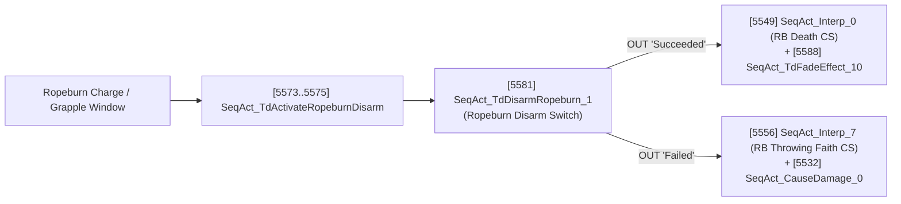

# Mirror's Edge (2009) — Complete Kismet Sequence Graphs & Gameplay Scripting RE

This document provides a comprehensive reverse-engineering specification of all **Kismet visual scripting graphs (`Engine.Sequence`)**, custom **`TdGame.u` sequence nodes**, prefab sub-sequence architectures, interactive puzzles, AI combat orchestrators, and boss state machines across all 10 campaign chapters (`SP00`–`SP09`) and Time Trials (`TT_*`) in *Mirror's Edge* (DICE, Unreal Engine 3 build 3323 / package version `536/43`).

> **Companion Spec**: Helicopter AI, flight splines (`TdAttackPathNode`), `TdVehicle_Helicopter`, `TdAI_HeliController`, `TdAI_Gunner`, `SeqAct_TdHelicopterFactory`, and `SeqAct_TdDummyWeaponFire` are detailed in [SCRIPTING_AND_HELICOPTERS_RE.md](file:///Users/tomnom/git/mierrorsedgere/docs/SCRIPTING_AND_HELICOPTERS_RE.md).

---

## 1. Global Kismet Node Census Across All Cooked Maps (`SP00`–`SP09`)

Scanning every persistent (`*_p.me1`), scripting (`*_Spt.me1`), sluice/airlock (`*_Slc_Spt.me1`), and cutscene (`*_CS.me1`) package under `TdGame/CookedPC/Maps/` yields **1,116 `Sequence` graphs**, **1,689 commented `SequenceFrame` / `SequenceFrameWrapped` organizational boxes**, and **26,400+ Kismet node exports**:

| Kismet Class | Domain | Global Count | Primary Role in Cooked Sequences |
| :--- | :--- | ---: | :--- |
| `SeqVar_Object` | Variable | **7,121** | World actor bindings (`InterpActor`, `TdTrigger`, `Emitter`, doors, valves) |
| `SeqAct_TdPlaySound` | Audio / VO | **1,963** | Occlusion-aware 3D SFX & radio dialogue playback (`OcclusionFilterDuckLevel`) |
| `SequenceFrame` / `SequenceFrameWrapped` | Editor / Layout | **1,689** | Commented sequence bounding boxes documenting every encounter & puzzle |
| `SeqEvent_TakeDamage` | Event | **1,207** | Breakable glass (`SPT_OfficeGlas01`), shootable vents, pipes, and server racks |
| `SeqAct_Interp` + `InterpData` | Matinee | **1,162** | Doors, elevators, valves, trains, cranes, trucks, and 1st-person cutscenes |
| `SeqAct_ToggleHidden` | Visibility | **1,039** | Swapping intact vs. shattered glass, hiding streaming props, crowd cars |
| `SeqAct_ChangeCollision` | Physics | **1,029** | Disabling door/glass collision after barge/shatter or during elevator travel |
| `SeqAct_Delay` | Flow Control | **927** | Staggered VO lines, door auto-close timers, alarm/explosion sequencing |
| `SeqAct_ActivateRemoteEvent` / `SeqEvent_RemoteEvent` | Cross-Level Bus | **892 / 674** | Decoupled messaging between `_p.me1` (checkpoints/streaming) and `_Spt.me1` |
| `SeqAct_SetStaticMesh` | Visual Swap | **786** | Randomizing car/pedestrian meshes & damaged server/obstacle states |
| `SeqAct_ActorFactory` | Spawner | **757** | Standard emitters, physics props, and ambient backdrop actors |
| `SeqEvent_Touch` / `SeqEvent_TdTouch` | Trigger | **750 / 568** | Player/AI volume entry (`SeqEvent_TdTouch` adds parkour `Momentum` filter) |
| `SeqVar_TdLocalPawn` | Variable | **697** | Direct reference to local `TdPlayerPawn` (Faith) without needing trigger instigator |
| `SeqAct_Gate` / `SeqAct_Switch` / `SeqAct_RandomSwitch` | Flow Control | **574 / 549 / 322** | One-shot encounter latches, multi-hit damage counters, procedural randomizers |
| `SeqEvt_TdCheckpointLoaded` / `SeqAct_TdCheckpoint` | Progression | **424 / 178** | Restoring sub-level state when loading a hard/soft checkpoint & saving progress |
| `SeqAct_PlaySound` / `SeqAct_Toggle` / `SeqAct_CauseDamage` | Core UE3 | **380 / 379 / 357** | Non-occluded UI/stinger audio, toggling lights/emitters/kill-volumes, scripted hits |
| `SeqAct_TdActorFactory` | AI Spawner | **263** | Spawns `TdBotPawn` squads (`AITemplate_PatrolCop`, `Assault`, `PursuitCop`, etc.) |
| `SeqAct_TdSetPathLimits` | AI Navigation | **169** | Restricts spawned `TdAIController` pawns to a `TdPathLimits` volume |
| `SeqAct_MultiLevelStreaming` / `SeqAct_StreamingZone` | Streaming | **150 / 118** | Asynchronous sub-level load/unload orchestration across chapter airlocks |
| `SeqAct_AIReleaseScripting` / `SeqAct_AIMoveToActor` | AI Directives | **145 / 132** | Releases scripted intro bots into autonomous combat (`Go to Roaming`) |
| `SeqAct_TdFadeEffect` | Camera / HUD | **132** | Screen fade-in / fade-out transitions (`FadeEffectType`: `FadeIn`, `FadeOut`) |
| `SeqAct_DisableLoadFromLastCheckpoint` | Progression | **126** | Locks out manual "Load Last Checkpoint" during active level streaming/elevators |
| `SeqAct_TdDummyWeaponFire` | Setpiece Combat | **116** | Scripted gunfire barrages (`TdWeapon_MG_HK21`, sniper warning shots, valve shots) |
| `SeqAct_TdAIPlayAnimation` | AI Animation | **113** | Door-bashing, helicopter rappelling, elevator exits (`EPlayAnimationEndState`) |
| `SeqAct_TdDisablePlayerInput` / `SeqAct_TdEnablePlayerInput` | Player Control | **73 / 65** | Locks look/move input & enters cinematic mode for cutscenes/elevators |
| `SeqEvent_TdUsed` | Interaction | **68** | Player `Use` (`E`) on `TdTrigger` buttons (`TIT_Button`) and valves (`TIT_Valve`) |
| `SeqAct_TdGetStatCount` / `SeqAct_TdRegisterStat` | Runner Bags | **60 / 30** | Tracks collectible yellow Runner Bags (`EASID_PackageFound_0a` .. `9c`) & stats |
| `SeqAct_TdTutorialMessage` | Tutorial UI | **56** | On-screen prompt cards with optional slomo (`bTriggerSlomo`) & key callouts |
| `SeqAct_TdAIPerfectAim` | AI Accuracy | **53** | Escalates enemy hit probability when Faith lingers in exposed sightlines |
| `SeqEvt_TTRaceFinished` / `CountDown` / `Loaded` / `Started` / `FinishLine` | Time Trials | **47 / 46 / 24 / 24 / 23** | Full Time Trial race lifecycle across `TT_*` sub-levels |
| `SeqAct_TdCrowdSpawner` | Living World | **34** | Ambient pedestrian & flock spline spawning along `TdCrowdPathNode` networks |
| `SeqAct_TdStartMovementChallenge` / `SeqEvt_TdMovementChallenge*` | Tutorial | **28 / 32 / 28 / 19** | Prologue (`SP00`) parkour & disarm challenge state machines |
| `SeqAct_TdBlockWhileLoading` | Streaming | **32** | Freezes game & shows loading indicator if async sub-level streaming isn't finished |
| `SeqAct_TdTriggerSubtitle` / `SeqAct_SetCombatRange` | VO / AI | **32 / 31** | Localized subtitle overlays; custom AI preferred/max engagement distances |
| `SeqAct_TdSpawnPooledEmitter` / `SeqAct_TdCameraShake` | FX / Camera | **28 / 28** | Pooled PhysX particle bursts; parametric camera shake (`Amplitude`, `Frequency`) |
| `SeqAct_AIHoldFire` / `SeqAct_TdMuteAI` | AI Directives | **27 / 27** | Suppresses AI gunfire or combat bark VO during stealth/intro setups |
| `SeqAct_TdPhysXGate` | Physics | **24** | Branches Kismet execution based on whether hardware PhysX effects are enabled |
| `SeqAct_ActivateLOI` / `DeactivateLOI` / `SeqAct_TdActivateLookAtPoint` | Camera (`Alt`) | **21 / 21 / 20** | Controls "Location of Interest" (`TdLookAtPoint`) camera hints & forced turns |
| `SeqAct_TdPlayerFail` / `SeqAct_AIImmobile` / `SeqAct_TdHelicopterFactory` | Gameplay | **19 / 17 / 16** | Instant mission failure screen; stationary AI turret/sniper posts; heli spawner |
| `SeqAct_TdInElevator` / `SeqEvt_TdCheckpointActivated` | Streaming / CP | **16 / 13** | Flags player inside moving lift (`In Elevator`); post-checkpoint save callback |
| `SeqAct_AIFireAt` / `SeqAct_TdLevelCompleted` / `SeqAct_AIThrowGrenade` | Combat / End | **13 / 10 / 10** | Scripted AI target fire; chapter completion transition; scripted flash/smoke toss |
| `SeqAct_TdActivateRopeburnDisarm` / `SeqAct_TdDisarmRopeburn` | Boss (`SP04`) | **3 / 1** | Ropeburn QTE disarm window activation and `Succeeded` / `Failed` branch switch |
| `SeqAct_TdTriggerBoss` / `SeqEvt_TdCelesteBossFight` | Boss (`SP07`) | **3 / 2** | Celeste multi-stage boss fight controller (`BossFightIndex` 3 & 4) & disarm hook |

---

## 2. Decompiled Custom `TdGame.u` Kismet Node Taxonomy

Decompiling `TdGame.u` via [tools/uscript_decompiler.py](file:///Users/tomnom/git/mierrorsedgere/tools/uscript_decompiler.py) reveals the exact UnrealScript properties, enums, and link signatures for all DICE-authored sequence classes:

### 2.1 Chapter Lifecycle, Streaming & Checkpoint Nodes

#### `SeqAct_TdLevelCompleted` (`extends SequenceAction`, `ObjName="Complete A Level"`)
Terminates the current chapter, saves profile progression/Runner Bag stats, and loads the next campaign map at a specific checkpoint:
```unrealscript
class SeqAct_TdLevelCompleted extends SequenceAction;
var string NextCheckpointName;
var string NextLevelName;
```

Every single campaign transition in the retail game is governed by the 10 instances of `SeqAct_TdLevelCompleted`:

| Chapter | Package & Export Index | `NextLevelName` | `NextCheckpointName` |
| :--- | :--- | :--- | :--- |
| **SP01 (The Edge)** | `SP01/Edge_p.me1 [1315]` | `'Escape_p'` | `'Start'` |
| **SP01 (Flight)** | `SP01/Escape_p.me1 [1491]` | `'Stormdrain_p'` | `'Canals'` |
| **SP02 (Jacknife)** | `SP02/Stormdrain_p.me1 [1207]` | `'Cranes_p'` | `'SP03_Start'` |
| **SP03 (Heat)** | `SP03/Cranes_p.me1 [1060]` | `'subway_p'` | `'Start_point_subway'` |
| **SP04 (Ropeburn)** | `SP04/Subway_NxtPlat_Spt.me1 [1540]` | `'mall_p'` | `'LevelStart'` |
| **SP05 (New Eden)** | `SP05/Mall_p.me1 [1668]` | `'factory_p'` | `'start_point'` |
| **SP06 (Pirandello/Kruger)** | `SP06/Factory_Pursu_Spt.me1 [8158]` | `'Boat_p'` | `'Start'` |
| **SP07 (The Boat)** | `SP07/Boat_p.me1 [1154]` | `'Convoy_p'` | `'Kates_convoy'` |
| **SP08 (Kate)** | `SP08/Convoy_p.me1 [877]` | `'Scraper_p'` | `'Scraper_Start'` |
| **SP09 (The Shard)** | `SP09/Scraper_Heli_Spt.me1 [6670]` | `'tdmainmenu'` | *(none — returns to Main Menu after credits)* |

#### `SeqAct_TdCheckpoint` (`ObjName="TdSetActiveCheckpoint"`) & `SeqEvt_TdCheckpointLoaded`
- **`SeqAct_TdCheckpoint`**:
  - `var bool teleportPawnToCheckpoint` — if `true`, warps Faith directly onto the linked `TdPlaceableCheckpoint` actor.
  - `var bool skipSaveToDisk` — distinguishes **Soft Checkpoints** (`skipSaveToDisk=True`, in-memory respawn point during an active run) from **Hard Checkpoints** (`skipSaveToDisk=False`, persisted to profile save and selectable from Chapter Select).
  - `var bool done` — latches once activated.
- **`SeqEvt_TdCheckpointLoaded`**: Fires in every streamed sub-level (`*_Spt.me1`) when a specific checkpoint is loaded or respawned from, re-initializing doors, elevators, music stems, and AI spawners without re-running prior cutscenes.

#### Streaming Airlocks (`SeqAct_StreamingZone`, `SeqAct_MultiLevelStreaming`, `SeqAct_TdBlockWhileLoading`, `SeqAct_TdInElevator`)
- Mirror's Edge divides every chapter into high-detail combat/parkour zones (`*_Spt.me1`) separated by L-corridors, maintenance vents, or elevators (`*_Slc_Spt.me1`, internally named **"Sluices"** by DICE level designers).
- Entering a sluice triggers `SeqAct_DisableLoadFromLastCheckpoint(bShouldBeDisabled=True)` so the player cannot reload a checkpoint whose geometry is mid-unload, fires `SeqAct_MultiLevelStreaming` / `SeqAct_StreamingZone` to unload behind and stream ahead, and places a `SeqAct_TdBlockWhileLoading` gate right before the sluice exit door.

---

### 2.2 Interactive World Props: Buttons, Steam Valves & Doors

#### `TdTrigger` + `TdValveSkeletalMeshActor` + `SeqEvent_TdUsed`
Interactive buttons and turn-valves combine three classes:
1. **`TdTrigger` (`extends Trigger`)**:
   ```unrealscript
   enum ETriggerInteractType {
       TIT_Button,     // Standard waist-height keypad / elevator call button
       TIT_Valve,      // Multi-revolution rotary steam/gas valve wheel
       TIT_ButtonHigh, // Overhead / high-reach switch
   };
   var ETriggerInteractType TriggerType;
   var float AngleLimit;      // Default 175.0 deg max player facing cone
   var int NumberOfRevs;      // Revolutions required to complete valve turn (default 1)
   var int CurrentRev;        // Current completed revolutions
   var bool bValveStartOpen;
   var bool Enabled;          // Toggled via SeqAct_Toggle
   ```
2. **`TdValveSkeletalMeshActor` (`extends SkeletalMeshActor`)**:
   - Exposes `PlayAnimation()` and `AddValveRoll()`, rotating the valve wheel skeletal mesh in lockstep with Faith's 1st-person valve-turning animation (`valve` AnimSet).
3. **`SeqEvent_TdUsed` (`extends SeqEvent_Used`)**:
   - `var TdValveSkeletalMeshActor InteractSkelMeshRef;` — binds the world valve actor directly to the `Used` event node.
   - `var bool bInteract;` — latent execution flag (`bLatentExecution=True`) that holds the Kismet pin until the valve revolutions or button press animation finishes, then fires `Used` / `Aborted` output pins into `SeqAct_Toggle` (shutting off steam `Emitter` + `TdKillZoneVolume` damage volumes + `SeqAct_TdPlaySound` hiss audio).

#### Barge doors (`SPT_OnewayDoor_Seq`)
A door Faith barges or kicks open is an `InterpActor` leaf driven by its own small sequence. `TdMove_Barge.HitObject` deals it `TakeDamage(100, .., TdDmgType_Barge)`, and:
1. **`SeqEvent_TakeDamage`** (`ReTriggerDelay` 4.4 s, longer than the whole cycle) plays `Doors.Door_Barge` on the leaf (`SeqAct_TdPlaySound`) and starts the **open matinee** (0.6 s): the leaf turns to -103.755 degrees by 0.25 s, bounces back to -98.13 at 0.4 s and settles at -103.755 at 0.6 s. Its sound track plays `Doors.Door_Hit` at 0.
2. **`SeqAct_Delay`** 3 s.
3. The **close matinee** (0.6 s) swings it shut, about 13.9 degrees past closed before it settles; its sound track plays `hatch.Squek` at 0 and `Doors.Door_Hit` at 0.25 s. The leaf is `bStopOnEncroach`, so it holds still rather than swing into the player, and `SeqAct_ChangeCollision` puts back the doorway's blocker once the pawn is out of it.

The port runs this in `ParkourController::open_barge_door` / `update_barge_doors` (oracle Stage 12D). It turns the leaf away from whoever opened it, whichever side the hit came from.

---

### 2.3 AI Squad Spawning & Tactical Combat Orchestration

#### `SeqAct_TdActorFactory` (`extends SeqAct_ActorFactoryEx`, `ObjName="Takedown Bot Factory"`)
Every enemy wave in the campaign (`263` instances) is spawned via `SeqAct_TdActorFactory` paired with a `TdActorFactoryAI` (`NewActorClass=TdBotPawn`, `ControllerClass=TdAIController`):
```unrealscript
class SeqAct_TdActorFactory extends SeqAct_ActorFactoryEx;
var class<AITemplate> BotTemplate;        // e.g. AITemplate_PatrolCop, AITemplate_Assault, AITemplate_Support, AITemplate_PursuitCop
var CoverGroup InitialCoverGroup;         // Cover links assigned immediately on spawn
var TdAIGroup Group;
var TdAITeam Team;
var int MainWeaponAmmoDrop_Easy, MainWeaponAmmoDrop_Medium, MainWeaponAmmoDrop_Hard;
var int MainWeaponAmmoDisarm_Easy, MainWeaponAmmoDisarm_Medium, MainWeaponAmmoDisarm_Hard;
var bool bSeePlayerOnSpawn;               // Instantly alerts AI to Faith's location without line-of-sight check
var bool SpawnIntoKismetState;            // Keeps AI in scripted state until SeqAct_AIReleaseScripting
var bool bUseRunnerVision;                // Highlights weapon/disarm target in red Runner Vision
var bool bChaseAI;                        // Enables relentless parkour pursuit behavior
var int DeathCount;                       // Tracks squad casualties to fire the 'All Dead' output pin
```

- **Key Output Pins**:
  - `Spawned One` (`SpawnedOneLink`): Fires each time an individual `TdBotPawn` spawns (often wired into `SeqAct_TdAIPlayAnimation` for door-barge or helicopter-rappel entry animations, followed by `SeqAct_AIReleaseScripting`).
  - `All Dead` (`AllDeadLink`): Fires `EveryoneDied()` when `DeathCount` reaches `SpawnCount`, unlocking exit elevators (`SP05/Mall_Mall_Spt`, `SP07/Boat_PDeck_Spt`, `SP09/Scraper_Lobby_Spt`) and crossfading combat music stems back to ambient (`All_AI_Dead_Music_Change`).
- **Tactical Modifier Nodes**:
  - `SeqAct_TdSetPathLimits` (`Limits` -> `TdPathLimits`): Prevents rooftop/balcony cops from pathfinding outside their designated arena.
  - `SeqAct_SetCombatRange` (`PreferredRange`, `MaxRange`): Forces shotgun/assault pushers into close quarters or keeps riflemen at standoff range.
  - `SeqAct_TdAIPerfectAim` (`AccuracyImprovementRate=1.0`): Triggered by "Accuracy Volumes" / timers (`Escape_Off_Spt`, `Mall_HW_Spt`, `Subway_Plat_Spt`) to guarantee lethal accuracy if the player stalls outside intended cover.

---

### 2.4 Boss Encounters (`SP04` Ropeburn & `SP07` Celeste)

#### 1. Ropeburn Rooftop Fight (`SP04/Subway_Roof_Spt.me1`)
Traced directly from cooked exports `[5573]`–`[5581]` in `Subway_Roof_Spt.me1`:

- `SeqAct_TdActivateRopeburnDisarm` enables the special counter-disarm window on `SeqVar_TdLocalPawn` during Ropeburn's rebar swing.
- `SeqAct_TdDisarmRopeburn` evaluates whether the player pressed Disarm during the Reaction Time window and branches cleanly into `Succeeded` (playing the Matinee cutscene where Ropeburn goes over the ledge) or `Failed` (Ropeburn throws Faith back onto the rooftop and applies damage).

#### 2. Celeste Multi-Stage Chase & Duel (`SP07/Boat_Chase_Spt.me1`, `Boat_Deck_Spt.me1`, `Boat_End_Spt.me1`)
Traced from `[3163]`, `[6812]`, `[3260]`, and `[3274]`:
- **`SeqAct_TdTriggerBoss`**:
  - `Boat_Chase_Spt.me1 [3163]` & `Boat_Deck_Spt.me1 [6812]`: `BossFightIndex = 3` (Upper Deck sniper & chase phase where Celeste snipes steam valves `Valve 01`–`03d` via `SeqAct_TdDummyWeaponFire` and transitions into parkour chase routes `Route 2`–`Route 7`).
  - `Boat_End_Spt.me1 [3260]`: `BossFightIndex = 4` (Final enclosed lower-deck duel, spawning `AITemplate_Celeste` via `[3256] SeqAct_TdActorFactory_0`).
- **`SeqEvt_TdCelesteBossFight` (`[3274]`)**:
  - Exposes the `Disarmed` output pin, which fires `[3258] SeqAct_TdFadeEffect_0` and remote events `[3236]` / `[3239]` to transition into the final cutscene once Faith disarms Celeste.

---

### 2.5 Notable Procedural & Multi-Stage Sub-Sequence Architectures

1. **Subway Roof-Surfing Procedural Obstacle Randomizer (`SP04/Subway_Train_Spt.me1`)**:
   - Contains sub-sequences `Trains_and_triggers`, `50/50_strafe_0`..`6`, and `random_piece_script` (`2in4_duck_3`, `3/4_duck_2`, `3in4_jump_4`, `Duck_1`, `Duck_2`, `Jump_1`, `Jump_3`, `Jump_4`, `Pillar_tunnel_only_1`..`4`).
   - Uses `SeqAct_RandomSwitch` wired into `SeqAct_SetStaticMesh` and `SeqAct_ChangeCollision` to randomize low jump barriers vs. high duck girders and oncoming train tracks on each run.
2. **Shard Server Room 4-Cluster Destruction (`SP09/Scraper_Mill_Spt.me1`)**:
   - Organized into 4 parent sub-sequences (`Cluster_01`..`Cluster_04`), containing 14 child server sub-sequences (`Cluster_1_server_1`..`3`, `Cluster_2_server_1`..`3`, `Cluster_3_server_1`..`4`, `Cluster_4_server_1`..`4`).
   - In `Cluster_1_server_1`, `SeqEvent_TakeDamage` (`[8197]`, `[8198]`) on the server rack `StaticMeshActor [9837]` routes through `SeqAct_Switch_21` / `SeqAct_Switch_11` to toggle spark/explosion `Emitter_19 [3061]` and fire `[7686] SeqAct_FinishSequence_4`. Once all servers in a cluster complete, the parent cluster updates the server destruction counter to unlock the rooftop staircase (`Scraper_Heli_Spt`).
3. **Sluice Elevator State Machine (`Spaghetti_Box` in `Stormdrain`, `Convoy`, `Escape`, `Mall`, `Scraper`)**:
   - Modular elevator sub-sequence containing child graphs `door_state`, `Dyn_Doors`, `Lower_Doors`, `upper_doors`, `mainlift`, and `up_or_down`.
   - Uses `SeqCond_TdCaseLanguage` (`[2733]` in `Escape_Intro-Off_Spt.me1`, `[6078]` in `Mall_R1_Spt.me1`, `[3145]` in `Scraper_Deck-Lobby_Spt.me1`) to swap out the localized elevator video/audio newscast while `SeqAct_TdInElevator` locks checkpoint reloading until the destination floor streams in.
4. **Runner Bag Collectibles (`BAG 1`, `BAG 2`, `BAG 3` in every `*_p.me1`)**:
   - Every persistent chapter map contains three `BAG 1`..`BAG 3` frames listening for `SeqEvent_TdUsed` on the hidden yellow Runner Bag actors, calling `SeqAct_TdRegisterStat` with enum `EAchievementStatsID::EASID_PackageFound_0a` (`11`) through `EASID_PackageFound_9c` (`40`) and playing the collectible chime (`SeqAct_PlaySound`).
