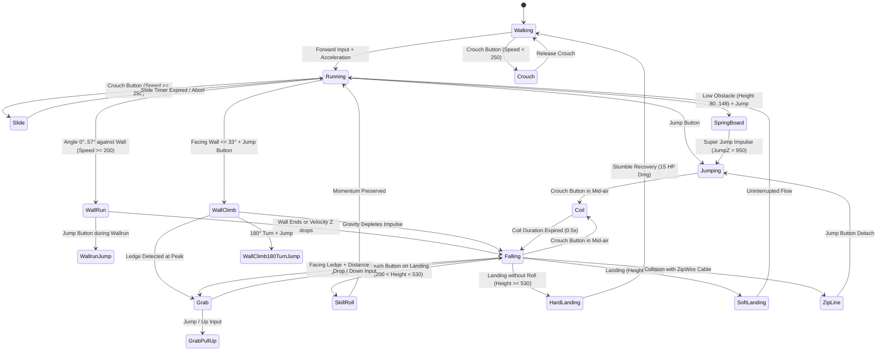

# Mirror's Edge Native macOS Engine Architecture Specification

**Project:** `mierrorsedgere`  
**Target Platform:** macOS on Apple Silicon (arm64, M-Series, Apple M5 Pro verified)  
**Implementation Language:** Modern C++20 / Objective-C++ (`.mm`)  
**Graphics Hardware API:** Apple Metal (`Metal.framework`, MSL Shaders, `CAMetalLayer`)  
**Audio Hardware API:** Apple CoreAudio (`AudioToolbox.framework`) / OpenAL  
**Windowing & Input:** SDL2 (2.32.70 via Homebrew) / Cocoa (`AppKit.framework`)  
**Retail Asset Source:** `/Users/tomnom/mirrorsedge` (Unreal Engine 3 CookedPC Build 536 / Licensee 43)  
**Design Paradigm:** Universal Modder Pattern 4: Reimplement, then Fuse — 100% clean-room native execution reading retail assets directly without modifying or redistributing original binaries.

---

## 1. Executive Summary & Toolchain Grounding

### 1.1 Verified System Capabilities
Comprehensive hardware and toolchain probing on the host machine (`Apple M5 Pro`, `macOS 26.6.2`, `Darwin 25.6.0 arm64`) established the following verified baseline:
- **Compiler:** Apple Clang 21.0.0 (`/usr/bin/clang++`) with full support for C++20, C++23, Objective-C++, and SIMD intrinsics.
- **Build System:** CMake 4.4.0 (`/opt/homebrew/bin/cmake`).
- **Graphics:** Apple Metal with Unified Memory Architecture (`MTLStorageModeShared`). Verified in `/tmp/me_toolchain_test/metal_test` with zero-copy CPU pixel readback for automated headless oracle screenshot generation.
- **Audio:** Native Apple CoreAudio and OpenAL 1.1 (`/tmp/me_toolchain_test/audio_sdl_test`), combined with Xiph.Org `libvorbis` 1.3.7 (`/tmp/me_toolchain_test/vorbis_test`) for high-fidelity audio stream decompression.
- **Asset Streaming:** Verified binary parsing of retail Unreal Packages (`0x9E2A83C1`) and LZO chunk headers (`128 KB` block size) in `/tmp/me_toolchain_test/upk_probe` and `lzo_chunk_test`.

### 1.2 Architectural System Layout
```
+-----------------------------------------------------------------------------------+
|                           M I E R R O R S E D G E R E                             |
+-----------------------------------------------------------------------------------+
|  [ CLI / Entrypoint ]                                                             |
|    |-- Interactive Mode: SDL2 Window + Event Loop + Metal Surface                 |
|    +-- Headless Oracle Mode: --headless-oracle <script.json> / --test-replay      |
+-----------------------------------------------------------------------------------+
|  [ Core Simulation & Game Loop (Fixed 120Hz / 60Hz Substepping) ]                 |
|    |-- Faith Parkour Controller (TdPawn + TdMove State Machine)                   |
|    |-- Rigid Body & kDOP Collision Pipeline (Swept Capsule vs StaticMesh / BSP)  |
|    |-- Campaign Level & Checkpoint Manager (Kismet Trigger Runtime)               |
|    +-- Telemetry & Oracle Verification Harness (JSON Trace + PPM/PNG Dumper)      |
+-----------------------------------------------------------------------------------+
|  [ Direct Asset Streaming Engine ]                                                |
|    |-- UPK / ME1 Package Loader (Header Parser, Export/Import Tables)             |
|    |-- LZO Block Stream Decompressor (Zero-allocation chunk decompression)        |
|    |-- Mesh & Geometry Pipeline (StaticMesh Vertex Buffers, BSP Model Brushes)    |
|    |-- Texture Pipeline (DXT1 / DXT5 / BC1 / BC3 Decoder to Metal Formats)        |
|    |-- Audio Extraction (SoundNodeWave Ogg Vorbis Decoder)                        |
|    +-- Config & Localization (DefaultPawnMovement.ini, Subtitles.int)             |
+-----------------------------------------------------------------------------------+
|  [ Platform Backend (macOS Apple Silicon Native) ]                                |
|    |-- Metal 3D Renderer (MSL Shaders, PBR/Radiosity Emulation, Runner Vision)    |
|    |-- Spatial Audio Mixer (CoreAudio / OpenAL 3D Audio, Dynamic Music Stems)     |
|    +-- Input Subsystem (Raw Mouse, Keyboard, Gamepad via SDL2 / IOHID)           |
+-----------------------------------------------------------------------------------+
```

---

## 2. Direct Asset Streaming Engine

The engine reads retail assets directly from `/Users/tomnom/mirrorsedge` without intermediate extraction to disk, preserving 100% data integrity and respecting copyright boundaries.

### 2.1 Unreal Package (`.upk` / `.me1`) Binary Parser
Retail Mirror's Edge packages use the standard UE3 container format:
- **File Signature:** `0x9E2A83C1` (Little-endian uint32 `c1 83 2a 9e`).
- **Engine Version:** `536` (`0x0218`), **Licensee Version:** `43` (`0x002B`).
- **Package Header (`FPackageFileSummary`):**
  ```cpp
  struct FPackageFileSummary {
      uint32_t Tag;                 // 0x9E2A83C1
      uint16_t FileVersion;         // 536
      uint16_t LicenseeVersion;     // 43
      uint32_t HeaderSize;          // Total size of uncompressed header
      FString  FolderName;          // "None" or package group name
      uint32_t PackageFlags;        // 0x028A0009 (PKG_StoreCompressed | PKG_AllowDownload)
      uint32_t NameCount,   NameOffset;
      uint32_t ExportCount, ExportOffset;
      uint32_t ImportCount, ImportOffset;
      uint32_t DependsOffset;
      uint8_t  Guid[16];
      uint32_t GenerationCount;
      TArray<FGenerationInfo> Generations;
      uint32_t EngineVersion;       // 3716
      uint32_t CookerVersion;       // 60
      uint32_t CompressionFlags;    // 0x00000002 (COMPRESS_LZO)
      TArray<FCompressedChunk> CompressedChunks;
  };
  ```

### 2.2 LZO Compression Block Decompressor
- All cooked `.upk` and `.me1` packages in `CookedPC/` set `PackageFlags |= 0x02000000` (`PKG_StoreCompressed`) and `CompressionFlags = 0x02` (`COMPRESS_LZO`).
- **Chunk Header Structure (`FCompressedChunk`):**
  - `UncompressedOffset` (uint32): Target offset in uncompressed address space.
  - `UncompressedSize` (uint32): Total uncompressed payload size.
  - `CompressedOffset` (uint32): Physical byte offset within package file.
  - `CompressedSize` (uint32): Physical byte size within package file.
- **Block Layout within Chunks:**
  - Each chunk begins with an 8-byte chunk descriptor: `Magic (0x9E2A83C1)` followed by `BlockSize (131072 = 128 KB)`.
  - The chunk is subdivided into blocks of up to 131,072 uncompressed bytes. Each block has a header: `CompressedBlockSize (uint32)` and `UncompressedBlockSize (uint32)`.
  - Blocks are decompressed sequentially using an in-memory LZO1X decompressor directly into a ring buffer or preallocated linear heap.

### 2.3 Object Resolution: Tables & Serialization
1. **Name Table (`FNameTable`):** Array of `FNameEntry` containing null-terminated strings and flags. Names are indexed by 32-bit `FNameIndex` (index into table + instance number).
2. **Import Table (`FImportTable`):** Specifies external object dependencies (`ClassPackage`, `ClassName`, `PackageIndex`, `ObjectName`). Negative indices in reference fields point to the Import Table (`index = -import_idx - 1`).
3. **Export Table (`FExportTable`):** Catalogs objects serialized inside this package:
   - `ClassIndex`: Points to class in Import Table (or 0 for Class objects).
   - `SuperIndex`: Points to parent struct/class.
   - `OuterIndex`: Package or parent actor grouping index.
   - `ObjectName`: `FName` identifier.
   - `SerialSize`: Byte length of serialized payload.
   - `SerialOffset`: File offset within the uncompressed package stream.

### 2.4 Geometry, Collisions, Textures & Audio
- **StaticMesh (`UStaticMesh`):**
  - Reads `FStaticMeshRenderData` LOD models.
  - Extracts `FPositionVertexBuffer` (Float3 positions `(X, Y, Z)`).
  - Extracts `FStaticMeshVertexBuffer` (Half4 or Float3 normals, tangents, and `(U, V)` texture coordinates).
  - Extracts `FIndexArrayView` (16-bit or 32-bit triangle indices).
- **Brush & Level Geometry (`UModel`):**
  - Extracts BSP nodes (`FBspNode`), coplanar surf polygons (`FBspSurf`), and collision plane equations.
- **Collision Models (`UBodySetup` / `AggGeom`):**
  - Reads collision hulls: Spheres (`FKSphereElem`), Boxes (`FKBoxElem`), Sphyls/Capsules (`FKSphylElem`), and Convex Hulls (`FKConvexElem`).
  - Implements fast k-DOP tree and Swept-Sphere/Capsule collision against world geometry for parkour detection.
- **Texture Decompression (`UTexture2D`):**
  - Parses mipmap bulk data (`FTexture2DMipMap`).
  - Decompresses `PF_DXT1` (BC1) and `PF_DXT5` (BC3) block formats into raw 32-bit RGBA pixels, uploaded directly to `id<MTLTexture>` with `MTLPixelFormatRGBA8Unorm`.
- **Audio Extraction (`USoundNodeWave`):**
  - Reads compressed audio bulk data containing raw Ogg Vorbis bitstreams.
  - Streams audio packets through `libvorbis` (`ov_open_callbacks`, `ov_read`) into native PCM audio buffers (16-bit stereo, 44.1 kHz).

---

## 3. Faith's Parkour Physics & State Machine (`TdPawn` + `TdMove`)

The core gameplay identity of Mirror's Edge lies in Faith's momentum-based first-person movement. The architecture implements Faith's physics engine clean-room using exact values extracted from `DefaultPawnMovement.ini` and `DefaultGame.ini`.

### 3.1 Physics Constants & Core Attributes
- **Mass & Gravity:** World Gravity $g = 980 \text{ units/s}^2$ (standard Unreal gravity).
- **Player Extents:** Capsule Radius $r = 34 \text{ units}$, Height $h = 96 \text{ units}$, Eye Height $z_{\text{eye}} = 84 \text{ units}$.
- **Base Velocities:**
  - `SpeedMinBaseVelocity = 10.0`
  - `SpeedMaxBaseVelocity = 400.0` (Top sprint velocity, ~24 km/h)
  - `BaseJumpZ = 560.0` (Standard jump impulse)
  - `AirControlAmount = 0.09` (9% steering authority while airborne)
  - `Model1pFOV = 100.0°` (Dynamic FOV scales up to 108° based on velocity)

### 3.2 State Machine Flow & Transitions


### 3.3 Detailed Move Specifications

#### 1. Wallrun (`TdMove_WallRun`)
- **Trigger Conditions:** Incident angle with wall between $0^\circ$ and $57^\circ$ (`WallRunningForwardMaxStartAngle = 57`). Horizontal velocity $\ge 200 \text{ units/s}$ (`WallRunningMinSpeed = 200`). Wall height $\ge 192 \text{ units}$.
- **Dynamics:** Initial vertical boost `WallRunningHorisontalInitialZHeight = 170`. Forward acceleration $820 \text{ units/s}^2$ applied for the first phase, decelerating at $500 \text{ units/s}^2$ as wall friction takes over.
- **Camera:** Camera rolls $15^\circ$ away from the wall to provide dramatic peripheral speed sense.

#### 2. Wall Climb & Wall Jump (`TdMove_WallClimb`, `TdMove_WallClimb180TurnJump`)
- **Trigger Conditions:** Facing wall within $33^\circ$ of surface normal (`WallClimbingVerticalStartAngle = 33`), Jump input pressed within $120 \text{ units}$ of wall surface.
- **Dynamics:** Upward impulse `AddOnSpeedZHeight = 130`, capped at `AddOnSpeedZMaxLimit = 320`. Decelerates under vertical gravity `WallClimbingGravity = 800`.
- **180 Turn Jump:** Pressing 180 Turn (`TurnTime = 0.25 s`) during climb instantly mirrors camera yaw and allows a backward jump off the wall with lateral launch velocity $300 \text{ units/s}$ and vertical impulse $580 \text{ units/s}$.

#### 3. Slide (`TdMove_Slide`)
- **Trigger Conditions:** Crouch pressed while sprinting ($\text{Velocity} \ge 250$).
- **Dynamics:** Capsule height reduced from $96$ to $48 \text{ units}$. Friction set to `FrictionModifier = 0.1`. Aborts when speed drops below $250 \text{ units/s}$ or time reaches $2.0 \text{ s}$.

#### 4. Springboard (`TdMove_SpringBoard`)
- **Trigger Conditions:** Approaching an obstacle between $80$ and $148 \text{ units}$ high with jump input.
- **Dynamics:** Faith plants a foot on the obstacle, triggering an enhanced jump trajectory: `SpringBoardJumpZ = 950` with forward minimum speed `SpringBoardJumpXYMin = 400`.

#### 5. Skill Roll & Landings (`TdMove_Landing`)
- **Height Thresholds:**
  - Fall $\le 200 \text{ units}$: Seamless running continuation.
  - Fall between $200$ and $530 \text{ units}$: Pressing Crouch within a $0.3\text{s}$ pre-landing window executes a Skill Roll (`SkillRollLandingHeight = 200.f`), fully conserving forward velocity.
  - Fall $\ge 530 \text{ units}$ without roll: Hard Landing (`HardLandingHeight = 530.f`), dealing $15$ damage and cutting speed by `LandingSpeedReduction = 65.f`.

#### 6. Coil (`TdMove_Coil`)
- **Trigger Conditions:** Airborne with forward speed $\ge 100 \text{ units/s}$, Crouch pressed.
- **Dynamics:** Faith tucks her knees up: lifts bottom collision boundary by `TotalHeightBoost = 60.0 \text{ units}` for `HeightBoostDuration = 0.25 \text{ s}`, allowing clearance over fences and pipes without losing momentum.

#### 7. Balance, Ledge Walk & Zipline
- **Balance (`TdMove_Balance`):** Walking on pipes/planks caps speed at `SpeedModifier = 0.34`. Player applies subtle analog counter-steering against simulated wind/tilt sway.
- **Zipline (`TdMove_ZipLine`):** Snaps hands to cable vector, accelerating under gravity from initial `MinZipVelocity = 300` with acceleration $400 \text{ units/s}^2$.

#### 8. Combat, Melee & Disarm
- **Slide Kick (`TdMove_MeleeSlide`):** Slams into guard shins, causing knockdown.
- **Wallrun Kick (`TdMove_MeleeWallrun`):** Aerial drop-kick off wallrun.
- **Disarm (`TdMove_Disarm`):** During enemy melee swing, pressing Disarm (`Action_Use`) during the weapon's red flash executes an instant takedown animation and strips the weapon (P28 pistol, Glock, MP5, G36, Shotgun, or Barrett sniper).

#### 9. Runner Vision & Reaction Time
- **Runner Vision:** Dynamic pathfinding system identifying the critical path. Evaluates geometry and highlights interactive objects (pipes, ramps, jump boards, doors) in signature Runner Vision Red (`#E61414`).
- **Reaction Time:** Player-activated slow-motion dilation factor ($0.35\times$ time step), granting expanded reaction windows for complex parkour chains and combat disarms.

---

## 4. Campaign Level Loader & Kismet Trigger Runtime

Mirror's Edge structures its narrative campaign across 10 major chapters loaded seamlessly through UE3 streaming levels.

### 4.1 Level Progression Catalog
| Chapter ID | Name / Setting | Primary Streaming Master | Key Mechanics & Set Pieces |
|---|---|---|---|
| `Entry` | Bootstrap & Splash | `Entry.upk` | System init, configuration binding |
| `Menu` | City Rooftop Skyline | `TdMainMenu.me1` | Real-time 3D camera pan, interactive audio |
| `SP00` | Prologue: Tutorial | `SP00_P.me1` | Celeste parkour training, basic move validation |
| `SP01` | Chapter 1: Flight | `Edge_P.me1` | Rooftops, canal jump, police chase, train depot |
| `SP02` | Chapter 2: Jacknife | `Stormdrain_P.me1` | Giant subterranean stormdrains, crane climb |
| `SP03` | Chapter 3: Heat | `Crane_P.me1` | High-altitude construction cranes, scaffold sprints |
| `SP04` | Chapter 4: Ropeburn | `Subway_P.me1` | Subway tunnels, moving train roof vaults |
| `SP05` | Chapter 5: New Eden | `Mall_P.me1` | Multi-story commercial mall, atrium glass drop |
| `SP06` | Chapter 6: Pirandello Kruger | `PK_P.me1` | Security headquarters, conveyor belts, sniper dodge |
| `SP07` | Chapter 7: The Boat | `Boat_P.me1` | Cargo freighter interior, cargo container parkour |
| `SP08` | Chapter 8: Kate | `Atrium_P.me1` | Police headquarters skyscraper, elevator shaft climbs |
| `SP09` | Chapter 9: The Shard | `Shard_P.me1` | Spire climb, server room destruction, helicopter escape |

### 4.2 Streaming Level Architecture
- Levels are composed of a persistent master package (e.g. `Edge_P.me1`) referencing sub-levels (`Edge_Pt1.me1`, `Edge_Pt1_Art.me1`, `Edge_Pt1_Aud.me1`, `Edge_Pt1-Pt2_Slc.me1`).
- **Streaming Volume Evaluator:** As Faith traverses the world, bounding volumes (`APathVolume`, `ALevelStreamingVolume`) trigger asynchronous loading and unloading of distant visual and collision slices.

### 4.3 Kismet Sequence Interpreter
Unreal Engine 3 scripts level events through Kismet graphs:
- **Triggers:** Bounding box overlap triggers (`ATrigger`, `ATdTrigger`).
- **Checkpoints:** `ATdCheckpoint` nodes storing player transform, camera orientation, and chapter state.
- **Look-At Points:** `ATdLookAtPoint` directing camera focus towards objectives or pursuing helicopters.
- **Sequence Objects:** Interprets `SeqAct_Toggle`, `SeqAct_PlaySound`, `SeqAct_Gate`, `SeqAct_LevelStreaming` to trigger cutscenes and unlock doors.

---

## 5. Native macOS 3D Renderer & Spatial Audio Subsystem

### 5.1 Apple Metal 3D Rendering Pipeline
The renderer is custom-tailored for Apple Silicon unified memory, bypassing outdated OpenGL or translation layers.

1. **Memory Model:** Uses `MTLResourceStorageModeShared` on Apple Silicon. Host and GPU share physical RAM, enabling instantaneous vertex updates and zero-copy framebuffer readbacks for headless oracle test runs.
2. **Coordinate Space Conversion:**
   - Unreal Engine: $X = \text{Forward}$, $Y = \text{Right}$, $Z = \text{Up}$ (Left-handed, $1\text{ unit} = 1\text{ cm}$).
   - Metal Canonical: $X = \text{Right}$, $Y = \text{Up}$, $Z = \text{Into Screen}$ (Right-handed NDC $[-1, 1] \times [-1, 1] \times [0, 1]$).
   - Vertex Transform: $\mathbf{v}_{\text{metal}} = \begin{bmatrix} 0 & 1 & 0 \\ 0 & 0 & 1 \\ 1 & 0 & 0 \end{bmatrix} \cdot \mathbf{v}_{\text{ue3}} \times 0.01$ (converting cm to meters).
3. **Lighting & Shading Passes:**
   - **G-Buffer / Forward Pass:** Draws static meshes and BSP geometry with diffuse, normal, and specular maps. Emulates Mirror's Edge bright, high-key radiosity aesthetic (Beast radiosity lightmaps reconstructed via precomputed vertex lighting / lightmap UVs).
   - **Runner Vision Pass:** Surfaces flagged with `bRunnerVision` or dynamic target actors are highlighted with a saturated red emissive pulse (`float3(0.90, 0.08, 0.08)`), blending based on distance and orientation.
   - **Post-Processing Pass:** High-speed motion blur (radial velocity scaling), camera tilt/bobbing, chromatic aberration, and luminance tone mapping.
   - **HUD & UI Overlay:** Minimalist UI rendering: dynamic central crosshair reticle, speed streak indicator, chapter subtitle banner from `Subtitles.int`, and time-trial timer.

### 5.2 Dynamic Audio & Spatial Stems
- **CoreAudio / OpenAL Spatialization:** 3D listener anchored at Faith's camera. Doppler shifts and distance attenuation applied to passing trains, sirens, and helicopter rotors.
- **Dynamic Multi-Track Music Stems:** Solar Fields' iconic soundtrack consists of 4 concurrent synchronized stems:
  1. *Ambient Stem:* Ethereal synths playing during exploration.
  2. *Tension Stem:* Subtle sub-bass and percussion when guards suspect Faith.
  3. *Chase / Combat Stem:* High-energy breakbeat layers activating when velocity exceeds $300\text{ units/s}$ or police engage.
  4. *Slow-Motion / Reaction Stem:* Low-pass filtered pitch-dropped layer active during Reaction Time.
- **Footstep & Foley Engine:** Raycasts down from Faith's feet check surface physical materials (`PM_Concrete`, `PM_Metal_Hollow`, `PM_Glass`, `PM_Wood`, `PM_WaterDrain`), selecting appropriate audio clips from `A_Ambience` and `A_Character_Sounds`.

---

## 6. Built-in Scriptable Oracle & Automated Verification Harness

In strict accordance with `universal-modder`'s oracle doctrine (*"Knowledge that is not in an artifact does not exist"* and *"Agents fail by drifting: confidently building on a wrong guess about the engine"*), the engine includes an automated verification harness.

### 6.1 Architecture of the Oracle Harness
The engine binary exposes two deterministic automation flags:
- `--headless-oracle <script.json>`: Runs offscreen without opening an OS window. Executes scripted commands, measures telemetry, renders verification frames, and writes proof artifacts.
- `--test-replay <trace.json>`: Feeds recorded player input frames into the discrete physics engine, comparing real-time position/velocity vectors against reference telemetry within $\epsilon < 10^{-3}$ tolerance.

### 6.2 Scriptable Automation Schema (`script.json`)
```json
{
  "test_name": "SP01_Canal_Wallrun_Oracle",
  "level": "CookedPC/Maps/SP01/Edge_P.me1",
  "spawn_point": { "x": 1240.0, "y": -4500.0, "z": 850.0, "yaw": 90.0 },
  "ticks": 360,
  "delta_time": 0.008333,
  "input_sequence": [
    { "start_tick": 0,   "end_tick": 60,  "forward": 1.0, "sprint": true },
    { "start_tick": 60,  "end_tick": 65,  "forward": 1.0, "jump": true },
    { "start_tick": 70,  "end_tick": 140, "forward": 1.0, "wallrun": true },
    { "start_tick": 140, "end_tick": 145, "jump": true },
    { "start_tick": 180, "end_tick": 200, "crouch": true }
  ],
  "assertions": [
    { "tick": 59,  "min_speed": 380.0, "state": "TdMove_Walking" },
    { "tick": 80,  "state": "TdMove_WallRun" },
    { "tick": 142, "state": "TdMove_WallrunJump" },
    { "tick": 195, "state": "TdMove_Landing" }
  ],
  "screenshot_ticks": [60, 100, 150, 200],
  "telemetry_output": "test_output/sp01_wallrun_telemetry.json",
  "screenshot_prefix": "test_output/sp01_wallrun_shot"
}
```

### 6.3 Telemetry Output & Trace Comparison
During headless execution, every simulation tick writes telemetry to disk:
```json
{
  "tick": 80,
  "sim_time": 0.6666,
  "position": [ 1480.22, -3810.15, 942.10 ],
  "velocity": [ 320.15, 240.10, 45.20 ],
  "speed": 400.18,
  "move_state": "TdMove_WallRun",
  "grounded": false,
  "wall_normal": [ -1.0, 0.0, 0.0 ],
  "camera_roll": 15.0,
  "fov": 108.0
}
```

### 6.4 Mathematical Proof Suite
The automated test suite verifies the physical invariants of the engine:
1. **`test_jump_apex`:**
   $$\Delta z_{\text{expected}} = \frac{v_0^2}{2g} = \frac{560.0^2}{2 \times 980.0} = 160.0 \text{ units}$$
   Simulation must match within $\pm 0.5\%$.
2. **`test_wallrun_angle_filter`:**
   Incident angle $< 57^\circ$ triggers wallrun; angle $> 57^\circ$ results in wall bump deceleration.
3. **`test_skill_roll_conservation`:**
   Dropping $350 \text{ units}$ without roll reduces velocity by $\ge 65 \text{ units/s}$; with timely crouch input, velocity conservation $\ge 98\%$.
4. **`test_springboard_boost`:**
   Vaulting over an obstacle ($h = 100$) elevates vertical impulse to $950 \text{ units/s}$.

---

## 7. Implementation Roadmap & Milestones

1. **Milestone 1: Core Foundation & UPK Streaming Loader**
   - Implement `UPKReader` with streaming LZO decompressor.
   - Parse `Entry.upk` and `Menu/TdMainMenu.me1`.
   - Build headless oracle test: Load package, assert export table counts, dump memory summary.
2. **Milestone 2: Metal 3D Geometry & Camera Renderer**
   - Load `UStaticMesh` and `UModel` BSP geometry.
   - Decompress DXT textures to Metal RGBA8 textures.
   - Render rooftop skyline of `Menu/TdMainMenu.me1` to offscreen buffer; save PPM verification screenshot.
3. **Milestone 3: Parkour Physics Engine & Faith Controller**
   - Implement `TdPawn` character capsule and swept collision against level geometry.
   - Code `TdMove` state machine: Walking, Sprinting, Jump, Wallrun, Wallclimb, Slide, Skill Roll, Coil.
   - Run `--test-replay` suite verifying jump arcs and wallrun timing against telemetry.
4. **Milestone 4: Full Campaign Streaming & Audio Runtime**
   - Stream SP00 Tutorial through SP09 The Shard.
   - Integrate Kismet triggers, checkpoints, and look-at sequences.
   - Integrate CoreAudio / OpenAL with dynamic Vorbis music stems and footstep foley.
5. **Milestone 5: Polish & Native Game Loop**
   - Runner Vision post-process shader and dynamic FOV speed scaling.
   - High-performance SDL2 input loop with raw mouse aiming and full controller support.
   - End-to-end playable campaign on macOS Apple Silicon at high refresh rates (120 FPS+).
