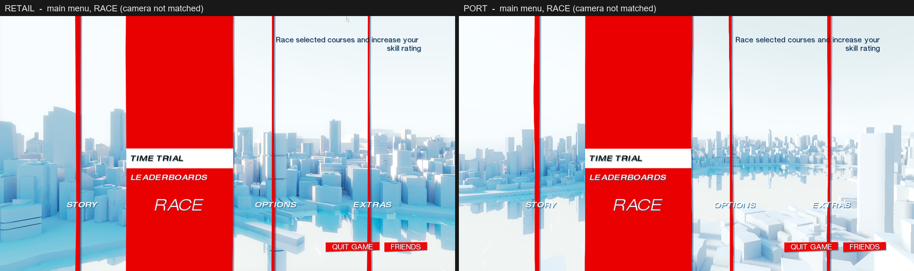
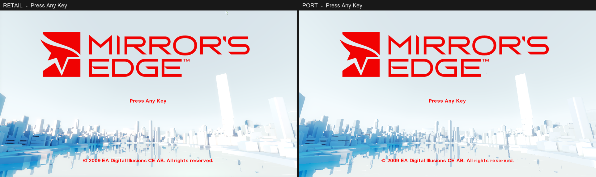
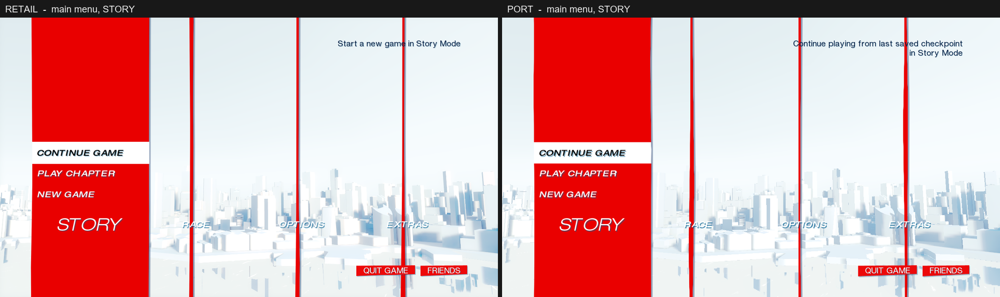
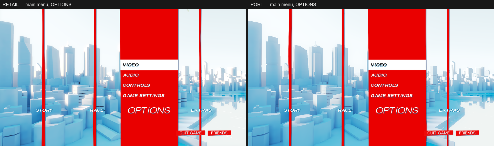
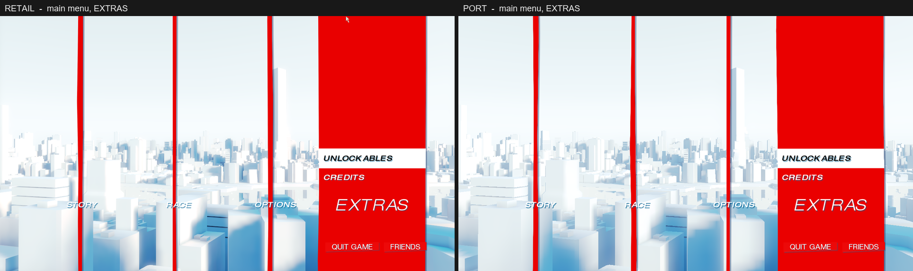

# Mirror's Edge front end: the "Press Any Key" screen and the main menu

What the retail PC game does between boot and the first menu choice, read out of the shipped packages and scripts. Every value below comes from the retail data unless it says "measured" (taken from a retail frame) or "not established".

Tools used: `tools/ue3_tree.py` (property trees), `tools/uscript_bytecode.py` (script), `tools/retail/` (running the retail game).

---

## 1. Boot flow

1. `DefaultEngine.ini` `[URL] Map=TdMainMenu` / `LocalMap=TdMainMenu` loads `Maps/Menu/TdMainMenu.me1` with `TdGame.TdMenuGameInfo`.
2. The level's Kismet (`SeqEvent_LevelLoaded`) opens the UI scene `tdstart` (class `TdUIScene_Start`), the "Press Any Key" screen.
3. Any key released after `TimeTillStartButton` (4 s) hides the start scene's `SafeRegionPanel`, runs the profile and save-file checks, then `StartGame()` opens the scene `TdMainMenu` (class `TdUIScene_MainMenu`).
4. Leaving the start screen idle for `TimeTillAttractMovie` (90 s) plays `Movies/Attract_Movie.bik`; a key stops it.

Both scenes live in `UI/TdUI_FrontEnd.upk` and are cooked into `TdMainMenu.me1` as forced exports. They are authored at 1280x720 (`CurrentViewportSize`).

`[TdGame.TdUIScene_Start]` in `DefaultUI.ini`: `MovieName="Attract_Movie"`, `TimeTillAttractMovie=90`, `TimeTillStartButton=4`, `bGoToLoadGame=false`. `[TdGame.TdUIScene] SceneAnimDuration=0.25`.

---

## 2. The start scene (`tdstart`, `TdUIScene_Start`)

Widget tree, positions in pixels at 1280x720:

| Widget | Class | Left, Top, Right, Bottom | Notes |
|---|---|---|---|
| `SafeRegionPanel` | `UISafeRegionPanel` | 96, 54, 1184, 666 | 7.5% inset each side, `bForce16x9AspectRatio` |
| `ContentPanel` | `UIPanel` | 96, 54, 1184, 666 | docked to all four faces of the safe region; background image is empty |
| `TitleImage` | `UIImage` | 96, 54, 1184, 666 | `TdUIResources.Scene.StartTitleImage`, `ADJUST_Justified`, centred both ways |
| `PressStartLabel` | `UILabel` | 96, 115.2, 1184, 666 | top docked to the panel top with 10% of the panel height as padding; `bHidden` until the timer |
| `CopyrightLabel` | `UILabel` | 96, 631.0, 1184, 666 | top docked to the panel *bottom* with -5.7156% padding |

Both labels use the skin style `TdLabelTextCommonTextBold`: font `UI_Fonts_Final.Helvetica_Small_Bold`, style colour (0, 0.0037, 0.0278), but each label overrides it with `DrawColor = (1, 0, 0, 1)` and centres the text on both axes.

Script (`TdUIScene_Start`):

* `SceneActivated`: `Opacity = 0`; the label text becomes `Localize("TdStart", IsConsole() ? "PressStartText" : "PressAnyKeyText", "TdGameUI")`, which is **"Press Any Key"** on PC; the label is hidden.
* `HandleInputKey`: reacts to `IE_Released` only. If the attract movie is playing, the key stops it. Otherwise, once `TimeElapsedInScene >= TimeTillStartButton`, it hides and disables `SafeRegionPanel` and calls `CheckProfile()` → `InitSavefileSystem()` → `StartGame()` → `OpenScene(TdMainMenu)`.
* The copyright line is `TdStart.CopyrightText`: "© 2009 EA Digital Illusions CE AB. All rights reserved."
* The tick that advances `TimeElapsedInScene`, fades `Opacity` in, shows the label and starts the attract movie is native (`MirrorsEdge.exe`). Measured (section 8): the scene's opacity is 0 for its first second and rises linearly to 1 over the next; "Press Any Key" appears at 4 s and does not pulse.
* `TitleImage` is `ADJUST_Justified` on both axes: the 1024x256 texture is scaled by 1.0625 to the widget's width and, with no vertical alignment set, sits at the widget's top (y = 54 to 326). The logo's opaque part is then x 176 to 1076, y 93 to 287, which is where retail draws it.

---

## 3. The main menu scene (`TdMainMenu`, `TdUIScene_MainMenu`)

Four columns, `ETdMainMenuPanel`: `TDMMP_STORY`, `TDMMP_TIMETRIAL` (caption "RACE"), `TDMMP_OPTIONS`, `TDMMP_EXTRAS`.

### 3.1 Layout (pixels at 1280x720)

| Widget | Left, Top, Right, Bottom | Notes |
|---|---|---|
| `SafeRegionPanel` | 96, 54, 1184, 666 | |
| `PanelButtonsPanel` | 96, 482.4, 1184, 584 | top = safe bottom - 30% of safe height; height 16.6% |
| `StoryCaptionButton` / `BigStoryCaptionButton` | 96, 482.4, 368, 583.8 | each caption is a quarter of the panel: 272 px |
| `TimeTrialCaptionButton` / `Big…` | 368, 482.4, 640, 583.8 | |
| `OptionsCaptionButton` / `Big…` | 640, 482.4, 912, 583.8 | |
| `ExtrasCaptionButton` / `Big…` | 912, 482.4, 1184, 583.8 | |
| `StoryPanel`, `TimeTrialPanel`, `OptionsPanel`, `ExtrasPanel` | caption left/right, 54, 482.4 | one per column, above its caption |
| sub-buttons | panel left/right, 53.55 px tall | stacked upward from the panel bottom; each is 12.5% of the panel height |
| `DescriptionLabel` | 748.8, 54, 1184, 176.4 | left padding 60% of the safe width, bottom padding -80% |
| `ButtonBar` | 96, 635.4, 1184, 666 | bottom 5% of the safe region; buttons right-aligned, 50 px apart |
| `StoryPanelBGImage` … `ExtrasPanelBGImage` | panel left - 27.2, 0, panel right + 27.2, 720 | on `ScreenRegionPanel` (full screen); 10% of the panel width wider on each side |

Sub-buttons, bottom row first (`Top` values 428.85, 375.3, 321.75, 268.2, 214.65):

| Column | Buttons, bottom to top | Hidden on PC when |
|---|---|---|
| STORY | `NewGameButton` "NEW GAME", `LoadLevelButton` "PLAY CHAPTER", `LoadGameButton` "CONTINUE GAME" | CONTINUE without a save (`CanContinueGame`); PLAY CHAPTER until level 0 is unlocked |
| RACE | `LeaderboardsButton` "LEADERBOARDS", `TimeTrialOnlineButton` "TIME TRIAL", `LevelRaceButton` "SPEED RUN" | SPEED RUN until every level is unlocked |
| OPTIONS | `GameSettingsButton` "GAME SETTINGS", `ControlsButton` "CONTROLS", `AudioButton` "AUDIO", `VideoButton` "VIDEO", `GamepadButton` "GAMEPAD SETUP" | GAMEPAD SETUP unless a controller is connected |
| EXTRAS | `CreditsButton` "CREDITS", `UnlocksButton` "UNLOCKABLES", `XBoxAchievementsButton`, `DownloadsButton` | ACHIEVEMENTS and DOWNLOADABLE CONTENT always (not a console) |

`TrainingButton` in the STORY panel has an empty caption and no handler. A hidden button leaves a gap in neither direction: the rows above it keep their docked positions, so e.g. OPTIONS without a controller shows four rows starting at 268.2.

Up/Down wrap inside a column through `ForcedNavigationTarget`s.

### 3.2 Text styles (skin `UI_Skins.UI_Skins_TDUISkins2`)

| Text | Style | Font | Colour | Drop shadow |
|---|---|---|---|---|
| sub-buttons | `TdMainMenu_Sub-Button` | `Helvetica_Medium_Italic` | white | `TdMainMenu_Sub-Button_DropShadow`: (0, 0.078, 0.227, 0.5), `VerticalPctOffset` 0.1 |
| small captions (unselected columns) | `TdLabelText_MenuButton_Normal` | `Helvetica_Medium_Italic` | white | `TdLabelText_MenuButton_DropShadow`: alpha 0.7, vertical 0.1; centred |
| big caption (selected column) | `TdLabelTextTitleThickWhite` | `Helvetica_Headline_Light_Italic` | white | `TdLabelTextTitleThickDropShadow`: alpha 0.5, vertical 0.055, horizontal 0.035; centred |
| description | `TdLabelText_CommonText` | `Helvetica_Small_Normal` | (0, 0.0037, 0.0278) | `TdLabelText_Common_Text_DropShadow_Light`: alpha 0.34; right-aligned, wrapped |

Colours are linear. Fonts are `MultiFont`s in `UI/UI_Fonts_Final.upk` (section 5).

### 3.3 Behaviour (`TdUIScene_MainMenu`)

* First tick: `SetActivePanel(0)` (STORY) unless a scene is being restored.
* `SetActivePanel(i)`: sets `bIsAnimatingPanel`, hides all four panels and shows all four small captions, tells the panel renderer, fires the level event `panel<i+1>` (Kismet moves the camera), shows `DescriptionLabel` only for columns 0 and 1, zeroes `FadeTimer` and plays the UI sound `TabChangeRight`.
* `PanelAnimFinished(i)`: for the active column, shows its panel (focus goes to its first enabled child), swaps the small caption for the big one and clears `bIsAnimatingPanel`.
* `HandleInputKey`: `Left`/`Right` pressed → `SwitchTab(∓1)`, which wraps modulo 4. `Escape` released → `OnQuitGame()`. Clicks are ignored while `bIsAnimatingPanel`.
* `HandleButtonClicked` fires the level event `<ButtonName>_Clicked`, opens the matching scene and plays `Accept`.
* `Tick`: `DescriptionLabel.Opacity = clamp((FadeTimer - TimeToFadeStart) / FadeTime, 0, 1)` with `TimeToFadeStart = 2`, `FadeTime = 1`. `FadeTimer` restarts whenever a button gains focus or the column changes, so the description fades in two seconds after the selection settles.
* Button bar on PC: "Friends" and "Quit", plus "Accept" when a controller is connected.

### 3.4 The red columns are a material (`TdMenuPostProcesWrapper`)

The four `*PanelBGImage` widgets are not textures. `TdMenuPostProcesWrapper.Initialize` gives each one its own `MaterialInstanceConstant` of `UI_Menus.M_MainMenuStick_01` (translucent, unlit) and drives it with parameters:

| Parameter | Set to |
|---|---|
| `StickWidth` | `CosineInterp(MinWidth, 1, AnimPosition / PanelAnimDuration)`; `MinWidth` = `UnfocusedPanelBGWidth` = 0.02, `PanelAnimDuration` = 0.3 s. `AnimPosition` runs up while the column is active and back down when it is not. |
| `SelectTop`, `SelectBottom` | the focused button's top and bottom as a fraction of the screen height (the white selection bar) |
| `SelectOpacity` | 1 once the active column's animation has finished, else 0 |
| `MovementOffset` | `PanelIndex / 4` |
| `MovementAmount` | 0 for the active column, 1 for the others |
| `LeftSideOffset`, `RightSideOffset` | `FRand()` each, once per boot |
| `SelectColor` | `SelectionColor` (class default) |

The material, with `uv` running 0..1 across the widget and `t` the unpaused time in seconds:

```
move   = (T_StickMovementTimeline_01(MovementOffset*5 + t*0.015).g - 0.5) * 5 * MovementAmount
right  = T_StickMaskRight_01( 40u - (StickWidth*0.9*20 + 20 + move),
                              0.15v + 0.15*(RightSideOffset*5 + t) )
left   = T_StickMaskLeft_01 ( 40u - (20*(1 - StickWidth*0.9) - 1 + move),
                              0.15v - 0.15*(LeftSideOffset*5 + t) )
shadow = T_StickMaskRightShadow_01(right's coordinates - (0.5, 0))

inField  = saturate(saturate(SelectTop*512 - v*512) + saturate(v*512 - SelectBottom*512)
                    + (1 - SelectOpacity))
Emissive = lerp(ShadowColor(0.1, 0.2, 0.4), lerp(SelectColor, StickColor(0.91575, 0, 0), inField), right.g)
Opacity  = saturate(right.rgb + shadow.rgb) * left.rgb
```

So a column is centred on its widget and `0.9 * StickWidth` of the widget wide: 293.8 px when open, 5.9 px as a "stick". The two edge masks scroll vertically in opposite directions, which is why the edges are never quite straight and never still, and an unselected stick drifts up to ±20 px sideways along a timeline texture. A blue-grey shadow falls to the right.

---

## 4. The level (`Maps/Menu/TdMainMenu.me1`)

| Actor | What |
|---|---|
| `StaticMeshActor_14/15/16/17/0` | `UI_City.S_City_01` … `S_City_05`, the city, at (0, -960, 0) |
| `StaticMeshActor_4`, `_5`, `_2` | `S_CityBase_01`, `S_CityBaseMountains_01`, `S_CityBaseWater_01` at (0, -960, 0) |
| `StaticMeshActor_7` | a second `S_CityBaseWater_01` at (0, -1616, 1) with `M_CityWaves_01`, no shadow |
| `StaticMeshActor_1` | `S_Skydome_Menu`, scale 33.9562, yaw -8192 |
| `SceneCaptureReflectActor_0` | planar reflection at (0.15, -956, 0), scale 0.2, into `UI_City.T_CityReflection_01_R` (the water) |
| `DirectionalLight_0` | rotation (-2750, 24554, 35134), baker colour (255, 245, 225), brightness 2; lighting is baked into 32 lightmaps |
| `CameraActor_0` … `_11` | twelve viewpoints (section 6) |
| `InterpActor_0` … `_11` | twelve hidden `UI_City.CC_Target` meshes, scale 5.23: the cameras' look-at targets |

### 4.1 Materials (`UI_City`)

Every one is small enough to state whole.

| Material | Used by | Graph |
|---|---|---|
| `M_CityBuildings_01` (and `MI_SP00_01` … `MI_SP09_01`, its instances) | the five city meshes | Diffuse (0.8, 0.83, 0.9); specular (1.2, 0.5, 0.18), power 6. The `Selected` parameter (0 here) lights a district on the chapter-select screen. |
| `M_CityBase_01` | ground, mountains | `fade = T_CityFade_01_A(uv1)`. Diffuse `fade * (0.8, 0.83, 0.9)`; emissive `(1 - fade) * (T_Skydome_Menu(uv2) * 2.2 - 0.5)`: the ground dissolves into the sky's colour toward the horizon. |
| `M_CityReflection_01` | water | Emissive `lerp(T_CityReflection_01_R(screen position) * 1.4 - 0.05, T_Skydome_Menu(uv2) * 2.0 - 0.3, 1 - T_CityFade_01_A(uv1).g)`. |
| `M_CityWaves_01` | the second water plane | Additive, unlit: emissive 200, opacity `T_Waves_01_A(uv0 * 25, panned 0.005/s) * T_Waves_01_A(uv0 * 15, panned 0.015/s)`. |
| `M_Skydome_Menu` | sky dome | Unlit: `Desaturation((VertexColor * 2.4 - 0.55) * (0.75, 0.88, 1.0), 0.7)`. |

### 4.2 Baked lighting

Each lit component carries an `FLightMap2D` in its native data, after the tagged properties:

```
int32 LOD count (1) { ShadowMaps[] (0) ; ShadowVertexBuffers[] (0) ; int32 type (2 = 2D) ;
  LightGuids[] ; 4 x { LightMapTexture2D ref ; float3 ScaleVector } ; float2 CoordinateScale ; float2 CoordinateBias }
```

Textures 0 to 2 are the directional coefficients (2048x2048 `PF_DXT1`, sRGB-encoded, each scaled by its `ScaleVector` of about 4), texture 3 is the simple light map. The light maps are addressed with **UV channel 0** (`LightMapCoordinateIndex` is left at its default; these meshes have no textures, so channel 0 is free for the unwrap). The coefficients are Half-Life 2 basis light: a normal is lit by `dot(N, basis)^2` of each, which for the surface normal is the plain average of the three.

### 4.3 Post process (`WorldInfo.DefaultPostProcessSettings`)

`Bloom_Scale` 0.15; `Scene_ExposureManual` 0.83 with `Scene_ExposureLow` 0.79 and `Scene_ExposureHigh` 0.95; and `Curves`, a colour curve stored as 16 slopes `Ms` and intercepts `Bs` per channel. Piece `i` covers `[i/15, (i+1)/15)`: consecutive pieces meet exactly at the fifteenths, and piece 15 is the identity that only `1.0` reaches. `DOF_*` values are set but `bEnableDOF` is not, and `HazeEnabled` is false, so neither applies.

From linear scene colour to the screen (section 8 has the measurements):

```
x       = scene + Bloom_Scale * wide_blur(scene)
g       = pow(saturate(x * 0.52), 1 / DisplayGamma)        DisplayGamma = 2.73
display = Ms[i] * g + Bs[i],  i = floor(g * 15)            per channel
```

---

## 5. Fonts (`UI/UI_Fonts_Final.upk`)

The front end uses four `MultiFont`s: `Helvetica_Small_Bold` (start screen), `Helvetica_Small_Normal` (description), `Helvetica_Medium_Italic` (sub-buttons, small captions) and `Helvetica_Headline_Light_Italic` (the selected column's caption).

A `MultiFont` is three fonts in one, for 480, 720 and 1080 lines (`ResolutionTestTable`). The engine uses the tier whose height is nearest the viewport's and scales glyphs by `viewport height / tier height`, so at 720p the middle tier is drawn 1:1.

* `Characters`: 3 x 256 `FontCharacter`s of 21 bytes: `StartU`, `StartV`, `USize`, `VSize` (int32), `TextureIndex` (byte), `VerticalOffset` (int32). Tier *n* is entries `256n .. 256n+255`, indexed by Latin-1 code.
* `Textures`: the atlas pages, 256 wide, `PF_DXT5`; the glyph is in the alpha channel.
* `Kerning` (property, 1 on the `Small` fonts, else 0): pixels added after every glyph.
* Native tail: `int32 CharRemap count` (0), `int32 N`, then `N` kerning pairs `{uint16 first, uint16 second, float amount}`, then an `int32` array of 4 offsets splitting those pairs between the three tiers (e.g. 0, 209, 524, 933).

Middle-tier (720p) line heights: `Small_Normal` 24, `Small_Bold` 25, `Medium_Italic` 26, `Headline_Light_Italic` 55. A capital is 15 px tall in the first three and 32 px in the headline font.

`UIComp_TdDropShadowString` draws its string twice, the shadow first, offset by `HorizontalPctOffset` and `VerticalPctOffset` (class defaults 0.06 each) in the shadow style's colour.

## 6. The camera (Kismet `Main_Sequence` and its Matinees)

One camera, `CameraActor_0`, is used for the start screen and all four columns. Every Matinee has a `Camera` group and a `Target` group (bound to the hidden `InterpActor_0`); the camera's move track has `RotMode = IMR_LookAtGroup`, `LookAtGroupName = Target`, so its rotation is always "look at the target" and its `EulerTrack` is unused. Positions are world space. An `InterpTrackFloatProp` drives `FOVAngle`.

Curve segments follow UE3's `FInterpCurve::Eval`: the *earlier* key's `InterpMode` picks the segment type, `CIM_Linear` is a lerp, and the curve modes are a cubic Hermite over the earlier key's `LeaveTangent` and the later key's `ArriveTangent`, both multiplied by the segment's duration.

### 6.1 Start screen: the opening shot (`InterpData_17`, 60 s, looping)

Started once by `SeqEvent_SequenceActivated_2`, together with a 2 s `SeqAct_TdFadeEffect` from white.

| | t = 0 | t = 60 |
|---|---|---|
| Camera | (-224.4, -2375, 47.41), leave tangent (1.073, 36.23, 0), `CurveUser` | (-193.7, -1066, 47.41), tangents 0 |
| Target | (-144, 80, 848), leave (1.366, 52.42, -0.2675) | (-112, 1408, 832), arrive (0, 0, -0.2589) |
| FOV | 90 | |

A low, slow push across the water toward the city, looking up at the skyline. An event key `StartFade` at t = 58 fades to white over 2 s (`SeqAct_TdFadeEffect`, `FadeOut`), then back in over 2 s, hiding the loop point.

### 6.2 The four columns

`panel<N>` first stops every other column's Matinees. If the `Sub_Menu` flag is clear it plays the column's 0.35 s intro and, on `Completed`, its 60 s loop; if set (coming back from a sub-menu) it goes straight to the loop. The very first `panel1` (flag `First_time`) also stops the opening shot.

Intro Matinees (0.35 s). Camera and target each move between two keys; FOV is a lerp:

| Column | Camera from → to | Target from → to | FOV |
|---|---|---|---|
| STORY (`InterpData_21`) | (-164, -1878, 47.41) → (404.7, -229.3, 112.9) | (-144, 80, 192) → (-992, -800, 288) | 110 → 70 |
| RACE (`InterpData_36`) | (185.8, -976, 112.9) → (-843.2, -1525, 176.9) | (-800.4, -694.8, 207.4) → (335.6, -806.8, 175.4) | 110 → 90 |
| OPTIONS (`InterpData_32`) | (-887.2, -546.9, 180.3) → (1.872, -1337, 104.5) | fixed (511.6, -918.8, 111.4) | 110 → 80 |
| EXTRAS (`InterpData_33`) | (-237.8, -213.3, 137.8) → (1143, -21.51, 163.9) | (447.6, -454.8, 111.4) → (-784.4, -166.8, 175.4) | 90 → 60 |

Loop Matinees (60 s, `bLooping`):

| Column | Camera keys | Target keys | FOV |
|---|---|---|---|
| STORY (`InterpData_18`) | 0: (404.7, -229.3, 112.9); 35.5: (246.1, -1360, 112.9); 59.5: (94.9, -1771, 112.9); 60: back to the first | 0: (-992, -800, 288); 59.5: (-1072, -1088, 288); 60: back | 70 |
| RACE (`InterpData_23`) | 0: (-843.2, -1525, 176.9); 59.5: (-1031, -612.1, 252) | 0: (335.6, -806.8, 175.4); 59.5: (271.6, -422.8, 175.4) | 90 |
| OPTIONS (`InterpData_27`) | 0: (1.872, -1337, 104.5); 60: (65.91, -677.2, 104.5) | 0: (511.6, -918.8, 111.4); 60: (575.6, -470.8, 111.4) | 80 → 90 |
| EXTRAS (`InterpData_57`) | 0: (1143, -21.51, 163.9); 60: (1038, -616.9, 147.9) | fixed (-784.4, -166.8, 175.4) | 60 |

The port reads the full keys, tangents and modes out of the level at load (`load_matinee` in `frontend_assets.cpp`); `python tools/ue3_tree.py <TdMainMenu.me1> --dump InterpData_18` and its groups' tracks print them.

Clicking a sub-button sets `Sub_Menu` and plays a 0.5 s "sub menu camera" Matinee; those, and the chapter-select cameras, are in [`SUB_MENUS_RE.md`](SUB_MENUS_RE.md), section 4.

The port no longer imitates this section: it loads `Main_Sequence` and runs it (`src/ui/frontend/kismet.*`), so the tables above are what the graph does, read by hand.

---

## 7. Sound

* **Music.** `SeqEvent_LevelLoaded` fires the remote event `DefaultMenuMusic`, which streams in the sublevel `Maps/Menu/TdMainMenu_Audio0.me1`. That sublevel's Kismet puts one track in the level's `MusicBank` and fires `PlayMenuMusic`, which cross-fades to track type `ambientMusic`:
  * cue `A_M_Menu.Menu.Menu`: `SoundGroup = HudMusic`, `VolumeMultiplier = 0.6`, a `SoundNodeLooping` over one wave;
  * wave `A_M_Menu.RAW.A_M_Menu`: Ogg Vorbis, stereo, 44.1 kHz, 110.782 s (also in `Audio/A_M_Menu.upk`);
  * `FadeInTime = 2`, `FadeOutTime = 2`, `bAutoPlay`.
  It starts on the start screen and plays through the menu. `TdMainMenu_Audio1` … `_Audio20` hold the unlockable tracks, one per sublevel.
* **UI sounds** (skin `SoundCues`, all in `Audio/A_HUD.upk`): `NavigateUp/Down/Left/Right`, `ListUp/Down`, `Slider*` → `A_HUD.Menu.D-Pad`; `TabChangeLeft/Right` → `A_HUD.Menu.Tab_Change`; `Accept` → `A_HUD.Menu.A_Pos`; `Cancel` → `A_HUD.Menu.B_Neg`; `Default` → `A_HUD.Menu.Accept`.
  Changing column plays `TabChangeRight` whichever way it goes; moving between buttons plays `NavigateUp`/`NavigateDown`; choosing one plays `Accept`.

---

## 8. Measured from retail frames

Taken from the retail game's back buffer at 1280x720 with `tools/retail`'s `d3d9` hook (`tools/retail/menu_capture.py`), which does not touch the game's input for the passive captures.

**The columns**

* The open STORY column is solid from x = 82 to 382 and its edges wander by a pixel or two over a minute; a stick that has never been opened is 5 to 9 px wide and drifts about 10 px either way. That is the material of section 3.4 with one addition: `UpdatePanelAnimation` only runs while a column animates, so a column that has not been opened yet still has the material's own `StickWidth` default, 0.005, not `UnfocusedPanelBGWidth`.
* Column red is (233, 0, 0). `StickColor` is 0.91575, and 0.91575 x 255 = 233.5: a material drawn in the UI reaches the screen without a gamma step.
* The shadow to the right of a column is `ShadowColor` at 43.6% over the background: `T_StickMaskRightShadow_01` peaks at 176/255, which is 0.434 once the sampler has undone its sRGB encoding.

**Canvas colours and the display gamma**

Text and image tiles go through a gamma step, and on the main menu it is not the 2.2 of `TdEngine.ini`:

| Drawn on the main menu | Linear colour | On screen |
|---|---|---|
| focused sub-button text | (0, 0, 0) | (9, 9, 9) |
| description text | (0, 0.0037, 0.0278) | (9, 33, 69) |
| sub-button drop shadow, 50% over column red | (0, 0.078, 0.227) | (121, 50, 74) |
| button bar image `button_full` | texel (232, 0, 0) | (237, 9, 9) |

All four are `pow(c, 1 / 2.73)` with a floor of 9/255 under it. On the start screen the same canvas gives `pow(c, 1 / 2.2)` with a floor of 2/255: the logo's texel (241, 0, 0) comes out (240, 2, 2) and the labels' (1, 0, 0) comes out (255, 2, 2).

The difference is the profile. Taking a key on the start screen loads it, and `TdPlayerController.SetVideoProfileSettings` then calls the native `SetGamma(Brightness / 10)`; 2.73 is what a default profile gives. The scene is encoded with the same gamma as the canvas in both places, so it is one setting for the whole frame: in a retail capture the sky visibly brightens between the start screen and the menu.

**Text placement**

String positions are rounded to whole pixels. Vertical centring uses the font's tallest glyph cell (26 for `Helvetica_Medium_Italic`, 55 for the headline font at 720 lines). With that, the port's text boxes for CONTINUE GAME, PLAY CHAPTER, NEW GAME and STORY land on retail's to the pixel. The button bar's red boxes are the label's rectangle grown by 20 px a side and 4.7 px above and below (`StylePadding` is -20; why the vertical figure differs is not established).

**The scene's transfer curve**

Retail frames were paired with port frames of the same camera pose (found by edge correlation over the 60 s loop), and the port's linear scene colour binned against retail's pixel values. With the light maps averaged as in section 4.2 and the bloom of section 4.3 added, the sky and the buildings fall on one curve, and that curve is the level's own `Curves` applied to `pow(x * 0.52, 1 / 2.73)`. The 0.52 is the one fitted number; it holds to a few percent from mid-grey to white. Over the part of a STORY frame the UI does not cover, port and retail then differ by 1.4 levels out of 255 on average (median 1).

Two readings that looked right and were not: weighting the light-map coefficients by `dot(N, basis)` (1/sqrt(3) each) makes the buildings 1.73 times too bright against the sky; and cutting the curve's pieces at sixteenths instead of fifteenths puts a visible band across the sky.

**The start screen**

Recorded from a cold start (`tools/retail/menu_capture.py boot`), time in seconds from the moment the level appears:

| t | What |
|---|---|
| 0 to 2 | the scene fades in from white (`SeqAct_TdFadeEffect`, 2 s) |
| 1 to 2 | the logo and the copyright line fade in (the scene's `Opacity`) |
| 4 | "Press Any Key" appears, at full strength; it never pulses |
| key | the logo and both labels vanish at once. The opening shot carries on, with a save-system spinner at the bottom left, for as long as the profile and the main menu's packages take to load (5 s on the test machine), then the four sticks and their captions appear over the opening shot for one frame before STORY opens |

The opening shot plays at its authored speed: retail frames 31.7 s apart match port frames 31.5 s apart.

With gamma 2.2 the port's start screen then differs from a retail frame of the same moment by 3.7 levels of 255 on average over the whole frame, logo and labels included.

**Timing**

* On the test machine one pass of the STORY camera loop took 66 s of wall clock, not the Matinee's 60. The opening shot kept exact time, so this is not a slow clock; it is not explained. The port plays every Matinee at its authored length.

**Not established**

* The RACE column's camera. STORY, OPTIONS, EXTRAS and start-screen frames match the port's Matinee evaluation (edge correlation 0.84 to 0.91). A RACE frame taken 5.5 s after the column opened matches nothing tried (best correlation 0.34): `InterpData_23` every 0.1 s of its first 12 s and every second of all 60; its first 14 s at fields of view from 25 to 120 degrees; its 0.35 s intro; each of the level's other Matinees at eight moments; and `InterpData_23`'s camera with every other Matinee's target, and the reverse. Retail's RACE camera sits among the buildings and barely moves over five seconds; the Kismet, read as in section 6.2, puts it above the south-west district looking across the water and moves it 16 units a second. All five city meshes are loaded and that district is under the port's camera, so the difference is the camera, not missing geometry. The port follows the Kismet as read:

  

* How the tone mapper gets from `Scene_ExposureManual` 0.83 to the measured 0.52.

---

## 9. The port (`src/ui/frontend/`)

| File | What |
|---|---|
| `frontend_assets.*`, `frontend_city.cpp` | reads the fonts, textures, widget rectangles, strings, Matinees, city meshes, light maps and post-process settings out of the retail packages |
| `frontend.*` | the state machine: `TdUIScene_Start`, `TdUIScene_MainMenu`, `TdMenuPostProcesWrapper`, and the stack of scenes the sub-buttons open. Input and time in, a `Frame` out: a camera and a list of 2D draw operations |
| `kismet.*` | the menu level's Kismet and Matinees, run as the engine runs them: the camera, the fades, the chapter-select highlight |
| `ui_scene.*`, `frontend_menus.*` | the screens behind the sub-buttons ([`SUB_MENUS_RE.md`](SUB_MENUS_RE.md)) |
| `soft_render.*`, `soft_city.cpp` | the reference renderer for a `Frame`, on the CPU: the stick material per pixel, canvas text and tiles, and the city with its reflection, bloom and tone curve |
| `src/tools/menu_main.cpp` | `me_menu`: runs the front end headless from a script and writes PNGs |

It is plain C++ with no window, GPU or audio, so it builds wherever the asset loader does, including the Windows machine that has retail installed.

The reference renderer is a visibility-buffer rasteriser on a small thread pool. At 1280x720 on a 16-thread desktop it takes about 33 ms for a main-menu frame and 49 ms for the start screen, whose shot looks across the whole city.

```bash
cmake --build build --target me_menu
./build/me_menu --out shots --script "wait 6; shot start.png; key any; wait 46; shot story.png; key right; wait 6; shot race.png"
python -m tools.retail.menu_capture columns                      # Windows, retail on its main menu
python -m tools.retail.side_by_side retail.png shots/story.png out.png --title STORY
```

Retail on the left, the port on the right, same camera pose:






### In the macOS app

`mirrorsedge_macos` boots into the front end (`run_interactive_app` in `src/main.mm`). While it is up it owns the frame: keyboard (arrows, Enter or Space, Escape), mouse and D-pad go to `Frontend`; its cue names become the skin's sounds from `Audio/A_HUD.upk` (`Tab_Change`, `D-Pad`, `A_Pos`) and the menu music; `SoftRenderer` draws the frame at 1280x720 and `MetalRenderer::set_frontend_frame` shows it full screen, aspect-fitted, the way a Bink frame is shown.

| Chosen | Does |
|---|---|
| CONTINUE GAME | starts the chapter loaded at start-up |
| NEW GAME, then SELECT | loads the Prologue with its opening |
| PLAY CHAPTER, a chapter, a checkpoint | loads that chapter; for a checkpoint other than the first, streams its sublevels in and stands the player there |
| VIDEO, AUDIO, GAME SETTINGS | the screens work and keep their values for the session; the app does not apply them to the game yet |
| QUIT GAME (Escape), then OK | quits |

The sub-menu screens are in [`SUB_MENUS_RE.md`](SUB_MENUS_RE.md), which also lists the ones not built yet; choosing one of those does nothing.

`--chapter` and `--level` start in the level and skip the front end, as they skipped the old menu.

This part was written on the Windows machine that has retail installed. It compiles and links on a macOS 15 Apple Silicon runner; it has not been run on a Mac, so the first launch there is its first test. The pictures above are the same `Frontend` and `SoftRenderer` the app uses, so what can differ on a Mac is the hand-off (input, sound, the texture upload), not the menu.

Not in the port yet: the building materials' specular term (retail's sunlit roofs are a little warmer), the save-system spinner between the start screen and the menu, and the attract movie. The front end is drawn at 720 lines whatever the window's size; on a Retina display that is upscaled.
