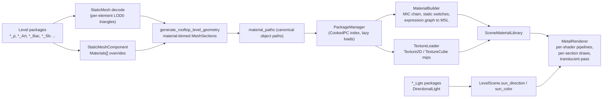

# Mirror's Edge Material System — Reverse Engineering & Implementation

This document covers how `mirrorsedge_macos` turns the materials cooked into Mirror's Edge's
UE3 packages (engine version 536, licensee 43) into Metal pipelines. The goal is that every
static mesh in a level renders with its real material: the right textures, parameters,
static switches, blend mode and two-sidedness.

| Level | Static meshes placed | Missing meshes | Materials resolved | Textures loaded | Generated shaders compiled |
|---|---|---|---|---|---|
| SP00 `Tutorial_p` | 2403 | 0 | 273 / 273 | 469 / 469 (143 MB) | 205 / 205 |
| SP01 `Edge_p` | 4276 | 0 | 407 / 407 | 646 / 647 (215 MB) | 267 / 267 |

The one texture that doesn't load is `M_SP01.T_EdgeReflection_01_R`. It's a
`TextureRenderTarget2D` (a runtime reflection target, with no cooked pixels), so the material
falls back to its default texture. Building the material library takes about 0.1 s per
level, and the GPU upload plus MSL compile takes about 0.75 s.

---

## 1. Pipeline overview



| Stage | Source |
|---|---|
| Generic tagged-property tree parser and object paths | [`ue3_props.cpp`](../src/assets/ue3_props.cpp) |
| Package index, cache, raw reads, export lookup | [`package_manager.cpp`](../src/assets/package_manager.cpp) |
| Texture2D / TextureCube decoding | [`texture_loader.cpp`](../src/assets/texture_loader.cpp) |
| Material resolution and the UE3 expression graph to MSL translator | [`material_system.cpp`](../src/assets/material_system.cpp) |
| GPU-facing contract (formats, bindings, library) | [`scene_materials.hpp`](../src/assets/scene_materials.hpp) |
| Mesh elements, component overrides, section binning, level sun | [`upk_loader.cpp`](../src/assets/upk_loader.cpp) |
| Pipelines, culling, scene copies, translucent pass | [`metal_renderer.mm`](../src/renderer/metal_renderer.mm) |

---

## 2. Which material does a mesh section use?

### 2.1 Static mesh elements
LOD0 of each `StaticMesh` stores an array of `FStaticMeshElement` records. Each record is
40 bytes plus 8 bytes per fragment:

```
Material (object ref), EnableCollision, OldEnableCollision, bEnableShadowCasting,
FirstIndex, NumTriangles, MinVertexIndex, MaxVertexIndex, MaterialIndex,
TArray<{int,int}> Fragments
```

The decoder expands each element's index range into a separate triangle range
(`StaticMeshElement{material, first_vertex, vertex_count}`).

Each vertex comes from the `StaticMeshVertexBuffer` and carries:
- TangentX and TangentZ as packed normals. TangentZ.w holds the binormal sign: 0xFF = +1, 0x00 = −1.
- An `FColor`.
- N UV sets, stored as half2 or as float2 when `bUseFullPrecisionUVs` is set.

The engine `Vertex` is 60 bytes. It includes `tangent_sign`, which lets the generated shaders
rebuild the full tangent basis for normal maps.

### 2.2 Per-element material (UE3 `UStaticMeshComponent::GetMaterial`)
1. `StaticMeshComponent.Materials[e]` if that entry is non-null (a per-placement override).
2. Otherwise `Element.Material`.
3. Otherwise `EngineMaterials.DefaultMaterial` (an empty path maps to it).

`generate_rooftop_level_geometry` gives every distinct material path an index into the
library. It then emits one `MeshSection{first_vertex, vertex_count, material}` per material
per batch, so each draw is a single non-indexed `drawPrimitives` call per section.

### 2.3 Mirrored placements
When the placement scale has a negative determinant, the emitter swaps vertices 1 and 2 of
every triangle. This mirrors UE3's `ReverseCulling` for mirrored primitives, so back-face
culling stays correct.

---

## 3. Finding objects across packages: canonical paths

Cooked level packages contain copies of objects from content packages. Getting their names
right is what makes cross-package resolution work:

- Inside a standalone content package (for example `M_GenericCubemaps.upk` or
  `EngineMaterials.upk`), the package's own exports have *file-relative* paths with no package
  prefix.
- In cooked level packages, foreign objects are rooted at top-level `Package` exports flagged
  `EF_ForcedExport` (`export_flags & 0x1`). For example, `Tutorial_p` has 87 of its 166
  top-level exports forced, while `M_GenericCubemaps` and `EngineMaterials` have none.

`object_canonical_path()` (in [`ue3_props.cpp`](../src/assets/ue3_props.cpp)) prefixes
package-owned objects with the file's package name. That gives the globally unique UE3 path
used by imports in other packages. `object_outermost_name()` uses the canonical path, and
also names the package that holds separate-file texture bulk data.

`PackageManager::find_export` indexes every export under both its canonical and its relative
path. The package manager also:
- indexes every file under `CookedPC` by lower-case stem;
- lazily loads and caches imports;
- keeps the already-loaded level packages registered under their names.

This fixed the missing `EngineMaterials.DefaultMaterial`, the `M_GenericCubemaps` cubemaps and
the `FX_TextureGeneric` textures.

---

## 4. Material resolution

### 4.1 Classes and properties
`Material` (and `DecalMaterial`) exports carry their inputs as `ExpressionInput` structs:

- `DiffuseColor`, `DiffusePower`, `SpecularColor`, `SpecularPower`
- `Normal`, `EmissiveColor`, `Opacity`, `OpacityMask`, `Distortion`
- `CustomLighting`, `TwoSidedLightingMask`

Each `ExpressionInput` is `Expression` (an object ref) plus `Mask`, `MaskR`, `MaskG`,
`MaskB` and `MaskA`. The mask picks components the same way `FExpressionInput::Compile` does.

They also carry `BlendMode` (Opaque, Masked, Translucent, Additive, Modulate),
`LightingModel` (Phong, NonDirectional, Unlit, Custom), `TwoSided`, `bIsMasked`,
`OpacityMaskClipValue` (default 0.3333) and `Expressions[]`.

### 4.2 MaterialInstanceConstant chains
A `MaterialInstanceConstant` has a `Parent` (another MIC or a Material) plus
`ScalarParameterValues`, `VectorParameterValues` and `TextureParameterValues`. These are arrays
of tagged structs with `ParameterName`, `ParameterValue` and `ExpressionGUID`.

The native tail holds two `{FMaterial; FStaticParameterSet}` blocks. A `FStaticParameterSet` is
`BaseMaterialId` followed by the static switches (32 bytes each:
`{FName, Value, bOverride, GUID}`) and the static component masks (44 bytes each:
`{FName, R, G, B, A, bOverride, GUID}`).

Resolution rules, matching UE3 behaviour:
- **Scalar, vector and texture parameters:** the first MIC in the chain (leaf → root) that
  defines the parameter wins. Otherwise the expression's default value is used.
- **Static switches and masks:** the first entry with `bOverride` while walking leaf → root
  wins. Otherwise the leaf-most stored value, otherwise the expression default. Static switches
  are folded at translation time, so each permutation becomes its own shader.

### 4.3 Expression translation
`MaterialBuilder` walks the expression graph from each material input and emits MSL with
UE3's type rules: `MCT_Float` scalars broadcast, otherwise component counts must match, and
masks are applied per input. Supported expression classes:

> Abs, Add, AppendVector, BumpOffset, CameraVector, Ceil, Clamp, ComponentMask, Constant,
> Constant2Vector, Constant3Vector, Constant4Vector, ConstantBiasScale, ConstantClamp, Cosine,
> CrossProduct, DepthBiasedAlpha, DepthBiasedBlend, Desaturation, DestColor, DestDepth, Divide,
> DotProduct, FlipBookSample, Floor, Frac, Fresnel, If, LensFlareIntensity, LensFlareOcclusion,
> LightVector, LinearInterpolate, Max, MeshEmitterVertexColor, MeshSubUV, Min, Multiply,
> Normalize, OneMinus, Panner, ParticleSubUV, PixelDepth, Power, ReflectionVector, Rotator,
> ScalarParameter, SceneDepth, SceneTexture, ScreenPosition, Sine, SquareRoot,
> StaticComponentMaskParameter, StaticSwitchParameter, Subtract, TextureCoordinate,
> TextureSample*, TextureSampleParameter2D/Normal/Cube, Time, Transform, VectorParameter,
> VertexColor

Shaders are de-duplicated by generated code. Material instances that share a shader differ
only in their uniform buffer (`float4` slots, at most 240) and their texture bindings (at most
14 slots). An unconnected input takes the UE3 default:
- Diffuse and Specular: `pow(128/255, 2.2)`
- SpecularPower: 15
- DiffusePower: 1

A missing texture falls back to FlatNormal, Black or White, chosen from the texture name and
whether it's a normal map.

---

## 5. Textures

`Texture2D` exports have tagged properties (`Format`, `SizeX`/`SizeY`, `AddressX`/`AddressY`,
`SRGB`, `CompressionSettings`, ...) followed by a native tail:

```
FByteBulkData SourceArt (16-byte header, empty when cooked)
int32 NumMips
per mip: { FByteBulkData header (flags, element count, size on disk, offset in file)
           [inline payload unless flags & 0x01]
           int32 SizeX; int32 SizeY }
```

Bulk-data flags:

| Flag | Meaning |
|---|---|
| `0x01` | Stored in a separate file. The payload is at an absolute file offset in the texture's canonical outermost package (for example `B_BD_Commercial.upk`), wrapped in UE3 compressed chunks (tag `0x9E2A83C1`). |
| `0x02` | ZLIB compressed |
| `0x10` | LZO compressed |
| `0x20` | Unused |

Supported formats: `PF_DXT1`, `PF_DXT3`, `PF_DXT5`, `PF_A8R8G8B8`, `PF_G8` and `PF_V8U8`.

`TextureCube` resolves `FacePosX`..`FaceNegZ` to six `Texture2D` faces. Mips above
`ME_MAX_TEXTURE_SIZE` (default 1024) are skipped at load time, and loading runs on a thread
pool.

### 5.1 LZO1X decompressor fix
The original LZO1X decoder sometimes reported success while writing wrong or all-zero output.
For example, `T_BD_08_03_NA` came out as all zeros and failed with "bad mip count". The
decoder in [`upk_loader.cpp`](../src/assets/upk_loader.cpp) is now a faithful port of the
reference "safe" `lzo1x_d.ch` decoder:

- first-byte > 17 literal run;
- 3-byte M1 match after a literal run, at distance `1 + 0x800 + (t >> 2) + (next << 2)`;
- 2-byte M1 match after trailing literals;
- M2, M3 and M4, including the end-of-stream marker;
- input, output and look-behind bounds checks.

It succeeds only if exactly `expected_len` bytes are produced. `load_from_file` counts failed
blocks and prints `[UPKPackage] <path>: N/M compressed blocks failed` when any fail; there are
0 failures across all 100 SP00 and SP01 packages. The fix also recovered geometry: SP00
colliders went from 2178 to 2405, and SP01 regained its skyline and red radio tower.

---

## 6. Generated MSL contract

Every material shares a prelude: `FrameUniforms`, the `mat_vertex` vertex function, and the
lighting and output helpers. The vertex function reads the 60-byte vertex by `vertex_id`
from `buffer(0)` and gets `FrameUniforms` from `buffer(1)`.

Each fragment entry point `mat_ps_N` binds:

| Binding | Contents |
|---|---|
| `buffer(0)` | `FrameUniforms` |
| `buffer(1)` | material uniforms (`float4[]`) |
| `texture(k)` / `sampler(k)` | 2D textures, then cube textures at `num_tex2d + j` |
| `texture(28)` | copy of the opaque scene colour (`SceneTexture`, `DestColor`) |
| `texture(29)` | copy of the opaque scene depth (`SceneDepth`, `DestDepth`, `DepthBiasedAlpha`) |
| `sampler(15)` | clamp sampler for the scene copies |

Set `ME_MATERIAL_DUMP=<file>` to write all generated MSL. There is no offline Metal compiler
in the toolchain, so a compile error only shows up at runtime, as
`[MetalRenderer] Material shaders: X/Y compiled`.

---

## 7. Lighting

The model follows `BasePassPixelShader.usf`, using its HL2 light-map basis and its
diffuse and specular transfer functions. Mirror's Edge lighting is baked by Beast into
`LightMapTexture2D`s, which are not decoded yet. Instead, a **virtual light-map** spreads an
unshadowed sun over the three HL2 basis directions. A flat normal with DiffusePower 1 receives
exactly Lambert N·L. On top of that come a sky/ground hemisphere term and a small ambient
term. Distance haze is added in the output helpers.

**The level sun** is read from the data (see `scan_level_suns` in
[`upk_loader.cpp`](../src/assets/upk_loader.cpp)):
- Sources: the master package, the loaded sub-levels, and the `*_Lgts` lighting packages.
  The `_Lgts` packages are opened for lights only.
- Every non-component class containing `DirectionalLight` is a candidate. Scoring:
  1. built into the light-map (`bHasLightEverBeenBuiltIntoLightMap`) first;
  2. then affects the Static lighting channel;
  3. then brightness.
- Cinematic-only and PhysX-only lights clear the Static channel, so they lose.
- Direction: `-FRotationMatrix(Rotation).GetAxis(0)`, where 65536 rotation units = 360°.
- Colour: `pow(LightColor, 2.2) * Brightness`. When `bUseBakerColorAndBrightness` is set, the
  Beast values `BakerColor` and `BakerBrightness` are used instead, since those are what the
  light-maps were baked with.

| Level | Source | Direction to sun | Linear colour |
|---|---|---|---|
| SP00 | `Tutorial_lgts.DirectionalLight_0` | (0.335, −0.500, 0.799) | (2.50, 2.29, 1.90) |
| SP01 | `Edge_Ext_Lgts.DirectionalLight_1` | (−0.575, 0.507, 0.643) | (2.50, 2.29, 1.90) |

The sky shader uses the same direction for its sun disc. Without a light, the old defaults
apply: direction (−0.4, 0.6, 0.7) and colour (2.0, 1.96, 1.9).

The scene colour buffer is display-referred: material outputs are encoded with `pow(1/2.2)`,
and `SceneTexture` reads decode with `pow(2.2)`.

---

## 8. Renderer integration

- **Pipelines:** one `MTLRenderPipelineState` per generated shader and blend mode.
  - Opaque and Masked write depth. Masked uses `discard` when `mask − clip < 0`.
  - Translucent uses alpha blending, Additive uses `One, One`, and Modulate uses `DestColor, Zero`.
- **Opaque pass:** draws every non-translucent section with its pipeline, uniforms and textures.
  Sections without a material fall back to the legacy procedural `world_pipeline`.
- **Translucent pass:** only runs when the frame has translucent sections. If any material
  reads the scene, the HDR colour and depth are first blitted into `scene_color_copy` and
  `scene_depth_copy`. Translucent sections then draw with depth testing on and depth writes off.
  They are not sorted.
- **Back-face culling:** front faces are **counter-clockwise** in this renderer's clip space.
  The view and projection matrices flip UE3's left-handed D3D convention, where front faces are
  clockwise.
  - Measured against culling off, CCW changed 0.3–1% of pixels, removing hidden back faces.
    CW changed 16–58%, which is wrong.
  - Two-sided materials (`TwoSided`) are drawn with culling off.

---

## 9. Environment variables

| Variable | Effect |
|---|---|
| `ME_NO_MATERIALS=1` | Skip the material system and use only the legacy procedural shading. |
| `ME_MATERIAL_VERBOSE=1` | Print per-material diagnostics (warnings, fallbacks, unsupported nodes) and the top missing meshes. |
| `ME_MAX_TEXTURE_SIZE=<n>` | Largest mip loaded (default 1024; minimum 16). |
| `ME_MATERIAL_DUMP=<file>` | Write the generated MSL (prelude plus all fragment shaders). The file is overwritten on every level load. |
| `ME_CULL=off\|ccw\|cw` | Override back-face culling, for debugging. |

---

## 10. Verification

```bash
cmake --build build -j
ME_MATERIAL_DUMP=/tmp/me_mats.metal ./build/mirrorsedge_macos --verify-all
```

Expected log lines:

```
[Level] Sun from Tutorial_lgts.DirectionalLight_0: direction (0.335133, -0.4999, 0.798615), linear colour (2.5, 2.28938, 1.89825)
[Level] 2403 static meshes placed, 0 missing (0 unique), 1 fallback boxes, 287 material sections
[Materials] 273 materials (273 resolved, 0 fallback, 3 with warnings), 205 shaders, 469 textures (469 loaded, 0 failed, 143 MB) ...
[Level] Sun from Edge_Ext_Lgts.DirectionalLight_1: direction (-0.574586, 0.506797, 0.642657), linear colour (2.5, 2.28938, 1.89825)
[Level] 4276 static meshes placed, 0 missing (0 unique), 1 fallback boxes, 420 material sections
[Materials] 407 materials (407 resolved, 0 fallback, 2 with warnings), 267 shaders, 647 textures (646 loaded, 1 failed, 215 MB) ...
[MetalRenderer] Material shaders: 205/205 compiled
[MetalRenderer] Material shaders: 267/267 compiled
```

The only remaining material warnings are the crane materials (`VH_Stationary.S_Crane_01.*`).
They sample TexCoord index 2, which is mapped to UV1.

---

## 11. Known limitations and next steps

1. **Beast light-maps.** Decode `LightMapTexture2D` and the `FLightMap2D`/`FLightMap1D` data in
   `StaticMeshComponent.LODData`. That needs light-map UVs and per-component scale vectors,
   and would replace the virtual light-map with the real baked GI and shadows. Tutorial_p alone
   has 76 light-map textures (35 MB).
2. **Decals.** Implement `DecalComponent` static receivers, the pre-baked decal geometry
   (550 components in Tutorial_p).
3. **BSP.** Render the `ModelComponent`s (Tutorial_p has 151 Models).
4. **Skeletal meshes** placed in levels.
5. **TexCoord ≥ 2.** It currently maps to UV1, because the vertex format carries two UV sets.
6. **Translucency sorting.** Translucent sections are drawn unsorted.
7. **`TextureRenderTarget2D`.** Planar reflections are not rendered, so these targets fall back
   to their default texture.
