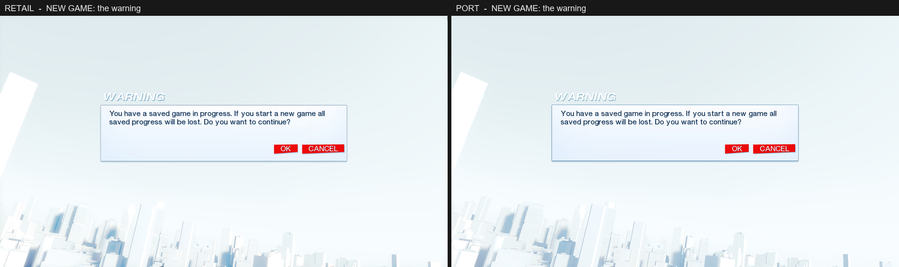
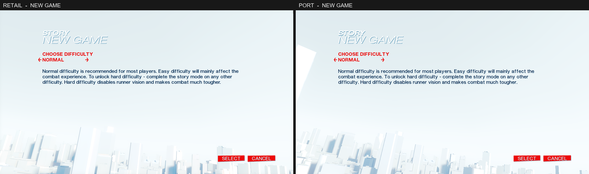
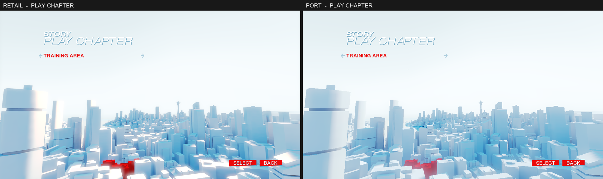
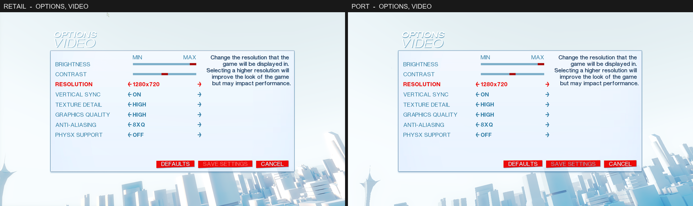
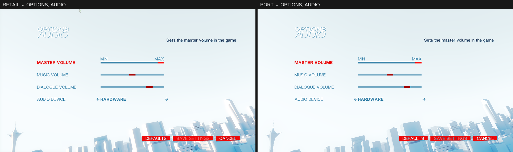
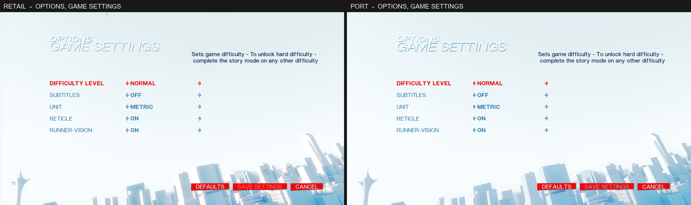
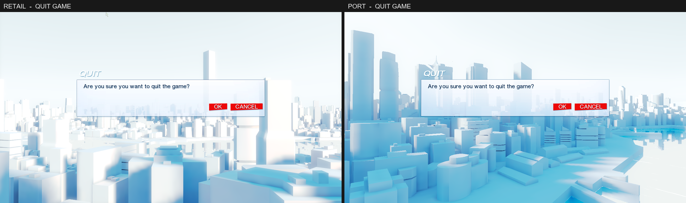
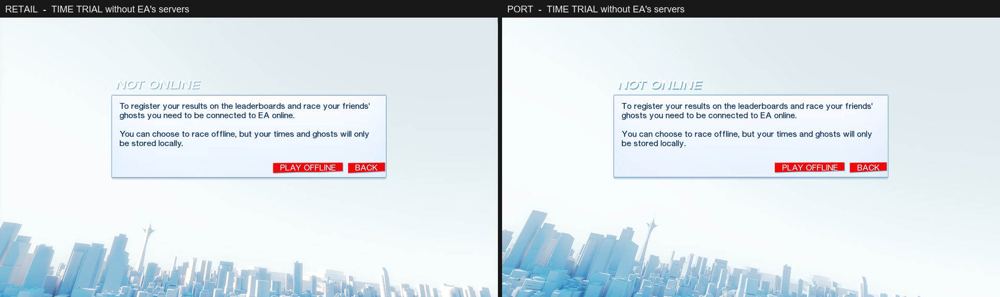

# Mirror's Edge front end: the screens behind the main menu

What each sub-button of the main menu opens on PC, how those UI scenes are stored, laid out and drawn, and how the port runs them. It follows [`MAIN_MENU_SYSTEM_RE.md`](MAIN_MENU_SYSTEM_RE.md), which covers the start screen, the four columns and the menu level.

Every value comes from the retail packages and scripts unless it says "measured" (taken from a retail frame at 1280x720) or "not established".

Tools: `tools/ue3_tree.py` (property trees), `tools/uscript_bytecode.py` (script), `tools/retail/` (the retail game), `me_menu` (the port's front end, headless).

---

## 1. What each button opens

`TdUIScene_MainMenu.HandleButtonClicked` fires the level event `<ButtonName>_Clicked`, plays the UI sound `Accept` and opens a scene. A click is ignored while a column is still opening.

| Button | Opens | Scene, package | Class |
|---|---|---|---|
| CONTINUE GAME | the saved game | | |
| NEW GAME | a warning if a game is in progress, then "NEW GAME" | `TdMessageBox` (`UI/TdUI.upk`), `TdDifficultySettings` (`UI/TdUI_FrontEnd.upk`) | `TdUIScene_MessageBox`, `TdUIScene_DifficultySettings` |
| PLAY CHAPTER | "PLAY CHAPTER", then "SELECT CHECKPOINT" | `TdLoadLevel`, `TdLoadCheckpoint` (`TdUI_FrontEnd`) | `TdUIScene_LoadLevel`, `TdUIScene_LoadCheckpoint` |
| TIME TRIAL | the connection boxes, then "TIME TRIAL OFFLINE" | `TdOnlineCheck` (`TdUI_FrontEnd_Online`), `TdTTSelectStretchOffline` (`TdUI_FrontEnd_TimeTrial`) | `TdUIScene_OnlineCheck`, `TdUIScene_TimeTrial` |
| SPEED RUN | the same, then the level list | `TdLRSelectLevelOffline` (`TdUI_FrontEnd_LevelRace`) | `TdUIScene_SPLevelRace` |
| LEADERBOARDS | the connection boxes | | |
| VIDEO | "VIDEO" | `TdVideoSettingsPC` (`UI/TdUI_Options.upk`) | `TdUIScene_VideoSettingsPC` |
| AUDIO | "AUDIO" | `TdAudioSettings` (`TdUI_Options`) | `TdUIScene_AudioSettings` |
| CONTROLS | "CONTROLS" | `TdKeyMappings` (`TdUI_Options`) | `TdUIScene_KeyMappings` |
| GAME SETTINGS | "GAME SETTINGS" | `TdGameSettings` (`TdUI_Options`) | `TdUIScene_GameSettings` |
| GAMEPAD SETUP | the controller screen | `TdControlsSettings` (`TdUI_Options`) | `TdUIScene_ControlsSettings` |
| UNLOCKABLES | "UNLOCKABLES" | `TdUnlocks` (`TdUI_FrontEnd`) | `TdUIScene_Unlocks` |
| CREDITS | the credits | `TdCredits` (`TdUI`) | `TdUIScene_TdCredits` |
| QUIT GAME (Escape) | "Are you sure you want to quit the game?" | `TdMessageBox` | |

Scenes replace each other on screen at once: `TdUIScene.BeginShowAnimation` and `BeginHideAnimation` both return false and no class overrides them, so the 0.25 s `SceneAnimDuration` is never used. Only the top scene is drawn; a message box does not show the main menu's columns behind it (measured).

When the top scene closes, the one below gets `SceneActivated(false)`. For the main menu that fires `panel<N>` again, which is what brings the column's camera back. If the closing scene's delegate opens another scene (OK on the new-game warning opens the difficulty screen), the main menu is not activated in between: the sub-menu camera stays (measured).

---

## 2. How a scene is stored

A `UIScene` is a tree of widgets under the scene export, parent to child through each widget's `Children` array. Widgets own *components* (separate exports named by object properties): `StringRenderComponent` (`UIComp_DrawString`, or `UIComp_TdDropShadowString` which draws the string twice), `BackgroundImageComponent` / `ImageComponent` (`UIComp_DrawImage`), and on a `UISlider` the bar and marker images.

A package only stores what differs from an object's archetype. A widget placed in a scene has the class default object in `Engine.u` or `TdGame.u` as its archetype (and its components have the default object's components), so reading a widget means reading that whole chain. A struct is stored as its difference too: a member the scene's `DockTargets` lacks comes from the archetype's.

The widget classes these scenes use: `UIPanel`, `UISafeRegionPanel`, `UILabel`, `TdUIFocusLabel`, `UIImage`, `UIButton`, `UILabelButton`, `UITdOptionButton`, `UISlider`, `UIList` (with `UIScrollbar`), `TdUITabControl` / `TdUITabButton` / `TdUITabPage`, `TdUIButtonBar` / `TdUIButtonBarButton`.

### 2.1 Position and docking

`Position` is `Value[4]` and `ScaleType[4]` for Left, Top, Right, Bottom:

| `ScaleType` | The value is |
|---|---|
| `EVALPOS_PixelViewport` | pixels from the viewport's corner |
| `EVALPOS_PixelOwner` | pixels from the parent's left or top |
| `EVALPOS_PercentageOwner` (the default) | a fraction of the parent's width or height, from its left or top |
| `EVALPOS_PercentageScene`, `EVALPOS_PercentageViewport` | a fraction of the scene |

Right and Bottom are a **width** and a **height** from the widget's own Left and Top, unless they are in viewport pixels. `SafeRegionPanel` is (0.075, 0.075, 0.85, 0.85): 96 to 1184 across.

`DockTargets` can pin each face to a face of another widget (`TargetWidget[f]`, `TargetFace[f]`; no widget means the scene) plus `DockPadding.PaddingValue[f]`:

| `PaddingScaleType` | The padding is |
|---|---|
| `UIPADDINGEVAL_Pixels` | pixels |
| `UIPADDINGEVAL_PercentTarget` | a fraction of the target widget's width (Left, Right) or height (Top, Bottom) |
| `UIPADDINGEVAL_PercentOwner` | a fraction of the widget's own width or height |
| `UIPADDINGEVAL_PercentScene` | a fraction of 1280 or 720 |

The editor saved every docked face's resolved pixel value into `Position`; those are what the scene looked like in the editor, not what the game uses.

### 2.2 The order faces are resolved in

This decides pixels, and it is not obvious. Retail's AUDIO screen has its rows 4 px lower than its GAME SETTINGS screen although the two dock `SettingsPanel` and `DescriptionLabel` identically (measured).

The rules below are a reconstruction: the engine's layout code was not disassembled. They were worked out from those two screens and the message box, and with them the text rows of the AUDIO, VIDEO and GAME SETTINGS screens land on retail's to the pixel.

1. Faces are resolved in the docking stack's order: widgets in tree order (depth first, `Children` order), Left, Top, Right, Bottom, each face after the face it is docked to.
2. A percentage padding measures widths and heights as they stand at that moment. A face that has not been resolved yet reads as the face it is docked to, **without its own padding**.
   * `TdGameSettings`: `DescriptionLabel` comes before `SettingsPanel`. When `SettingsPanel.Top` (= `DescriptionLabel.Bottom` + 10% of the label's height) is resolved the label is 144 to 225, so the padding is 8.1 and the top is 233.1.
   * `TdAudioSettings`: `SettingsPanel` comes first. The label's top has not been resolved and reads as what it is docked to, `ScenePanel.Top` = 90; the label "is" 90 to 225, the padding is 13.5 and the top is 238.5.
3. In this pass a string does not size its widget yet: an auto-sized label has the height its `Position` gives.
4. Then the auto-sized strings set their sizes (`AutoSizeParameters[orientation].bAutoSizeEnabled`; not when both faces that way are docked; the far face moves, or the near one when only the far one is docked), and only faces that depend on a face that moved are resolved again.
   * `TdMessageBox`: `ContentPanel.Top` hangs from `MessageLabel.Top`, which does not move, so it keeps the 255.8 the first pass gave it for a one-line message, whatever the message. `ContentPanel.Bottom` follows the button bar, which follows the label's bottom: the box grows downward.

### 2.3 Styles

The active skin is `UI_Skins.UI_Skins_TDUISkins2` (`UI/UI_Skins.upk`) over the engine's `DefaultUISkin`. A `UIStyle` has a `StyleID` (a GUID), a `StyleTag`, and after its tagged properties a native map from widget state to style data:

```
int32 count ; count x { state class default object ref ; UIStyle_Data ref }
```

States: `UIState_Enabled`, `Disabled`, `Focused`, `Active` (the mouse is over it), `Pressed`, `TargetedTab`, and Mirror's Edge's `TdUIState_FakeActive`. Style data is a `UIStyle_Text` (`StyleFont`, `StyleColor`, `Alignment[2]`, `ClipMode`), a `UIStyle_Image` (`DefaultImage`, `StyleColor`, `AdjustmentType[2]`, `Coordinates`, `StylePadding[2]`) or a `UIStyle_Combo`, whose `TextStyle` and `ImageStyle` each name either custom data or a state of another style.

A component refers to a style through a `UIStyleReference`: `AssignedStyleID` if set, else `DefaultStyleTag`. The styles these screens use (colours linear, as stored):

| Style | Used for | Enabled | Focused |
|---|---|---|---|
| `TdLabelTextTitleThin` | "OPTIONS", "STORY" over the title | `Helvetica_Headline_Thick_Italic`, white; shadow `TdLabelTextTitleThinDropShadow` (0, 0.078, 0.227, 0.5) | |
| `TdLabelTextTitleThick` | the title | `Helvetica_Headline_Light_Italic`, white; shadow `TdLabelTextTitleThickDropShadow` | |
| `TdLabelText_CommonText` | descriptions, messages | `Helvetica_Small_Normal`, (0, 0.0037, 0.0278), wrapped; shadow alpha 0.34 or 0.5 | |
| `TdLabelTextButtonText2` | a row's label (`TdUIFocusLabel`) | `Helvetica_Small_Normal`, (0, 0.078, 0.227, 0.8) | `Helvetica_Small_Bold`, (0.797, 0, 0) |
| `TdLabelText_Option_Text` | an option's value | `Helvetica_Small_Bold`, (0, 0.078, 0.227, 0.8) | (0.797, 0, 0) |
| `TdImageOptionListDecrementStyle` / `Increment…` | the arrows | `TdUIResources.Icons.Arrow_Black_Left_Unfocused`, tinted (0, 0.078, 0.227, 0.8); disabled alpha 0.29 | tinted (0.797, 0, 0) |
| `TdImageSliderBarStyle` | a slider's bar | `TdUIResources.White`, (0, 0.078, 0.227, 0.5) | alpha 0.81 |
| `TdImagePanelBG` | panels | `TdUIResources.Scene.Panel512x512`, `ADJUST_Stretch`, `StylePadding` (-7, -6) | |
| `TdImageButtonBarBackground` | button bar buttons | `TdUIResources.button_full`, `ADJUST_Stretch`, `StylePadding` (-20, -3) | |

On screen the dark blue (0, 0.078, 0.227) at alpha 0.8 over the pale background is the steel blue (55, 130, 169), and (0.797, 0, 0) is (235, 9, 9): the canvas gamma of the main-menu document.

A focused row is red because the option button (or slider) holds the focus and its `TdUIFocusLabel` child and arrow buttons take its state. `TdUIScene_SubMenu.UpdateFocusLabelState` gives the label `TdUIState_FakeActive` (bold, dark blue) when the mouse is over the row.

### 2.4 Drawing an image

`UIComp_DrawImage` draws its style's `DefaultImage`, or `ImageRef.ImageTexture` when the scene set one (the message box's panel is `Panel1024x256`).

* `StylePadding` is taken off each side of the widget; the panel and button styles' is negative, so the image is larger than the widget. The video panel's frame line is 1 to 3 px inside the widget's rectangle (measured), not 17 as a plain stretch of the texture's 10 px margin would give.
* `ADJUST_Normal` scales the image to the widget. `ADJUST_Justified` keeps its shape. `ADJUST_Stretch` is `UCanvas::DrawTileStretched`: the image is cut in four at its middle; where the box is larger than the image the quarters keep their size in the corners and the middle row and column of texels are stretched between them; where the box is smaller the quarters are scaled down to meet. Both cases measured: the video panel (922 x 466 against 512 x 512) has its frame unscaled left and right; the message box panel (718 x 173 against 1024 x 256) is drawn at 0.7, frame and all.
* An unscaled image starts on a whole pixel.

### 2.5 Drawing text

* A wrapped line keeps the space it was broken at. Right-aligned, every line but the last ends one space short of the edge (measured on the video screen's description).
* `Font.Kerning` (1 on the `Small` fonts) is added after every glyph except a space: two words are 8 px apart, the 7 px space glyph plus one (measured).
* Everything else is as in the main-menu document: whole-pixel positions, the font's tallest cell for vertical centring, drop shadow offsets as fractions of the line height.

### 2.6 The button bar

`TdUIButtonBar` holds six `TdUIButtonBarButton`s. `AppendButton` fills them from the right: button 0 is docked to the bar's right edge and each next one to the left edge of the one before it, -50 px (-20 with a controller). A button is as wide as its label and as tall as the bar; its red box is the label's rectangle grown by the style's padding, 20 px a side and 3 px above and below. A bare word names a `TdButtonCallouts` string: `AppendButton("Back")` shows "BACK". A disabled button (SAVE SETTINGS before anything changed) keeps its box and dims its label.

---

## 3. The scenes

### 3.1 `TdUIScene_MessageBox`

`Display(Message, Title, …)` sets `TitleLabel` and `MessageLabel` and appends one button per option; each option has keys. `DisplayAcceptCancelBox`: option 0 "CANCEL" (Escape), option 1 "OK" (Enter). `DisplayAcceptBox`: "OK" (Enter). `DisplayModalBox` has no buttons and closes after a minimum time. Choosing an option closes the scene, then calls the selection delegate.

| Used for | Title | Message |
|---|---|---|
| NEW GAME with a save | `TdMessageBox.NewGameWarningTitle` "WARNING" | `NewGameWarningMessage` |
| QUIT GAME | `QuitConfirm_Title` "QUIT" | `QuitConfirm_Message` |
| leaving an options screen with changes | `WillNotSave_Title` "CANCEL CHANGES" | `WillNotSave_Message` |
| connecting | `TdModalConnectingMessageBox.TitleText` "CONNECTING" | "Connecting", CANCEL only |
| no connection | `TpErrors.Failed_Connect_Title` "COULD NOT CONNECT" | `TpErrors.Error_-203`, OK only |

### 3.2 NEW GAME (`TdUIScene_DifficultySettings`)

`DifficultyOptionButton` is bound to `<OnlinePlayerData:ProfileData.GameDifficulty>`; HARD is not offered until the story has been finished, so the option steps between EASY and NORMAL and wraps (measured). The bar is "CANCEL" and "SELECT". Enter runs `OnAccept`: the difficulty is saved, `CheckpointManager.ClearGameProgress()` erases the old progress, and `StartNewGameWithTutorial` starts the game. Nothing is erased before that; the warning box only opens this screen.

### 3.3 PLAY CHAPTER (`TdUIScene_LoadLevel`, `TdUIScene_LoadCheckpoint`)

`LevelOptionButton` is bound to `<TdGameData:TdMaps>`: the `UIDataProvider_TdMaps` sections of `DefaultGame.ini` the profile has unlocked, named by `MapName` in `TdGame.int`:

| Section | Map | Name | Level event |
|---|---|---|---|
| `TrainingArea` | `Tutorial_p` | TRAINING AREA | `LoadLevel_Tutorial` |
| `SP01a` | `edge_p` | PROLOGUE - THE EDGE | `LoadLevel_Edge` |
| `SP01b` | `escape_p` | CHAPTER 1 - FLIGHT | `LoadLevel_Escape` |
| `SP02` … `SP09` | `Stormdrain_p`, `cranes_p`, `Subway_p`, `mall_p`, `factory_p`, `boat_p`, `convoy_p`, `Scraper_p` | CHAPTER 2 - JACKNIFE … | `LoadLevel_Stormdrains` … `LoadLevel_Scraper` |

Changing the option fires the chapter's level event: the camera flies to its district and the district turns red (section 4). `LevelStatsPanel` (speed-run time, bags found "n/3") shows for every chapter but the Training Area. Enter opens `TdLoadCheckpoint` if the chapter has checkpoints (each a `Checkpoints` entry: a name the level is started at, and a picture in `TdUIResources_CheckpointImages`), else starts the level. With one chapter unlocked the arrows are in their disabled state.

### 3.4 The options screens (`TdUIScene_OptionMenu`)

GAME SETTINGS, AUDIO, VIDEO and CONTROLS share a base class. Every `UITdOptionButton` and `UISlider` under `SettingsPanel` is an option. The bar is "CANCEL", "SAVE SETTINGS" (disabled until a value changes) and "DEFAULTS". Enter saves and closes, but only once something has changed. Escape closes, after "CANCEL CHANGES" if something changed; it asks even if the value was put back (measured). The description at the top right follows the focused row: the row's label is `<Strings:…FooText>` and the description `…FooDesc`.

Where the values come from:

* `<OnlinePlayerData:ProfileData.X>`: the profile setting `X` of `TdGame.Default__TdProfileSettings`. `ProfileMappings` gives each setting its values and `DefaultSettings` its default.

  | Setting | Values (in list order) | Default |
  |---|---|---|
  | `GameDifficulty` | EASY, NORMAL, HARD | NORMAL |
  | `GameSubtitles` | OFF, ON | OFF |
  | `MeasurementUnits` | METRIC, IMPERIAL | METRIC |
  | `Reticule` | OFF, WEAPON ONLY, ON | ON |
  | `FaithOVision` (RUNNER-VISION) | ON, HOSTILES OFF, OFF | ON |
  | `Brightness`, `Contrast` | sliders 0 to 10 | 5, 5 |
  | `MasterVolume`, `MusicVolume`, `DialogueVolume` | sliders 0 to 10 | 10, 5, 8 |

* `<TdStringList:Tag>`: a list of `UIDataStore_TdStringList`. `DefaultGame.ini` gives the tags and `TdGame.int` the strings at the same index: `VSync` OFF, ON; `TextureDetail` and `GraphicsQuality` LOWEST, LOW, MEDIUM, HIGH, HIGHEST; `PhysXSupport` OFF, ON; `AudioDevices` HARDWARE, GENERIC SOFTWARE. `ScreenResolution` and `Antialiasing` are filled at run time from the display's modes and the card's multisampling modes (on the test machine OFF, 2X, 4X, 8X, 8XQ). The difficulty, the audio device and the video lists other than the resolution were stepped through on retail and wrap from the last value to the first; the resolution list was not stepped to its end.

---

## 4. The camera and the red district

All of it is the menu level's Kismet. The port runs the graph instead of imitating it (`src/ui/frontend/kismet.*`): `Main_Sequence` and its sub-sequences, every Matinee, the twelve camera actors and their targets.

Clicking a sub-button stops the column's Matinees, sets `Sub_Menu` and plays a 0.5 s Matinee followed by a 60 s loop:

| Event | Matinee, then loop |
|---|---|
| `NewGameButton_Clicked` | `InterpData_53`, `InterpData_43` |
| `TimeTrialOnlineButton_Clicked`, `LevelRaceButton_Clicked`, `LeaderboardsButton_Clicked` | `InterpData_54`, `InterpData_51` |
| `VideoButton_Clicked`, `AudioButton_Clicked`, `ControlsButton_Clicked`, `GameSettingsButton_Clicked` | `InterpData_55`, `InterpData_52` |
| `UnlocksButton_Clicked` | `InterpData_9`, `InterpData_30` |
| `CreditsButton_Clicked` | `InterpData_56` (450 s) |

These Matinees have a `Camera` group only. Its move track says `IMR_LookAtGroup` "Target", but there is no such group in the Matinee, and the port then uses the keyed rotation: the `EulerTrack`, which is (roll, pitch, yaw) in degrees. The race sub-menu loop starts at roll -13.4, pitch 23.6, yaw 13.3: the camera looks up at the sky, tilted, which is what retail shows on these screens. `PLAY CHAPTER` has no Matinee of its own; the chapter events move the camera.

`panel<N>` with `Sub_Menu` set (coming back) starts the column's loop without its 0.35 s intro.

Each `LoadLevel_<Chapter>` event looks at which chapter was shown before (`Current_Level`, through a `SeqCond_TdCaseInt`), plays one of two short fly-in Matinees depending on the direction, then the chapter's 60 s loop, each with its own camera actor and target. It also runs two `Level_Selection_Fade` sub-sequences: the new chapter's material instance (`MI_SP00_01` … `MI_SP09_01`, one per district) has its `Selected` parameter raised by 0.25 a step until it reaches 1, the old one's lowered by 0.05 a step to 0, a step being a 0.01 s `SeqAct_Delay` (one frame). `M_CityBuildings_01` uses `Selected` as:

```
Diffuse  = lerp((0.8, 0.83, 0.9), (0.5, 0, 0), Selected)
Emissive = (0.1, 0, 0) * Selected
```

How the port runs the graph is Unreal Engine 3's `USequence::ExecuteActiveOps` as its source has it, not something re-derived from this game's binary: active ops are popped off the end of a list; what an op activates runs depth first in link order before whatever was waiting; an event fired from the UI goes to the bottom of the list and so runs after the Matinees already playing; a `SeqAct_Interp` that gets Play and Stop in the same step plays; it fires `Completed` when it deactivates at its end and nothing when stopped part way; a `SeqAct_Delay` cannot finish in the step that started it. A look-at camera takes its direction from where the camera was before the step moved it.

Not established: the RACE column's camera still differs from retail's (see the main-menu document). Running the graph this way gives the same RACE camera as reading it by hand did. Two other readings were tried and matched retail no better: letting a stopped, finished Matinee fire `Completed` again (which leaves the earlier columns' loops running), and using the RACE loop's keyed rotation instead of its look-at.

---

## 5. The port

| File | What |
|---|---|
| `src/ui/frontend/kismet.*` | the menu level's sequence graph and Matinees, loaded and run |
| `src/ui/frontend/ui_scene.*` | scenes, widgets, the skin's styles, layout (section 2.2), drawing (2.4 to 2.6) |
| `src/ui/frontend/frontend_menus.*` | what each scene does: `SubMenu` and one subclass per scene class, the message box, the option data |
| `src/ui/frontend/frontend.*` | the stack of open scenes, input, the main menu's button handlers |

Built so far: the message box, NEW GAME, PLAY CHAPTER with its checkpoint screen, VIDEO, AUDIO, GAME SETTINGS, QUIT, and the connection boxes TIME TRIAL and LEADERBOARDS show without EA's servers. Not built yet: CONTROLS, the TIME TRIAL course list, SPEED RUN, GAMEPAD SETUP, UNLOCKABLES, CREDITS; the mouse on these screens (keyboard and D-pad only); DEFAULTS, which on PC is only reachable with the mouse.

`Frontend::take_action()` tells the host what to do: `Continue`, `NewGame`, `StartLevel <map> [checkpoint]`, `ApplySettings`, `Quit`. The game (`src/main.cpp`) starts the chapter and stands the player at the checkpoint for `StartLevel`; it does not act on `ApplySettings` yet, so the option screens keep their values for the session and change nothing in the game. Run in the Windows build: PLAY CHAPTER, PROLOGUE - THE EDGE, CHECKPOINT B loads `Edge_p` with `After_Intro` active.

```bash
./build/me_menu --out shots --chapters 1 --script "wait 6; key any; wait 3; key down; key enter; wait 4; shot chapter.png; key escape; \
    key right; key right; wait 2; key enter; wait 1; key down; key down; shot video.png; rects"
```

Script verbs added for these screens: `key enter` / `key escape`, `state` (prints the open scene and its focused widget), `rects` (the open scene's widgets with their resolved rectangles), `kismet` (the Matinees playing), `event <name>` (fire a level event), `set <setting> <value>` and `list <tag> <a,b,c> <index>` (the profile and the PC string lists, as a host would set them), `texture <object path> <name>` (write a texture and its alpha as PNG). Options: `--chapters <n>`, `--hard`, `--player <name>`.

Retail on the left, the port on the right:










The 2D layer is what to compare; the city behind it is at a different moment of the same camera loop. Text rows land on retail's to the pixel on the three options screens. Over the AUDIO screen's options the two frames differ by 0.6 levels of 255 on average.

The retail frames were taken with the game's own input: this is the first time the capture tools press Enter in retail's menus. Nothing was saved: every options screen was left through CANCEL, and NEW GAME through its own CANCEL.
