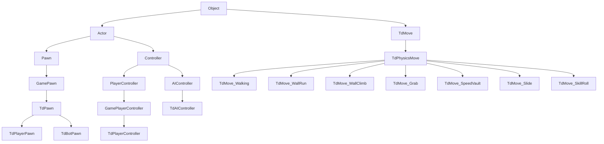

# Mirror's Edge: UnrealScript (`TdGame.u`) Gameplay Architecture & Class Reverse Engineering

## Executive Summary & Architecture Overview

Mirror's Edge runs on a customized build of **Unreal Engine 3** (Engine Version 3716, Cooked Content Version 60, Package File Version 536/43). Gameplay logic, player parkour mechanics, enemy combat AI, weapon handling, HUD rendering, and level scripting reside in cooked script packages located in `TdGame/CookedPC/`:

| Package | Classes | Exports | Purpose |
| :--- | :--- | :--- | :--- |
| `Core.u` | 8 | 1,274 | Unreal Engine base object system (`Object`, `Component`, `DistributionFloat`, etc.) |
| `Engine.u` | 1,115 | 25,282 | Core engine framework (`Actor`, `Pawn`, `PlayerController`, `Volume`, `SkeletalMesh`) |
| `GameFramework.u` | 12 | 161 | Epic base gameplay extension classes (`GamePawn`, `GameWeapon`, `GamePlayerInput`) |
| **`TdGame.u`** | **916** | **52,410** | **Mirror's Edge core gameplay runtime: parkour state machine, Faith pawn, AI, Kismet** |
| `TdSharedContent.u` | 15 | 188 | Firearms & ordnance definitions (Colt 1911, MP5K, Remington 870, Barrett M95, etc.) |
| `TdSpContent.u` | 16 | 169 | Single-player campaign enemy bot pawns (Patrol Cop, SWAT, Riot, Pursuit, Gunner) |
| `TdSpBossContent.u`| 2 | 34 | Boss encounter pawns (`TdBotPawn_Celeste`, `TdBotPawn_SniperCeleste`) |
| `TdTTContent.u` | 7 | 103 | Time Trial mode logic (`TdGhostPawn`, `TdHUDContentTimeTrial`, announcer messages) |
| `TdTuContent.u` | 3 | 39 | Tutorial challenge framework (`TdHUDContentTutorial`, feedback messages) |
| `TdMenuContent.u` | 1 | 2 | Main menu interface HUD content (`TdHUDContentMainMenu`) |

The package format uses standard UE3 package serialization (`0x9E2A83C1`), compressed with **LZO1X** in 128KB chunks. When decompressed, `TdGame.u` expands from 29.3 MB to **56.16 MB** containing 20,592 names, 2,246 imports, and 52,410 exports.

---

## Complete Class Hierarchy & Gameplay Systems



---

## Movement System & Parkour State Machine

### 1. `EMovement` Enum & `MoveClasses` Mapping

In `TdPawn`, the current player move is tracked by `MovementState` and `OldMovementState` of type `EMovement` (95 enum entries). Each enum value maps directly to an index in `TdPawn.MoveClasses`, which holds the class archetype for that move:

| ID | Enum Value | Class (`MoveClasses[ID]`) | Base Class | Physics State | Key Purpose / Mechanic |
| :---: | :--- | :--- | :--- | :--- | :--- |
| `0` | `MOVE_None` | `None` | - | `PHYS_None` | Uninitialized / invalid move |
| `1` | `MOVE_Walking` | `TdMove_Walking` | `TdPhysicsMove` | `PHYS_Walking` | Standard jogging, running, and sprinting ground locomotion |
| `2` | `MOVE_Falling` | `TdMove_Falling` | `TdPhysicsMove` | `PHYS_Falling` | Air state after leaving ground without vaulting/jumping |
| `3` | `MOVE_Grabbing` | `TdMove_Grab` | `TdPhysicsMove` | `PHYS_Flying` | Hanging from a ledge, pipe, or sign board |
| `4` | `MOVE_WallRunningRight` | `TdMove_WallRun` | `TdPhysicsMove` | `PHYS_WallRunning` | Right wall horizontal traversal (tilt 15°, friction 0.15) |
| `5` | `MOVE_WallRunningLeft` | `TdMove_WallRun` | `TdPhysicsMove` | `PHYS_WallRunning` | Left wall horizontal traversal |
| `6` | `MOVE_WallClimbing` | `TdMove_WallClimb` | `TdPhysicsMove` | `PHYS_WallClimbing` | Vertical wall climb (up to 320 units Z add-on velocity) |
| `7` | `MOVE_SpringBoarding` | `TdMove_SpringBoard`| `TdPhysicsMove` | `PHYS_Falling` | Launching off low obstacle (dumpster/vent) to gain height |
| `8` | `MOVE_SpeedVaulting` | `TdMove_SpeedVault` | `TdPhysicsMove` | `PHYS_Flying` | Fast momentum-preserving one-hand vault over railings |
| `9` | `MOVE_VaultOver` | `TdMove_VaultOver` | `TdMove_SpeedVault` | `PHYS_Flying` | Two-handed vault over thicker obstacles or tables |
| `10` | `MOVE_GrabPullUp` | `TdMove_GrabPullUp` | `TdPhysicsMove` | `PHYS_Flying` | Climbing up from ledge hang to standing position |
| `11` | `MOVE_Jump` | `TdMove_Jump` | `TdPhysicsMove` | `PHYS_Falling` | Standard ground jump with speed-dependent vertical impulse |
| `12` | `MOVE_WallRunJump` | `TdMove_WallrunJump`| `TdPhysicsMove` | `PHYS_Falling` | Angled leap off a wallrun across a gap |
| `13` | `MOVE_GrabJump` | `TdMove_GrabJump` | `TdPhysicsMove` | `PHYS_Falling` | Leap backward or sideways from a hanging ledge |
| `14` | `MOVE_IntoGrab` | `TdMove_IntoGrab` | `TdPhysicsMove` | `PHYS_Flying` | Pre-grab alignment and reach phase before full hang |
| `15` | `MOVE_Crouch` | `TdMove_Crouch` | `TdPhysicsMove` | `PHYS_Walking` | Crouched ground locomotion (height scale 0.40) |
| `16` | `MOVE_Slide` | `TdMove_Slide` | `TdMove` | `PHYS_Walking` | Low-friction sprint slide under pipes/fences |
| `17` | `MOVE_Melee` | `TdMove_Melee` | `TdMove_MeleeBase` | `PHYS_Walking` | Standing / running punch-kick attack combo |
| `18` | `MOVE_Snatch` | `TdMOVE_Disarm` | `TdPhysicsMove` | `PHYS_Flying` | Weapon disarm QTE maneuver on enemy guards |
| `19` | `MOVE_Barge` | `TdMove_Barge` | `TdPhysicsMove` | `PHYS_Walking` | Shoulder bash through heavy closed doors |
| `20` | `MOVE_Landing` | `TdMove_Landing` | `TdMove` | `PHYS_Walking` | Heavy hard landing with momentum stall from extreme height |
| `21` | `MOVE_Climb` | `TdMove_Climb` | `TdPhysicsMove` | `PHYS_Flying` | Climbing vertical ladders or pipes |
| `22` | `MOVE_IntoClimb` | `TdMove_IntoClimb` | `TdPhysicsMove` | `PHYS_Flying` | Ladder/pipe mounting alignment |
| `23` | `MOVE_WallKick` | `TdMove_Disabled` | `TdPhysicsMove` | `PHYS_Falling` | Obsolete kick off wall (disabled in final release) |
| `24` | `MOVE_180Turn` | `TdMove_180Turn` | `TdMove` | `PHYS_Walking` | Ground quick-turn 180° rotation |
| `25` | `MOVE_180TurnInAir` | `TdMove_180TurnInAir` | `TdPhysicsMove` | `PHYS_Falling` | Mid-air 180° quick spin for wall-to-ledge jump |
| `26` | `MOVE_LayOnGround` | `TdMove_LayOnGround`| `TdPhysicsMove` | `PHYS_Walking` | Knocked down / recovery state after heavy explosion or punch |
| `27` | `MOVE_IntoZipLine` | `TdMove_IntoZipLine`| `TdPhysicsMove` | `PHYS_Flying` | Zipline grab and cable-snapping alignment |
| `28` | `MOVE_ZipLine` | `TdMove_ZipLine` | `TdPhysicsMove` | `PHYS_Flying` | Fast gravity slide down zipline cables |
| `29` | `MOVE_Balance` | `TdMove_Balance` | `TdPhysicsMove` | `PHYS_Walking` | Walking across narrow planks/pipes with balance tilt |
| `30` | `MOVE_LedgeWalk` | `TdMove_LedgeWalk` | `TdPhysicsMove` | `PHYS_Walking` | Shuffling along narrow wall ledges (shimmying) |
| `31` | `MOVE_GrabTransfer` | `TdMove_GrabTransfer` | `TdPhysicsMove` | `PHYS_Flying` | Traversing around corners while hanging on a ledge |
| `32` | `MOVE_MeleeAir` | `TdMove_MeleeAir` | `TdMove_MeleeBase` | `PHYS_Falling` | Jump kick in mid-air |
| `33` | `MOVE_DodgeJump` | `TdMove_DodgeJump` | `TdPhysicsMove` | `PHYS_Falling` | Lateral dodge leap |
| `34` | `MOVE_WallRunDodgeJump` | `TdMove_WallrunDodgeJump` | `TdPhysicsMove` | `PHYS_Falling` | Sideways kick-off from wallrun |
| `35` | `MOVE_Stumble` | `TdMove_Stumble` | `TdMove_StumbleBase` | `PHYS_Walking` | Light stagger after taking non-lethal impact |
| `36` | `MOVE_Snatched` | `TdMove_Disarmed` | `TdPhysicsMove` | `PHYS_Flying` | State applied to victim being disarmed |
| `37` | `MOVE_StepUp` | `TdMove_StepUp` | `TdPhysicsMove` | `PHYS_Walking` | Auto step-up over low curbs (height < 35 units) |
| `38` | `MOVE_RumpSlide` | `TdMove_RumpSlide` | `TdPhysicsMove` | `PHYS_Walking` | Sliding down steep metal/glass roof slopes on bottom |
| `39` | `MOVE_Interact` | `TdMove_Interact` | `TdPhysicsMove` | `PHYS_Walking` | Pressing buttons, opening valve wheels, pulling levers |
| `40` | `MOVE_WallRun` | `TdMove_WallRun` | `TdPhysicsMove` | `PHYS_WallRunning` | General base class for wallrun physics |
| `47` | `MOVE_Vertigo` | `TdMove_Vertigo` | `TdPhysicsMove` | `PHYS_Walking` | Camera vertigo sway when looking over sheer roof edge |
| `48` | `MOVE_MeleeSlide` | `TdMove_MeleeSlide`| `TdMove_MeleeBase` | `PHYS_Walking` | Low sweep kick during ground slide |
| `49` | `MOVE_WallClimbDodgeJump` | `TdMove_WallClimbDodgeJump` | `TdPhysicsMove` | `PHYS_Falling` | Lateral leap away from vertical wall climb |
| `50` | `MOVE_WallClimb180TurnJump` | `TdMove_WallClimb180TurnJump` | `TdPhysicsMove` | `PHYS_Falling` | Turn-and-jump off vertical climb to reach behind |
| `51` | `MOVE_WallClimbDodgeJumpLeft` | `TdMove_WallClimbDodgeJump` | `TdPhysicsMove` | `PHYS_Falling` | Wall climb push-off to the left |
| `52` | `MOVE_WallClimbDodgeJumpRight`| `TdMove_WallClimbDodgeJump` | `TdPhysicsMove` | `PHYS_Falling` | Wall climb push-off to the right |
| `53` | `MOVE_MeleeVault` | `TdMove_MeleeVault`| `TdMove_MeleeBase` | `PHYS_Flying` | Flying kick over an obstacle directly into an enemy |
| `55` | `MOVE_StumbleHard` | `TdMove_StumbleHard` | `TdMove_Stumble` | `PHYS_Walking` | Violent backward stumble from shotgun/melee blast |
| `56` | `MOVE_BotRoll` | `TdMove_BotRoll` | `TdMove` | `PHYS_Walking` | AI tactical roll |
| `60` | `MOVE_Swing` | `TdMove_Swing` | `TdPhysicsMove` | `PHYS_Flying` | Horizontal bar swinging (momentum accumulation) |
| `61` | `MOVE_Coil` | `TdMove_Coil` | `TdPhysicsMove` | `PHYS_Falling` | Tucking legs up during mid-air jump over razor wire |
| `62` | `MOVE_MeleeWallrun` | `TdMove_MeleeWallrun` | `TdMove_MeleeBase` | `PHYS_WallRunning` | Dropping from wallrun with high-velocity kick |
| `63` | `MOVE_MeleeCrouch` | `TdMove_MeleeCrouch` | `TdMove_MeleeBase` | `PHYS_Walking` | Crouch uppercut punch |
| `71` | `MOVE_MeleeBarge` | `TdMove_Disabled` | `TdMove_MeleeBase` | `PHYS_Walking` | Heavy door kick (merged into `TdMove_Barge`) |
| `72` | `MOVE_FallingUncontrolled` | `TdMove_FallingUncontrolled` | `TdPhysicsMove` | `PHYS_Falling` | Terminal velocity freefall with wind rush sound |
| `73` | `MOVE_SwingJump` | `TdMove_SwingJump` | `TdPhysicsMove` | `PHYS_Falling` | Release launch from horizontal swing bar |
| `74` | `MOVE_AnimationPlayback` | `TdMove_AnimationPlayback` | `TdMove` | `PHYS_Custom` | Scripted cutscene root-motion animation player |
| `78` | `MOVE_SoftLanding` | `TdMove_SoftLanding`| `TdPhysicsMove` | `PHYS_Walking` | Fluid knee-bend landing maintaining jogging speed |
| `81` | `MOVE_AutoStepUp` | `TdMove_AutoStepUp`| `TdPhysicsMove` | `PHYS_Walking` | Smooth ledge step without breaking sprint |
| `82` | `MOVE_MeleeAirAbove` | `TdMove_MeleeAirAbove` | `TdMove_MeleeBase` | `PHYS_Falling` | Aerial takedown stomp onto enemy below |
| `85` | `MOVE_AirBarge` | `TdMove_AirBarge` | `TdMove_Barge` | `PHYS_Falling` | Mid-air flying shoulder barge into door/window |
| `91` | `MOVE_SkillRoll` | `TdMove_SkillRoll` | `TdPhysicsMove` | `PHYS_Walking` | Forward roll on landing (crouch within 0.2 s of touchdown): `fallinglandroll` on root motion (313.5 uu, 1.27 s) with a full camera somersault, then `MOVE_Walking` |
| `93` | `MOVE_Cutscene` | `TdMove_Cutscene` | `TdPhysicsMove` | `PHYS_None` | Interactive cutscene state (e.g. elevator escape) |

---

### 2. Core Move Transition State Machine

Every tick, `TdPawn` coordinates with `TdMoveManager` and the active `TdMove`:

```
Input / Environment Trace
          │
          ▼
   CanDoMove(NewMove) ──[False]──> Keep Current Move
          │
       [True]
          ▼
   SetMove(NewMove)
          │
          ├──> Moves[OldMove].StopMove()
          │         └── PostStopMove()
          │
          ├──> MovementState = NewMove
          │
          └──> Moves[NewMove].StartMove()
                    ├── SetCustomCollisionSize()
                    ├── SetPawnPhysics(PawnPhysics)
                    ├── PlayMoveAnim()
                    └── SetSwanNeckConstraints()
```

#### Key Transition Logic:
- **`CanDoMove(NewMove, bCheckOnly)`**: Checks `bAllowMoveChange`, validates move bounds, checks cooldown timers (`LastStopMoveTime`), and executes `Moves[NewMove].CanDoMove()`.
- **`StartMove()`**: Configures collision radius/height (e.g. shrinking cylinder during slide or crouch), locks/unlocks camera pitch/yaw constraints, blends first-person skeletal mesh animations, and enables or disables root motion.
- **`StopMove()`**: Restores base cylinder collision (`Radius=30.0`, `Height=90.0`), resets camera swan-neck offsets, and triggers transition to `MOVE_Walking` or `MOVE_Falling`.

---

### 3. Environmental Trace & Detection Logic

Mirror's Edge uses specialized ray and box traces to detect interactive geometry without manual trigger volumes:

```
                  [Eye Level] ────────── Trace Forward (350 units)
                       │                       │
                       │                       ▼
                       │                 [Wall Detected]
                       │                       │
    [Ledge Trace] ─────┴──────── Box Trace Down (Height / Depth)
                       │                       │
                       ▼                       ▼
            Ledge Found (MinZ=0.707)    CheckForWallRun (Angle 45°-85°)
                       │                       │
                       ▼                       ▼
                  MOVE_Grab            MOVE_WallRunning
```

- **`CheckForGrab()`**: Casts forward trace from eye (`LedgeFindDistance = 350.0`, `LedgeFindDepth = 4.0`), followed by vertical downward trace to detect top surface normal (`MinLedgeZNormal = 0.707`, corresponding to max 45° slope).
- **`CheckForVaultOver()`**: Runs forward box trace at waist level. If obstacle height is between 40 and 110 units and obstacle thickness is < 150 units, triggers `MOVE_SpeedVault` (if sprinting) or `MOVE_VaultOver` (if jogging).
- **`CheckForWallRun()`**: Measures player angle against wall normal. If angle is between 45° and 85°, player speed is > 300 units/s, and wall height is > 180 units, triggers `MOVE_WallRunningRight` or `MOVE_WallRunningLeft`.
- **`CheckForWallClimb()`**: Forward impact angle < 30° from wall normal at speed > 100 units/s initiates vertical climb with up to 320 units/s Z-velocity boost.
- **`CheckForSpringBoard()`**: Traces for low objects (height 50–90 units). If jumped into within 0.15s of contact, adds vertical launch impulse.

---

### 4. Locomotion Physics & Momentum Formulas

Ground locomotion uses dynamic velocity interpolation depending on input state and forward flow:

```
               0          50         260         400              630
Velocity (u/s) ├───Sneak───┼───Walk───┼────Jog────┼──────Run───────┼─────Sprint─────>
               │           │          │           │                │
               ▼           ▼          ▼           ▼                ▼
           Crouch/Pipe  Normal Walk  Base Run   Full Momentum   Max Flow / Glaze
```

- **Sneak Velocity**: `5.0 units/s`
- **Walk Velocity**: `50.0 units/s`
- **Jog Velocity**: `260.0 units/s`
- **Run Velocity**: `400.0 units/s`
- **Sprint Velocity**: `630.0 units/s` (Max sprint achieved after 3.0s uninterrupted run)
- **Air Speed**: `2400.0 units/s`
- **Air Control**: `0.025`
- **Acceleration Rate**: `6144.0 units/s²`
- **Momentum Deceleration On Turn**: `SpeedTurnDecelerationFactor = 10.0`
- **Sprint Acceleration Factor**: `SpeedSprintVelocityAccelerationFactor = 30.0`
- **Energy Deceleration Time**: `SpeedEnergyDecelerationTime = 3.0s`, `Exponent = 0.5`
- **Wall Step Max Height**: `MaxWallStepHeight = 35.0 units`

---

### 5. Health, Damage & Regeneration System

Faith has a regenerating health pool managed in `TdPawn` and `TdPlayerPawn`:

- **Maximum Health**: `100.0`
- **Regenerate Delay**: `5.000s` (Health regeneration starts after 5 seconds without taking damage)
- **Regenerate Health Rate**: `25.000 HP/s` (Full recovery from 1 HP to 100 HP takes 4 seconds)
- **Stun Recovery Rate**: `10.0 units/s`
- **Taser Recovery Rate**: `50.0 units/s`
- **Falling Damage Threshold**: `FallingUncontrolledHeight = 1000.0 units`. Falls beyond this without skill roll result in fatal impact. Performing `TdMove_SkillRoll` replaces the landing: `StartMove` zeroes Velocity and Acceleration and the pawn rolls on `fallinglandroll`'s root motion (313.5 uu forward over 1.27 s), leaving at the animation's ~233 uu/s exit speed.
- **Armor Damage Scaling**: Headshots take `1.5x` damage, body hits `1.0x`, limbs `0.75x`.

---

### 6. Runner Vision & Red Target Coloring

Runner Vision highlights parkour-traversable objects in vibrant red:

- **Look-At Points (`TdLookAtPoint`)**: Placed throughout levels with `LookAtInterpolationTimer = 0.1s` and `LookAtDurationTimer = 0.5s`. Pressing the Look-At button smoothly blends camera rotation toward the next critical route objective.
- **Red Material Highlighting (`TdRedTarget`)**: Dynamic material instance swapping where `bIsInteractive` objects (doors, pipes, springboards, ziplines) interpolate parameter `HighlightAmount` from 0.0 (white/neutral) to 1.0 (Runner Red) as the player approaches within 1500 units.
- **Color Gradients**: Uses post-process color grading (`TdFakePostProcessEffect`) to desaturate world surroundings while saturating red and cyan channels.

---

### 7. Reaction Time (Bullet Time Slow-Motion)

- **Spawn Level**: `ReactionTimeSpawnLevel = 99.9` (Starts fully charged)
- **Energy Drain Rate**: `ReactionTimeDrain = 8.0 units/s` (~12.5 seconds max duration)
- **Maximum Time Dilation**: `ReactionTimeMaxEffect = 0.250` (Slows game world to 25% speed; Faith moves relatively faster)
- **Fade In Rate**: `ReactionTimeFadeIn = 90.0/s`
- **Fade Out Rate**: `ReactionTimeFadeOut = 20.0/s`
- **Energy Recharge**: Builds up by maintaining flow, chaining moves, and performing disarms.

---

## Weapons & Combat Architecture

Weapon definitions in `TdSharedContent.u` derive from `TdWeapon_Light` or `TdWeapon_Heavy`:

| Weapon Class | Real-World Model | Category | Ammo | Equip (s) | Reload (s) | Range (u) | Recoil | Damage |
| :--- | :--- | :--- | :---: | :---: | :---: | :---: | :---: | :---: |
| `TdWeapon_Pistol_Colt1911` | Colt M1911 .45 ACP | Light | 8 | 0.75 | 2.0 | 4,500 | 2.0 | 35 |
| `TdWeapon_Pistol_Glock18c` | Glock 18C 9mm Auto | Light | 19 | 0.60 | 1.8 | 3,800 | 1.8 | 20 |
| `TdWeapon_Pistol_BerettaM93R` | Beretta 93R Burst | Light | 15 | 0.65 | 1.9 | 4,000 | 2.2 | 22 |
| `TdWeapon_Pistol_DE05` | Desert Eagle .50 AE | Light | 7 | 0.85 | 2.2 | 5,000 | 4.5 | 70 |
| `TdWeapon_Pistol_TaserContent` | Taser X26 | Light | 1 | 0.70 | 2.5 | 1,200 | 0.5 | Stun |
| `TdWeapon_AssaultRifle_MP5K` | H&K MP5K 9mm | Heavy | 30 | 0.90 | 2.4 | 4,200 | 2.8 | 22 |
| `TdWeapon_SMG_SteyrTMP` | Steyr TMP 9mm | Light | 30 | 0.70 | 2.0 | 3,600 | 2.5 | 18 |
| `TdWeapon_AssaultRifle_HKG36` | H&K G36C 5.56mm | Heavy | 30 | 1.00 | 2.5 | 6,000 | 3.2 | 30 |
| `TdWeapon_AssaultRifle_FNSCARL`| FN SCAR-L 5.56mm | Heavy | 30 | 1.00 | 2.6 | 6,500 | 3.0 | 32 |
| `TdWeapon_Shotgun_Remington870`| Remington 870 12ga | Heavy | 8 | 1.10 | 3.5 | 2,500 | 5.5 | 8x18 |
| `TdWeapon_Shotgun_Neostead` | Neostead 2000 12ga | Heavy | 12 | 1.15 | 3.8 | 2,800 | 5.2 | 8x18 |
| `TdWeapon_Sniper_BarretM95` | Barrett M95 .50 BMG | Heavy | 5 | 1.40 | 4.0 | 15,000 | 8.0 | 150 |
| `TdWeapon_Machinegun_FNMinimi` | FN Minimi 5.56mm LMG | Heavy | 100 | 1.50 | 5.0 | 7,000 | 3.8 | 28 |

### Combat Mechanics:
- **Speed Penalty**: Carrying light weapons scales speed to 0.9x (`SpeedCurve_LightWeapon`); heavy weapons scale speed to 0.7x (`SpeedCurve_HeavyWeapon`) and disable wallruns and vertical climbs.
- **Dropping Weapons**: Weapons cannot be holstered or reloaded by Faith; when empty, they are thrown away or dropped via `DropWeapon()`.

---

## AI & Bot Archetypes

`TdBotPawn` and `TdAIController` drive enemies with tactical squad roles:

1. **Patrol Cop (`TdBotPawn_PatrolCop`)**: Light armor, armed with Colt 1911 or Steyr TMP. Short engagement range (1200–1500 units), vulnerable to frontal slide-kick and instant disarm.
2. **Pursuit Cop (`TdBotPawn_PursuitCop`)**: Agile runner cops capable of parkour (`TdMove_BotMelee`, `TdMove_BotRoll`, `TdMove_BotJump`). Cannot be outrun in straight line; must be countered with slide kicks or environment traps.
3. **Riot Cop (`TdBotPawn_RiotCop`)**: Wears impact armor and riot helmet. Armed with Remington 870. Immune to frontal melee until stunned from behind or kicked off ledge.
4. **SWAT / Assault (`TdBotPawn_Assault`)**: Armed with G36C or MP5K. Uses squad cover tactics (`SeqAct_SetCoverGroup`) and bounding fire.
5. **Heavy / Support (`TdBotPawn_Support`)**: Wears full explosive armor, armed with FN Minimi LMG. Slow turn rate; vulnerable only from behind.
6. **Bosses**:
   - **Celeste (`TdBotPawn_Celeste`)**: Fast runner boss with exclusive counter-moves (`TdMove_Melee_BossCeleste`, `TdMove_HeadButtedByCeleste`, `SeqEvt_TdCelesteBossFight`).
   - **Jackknife (`TdBotPawn_JKSniper`)**: Sniper boss encounter with blind aiming spot mechanics (`SeqAct_AISetSniperBlindAimSpot`).

---

## Kismet Level Scripting Engine

Mirror's Edge uses 115 specialized Kismet sequence nodes to drive missions, doors, elevators, and streaming:

- **Checkpoints**: `SeqAct_TdCheckpoint` saves player transforms, health, inventory state, and active time. `SeqEvt_TdCheckpointActivated` and `SeqEvt_TdCheckpointLoaded` restore state after death.
- **Elevators & Streaming**: `SeqAct_TdInElevator` disables player combat, triggers door close, and initiates background asset streaming (`SeqAct_StreamingZone` / `SeqAct_BlockWhileLoading`).
- **Dynamic Music Stems**: `SeqAct_TdPlaySound` dynamically crossfades four audio stems (Ambient, Danger, Pursuit, Combat) based on `Pawn.GetStreakValue()` and proximity to guards.
- **Movement Challenges**: `SeqAct_TdStartMovementChallenge` tracks time and path completion; events fire on success (`SeqEvt_TdMovementChallengeCompleted`) or reset (`SeqEvt_TdMovementChallengeReset`).
- **Story Cutscenes**: `SeqAct_TdIntoCutscene` blends player into third-person camera animations, preserving world alignment.

---

## Verification & Tooling Guide

The Python package parser `/Users/tomnom/git/mierrorsedgere/tools/uscript_decompiler.py` verifies all extracted structures:

```bash
# Display package header summary
python3 tools/uscript_decompiler.py /Users/tomnom/mirrorsedge/TdGame/CookedPC/TdGame.u --info

# List all 916 classes in TdGame.u
python3 tools/uscript_decompiler.py /Users/tomnom/mirrorsedge/TdGame/CookedPC/TdGame.u --list-classes

# Decompile a specific class (e.g. TdMove_WallClimb)
python3 tools/uscript_decompiler.py /Users/tomnom/mirrorsedge/TdGame/CookedPC/TdGame.u --dump-class TdMove_WallClimb

# Disassemble function bytecode (e.g. CanDoMove)
python3 tools/uscript_decompiler.py /Users/tomnom/mirrorsedge/TdGame/CookedPC/TdGame.u --dump-bytecode CanDoMove

# Decompile all classes in a package to external dump directory
python3 tools/uscript_decompiler.py /Users/tomnom/mirrorsedge/TdGame/CookedPC/TdSharedContent.u --dump-all /tmp/mirrorsedge-uscript-dump
```

All 916 classes in `TdGame.u`, 15 classes in `TdSharedContent.u`, and companion packages decompile cleanly without errors, providing the complete specification for the clean-room macOS playable runtime.
